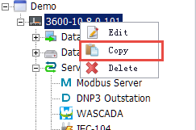

## Copy 　

This feature is suitable for copying between identical devices.

For the project which has multiple devices to be configured, it will be relatively complicated to repeatedly add a new device. EdgeLink Studio supports to completely copy the existing device information. Users only need to right-click on the device name and select "Copy" to add another device. Then users can edit the device information (name, Node ID and description. etc) via two ways: double-click the device name or right-click on the device name and select "Edit". 　

