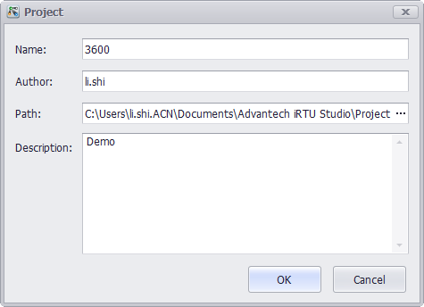

## Project Configuration by Advantech EdgeLink Studio

### Project Management 　

When EdgeLink Studio is opened for the first time, users can follow the procedures of "Create Project" -> "Add Device" -> "Copy" (if multiple devices are required) -> "Save" to initialize the project.　

### Create Project 　

Click "Create Project" under "Project" tab to pop up the below window. Then enter a name, path and description, and click "OK" button. 　

