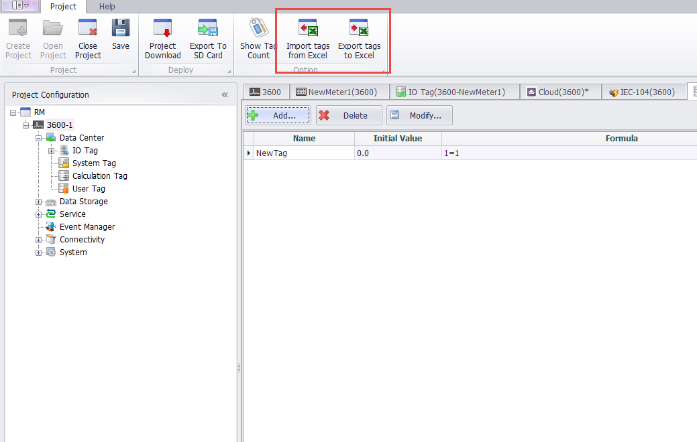
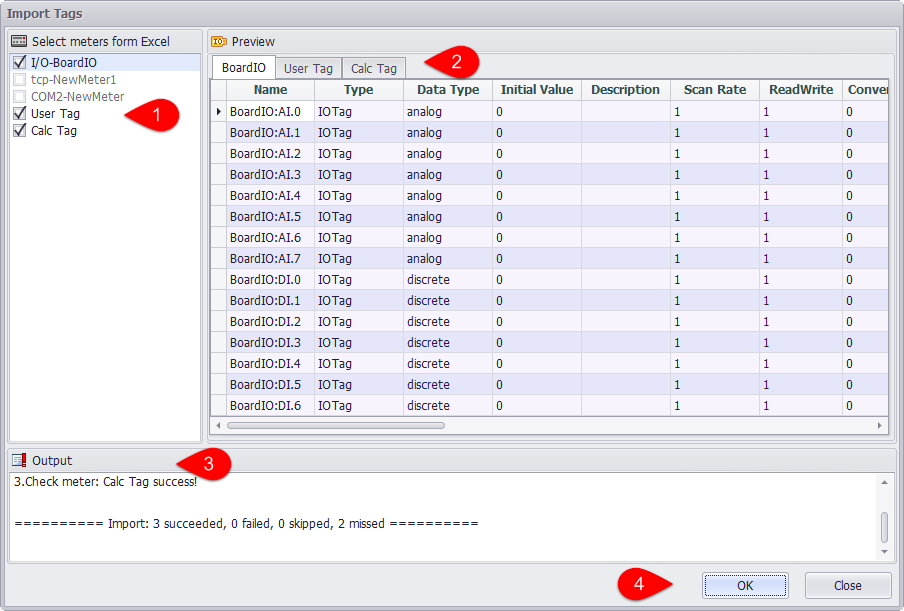
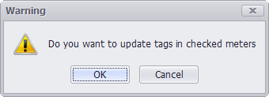
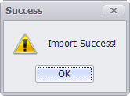
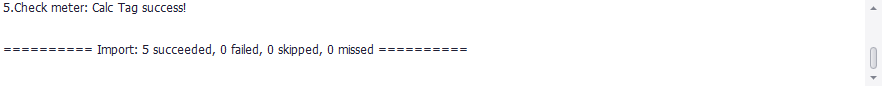
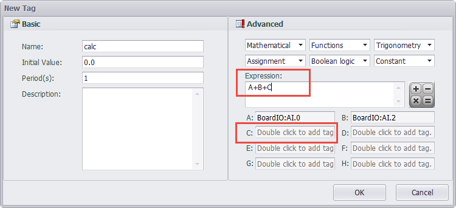
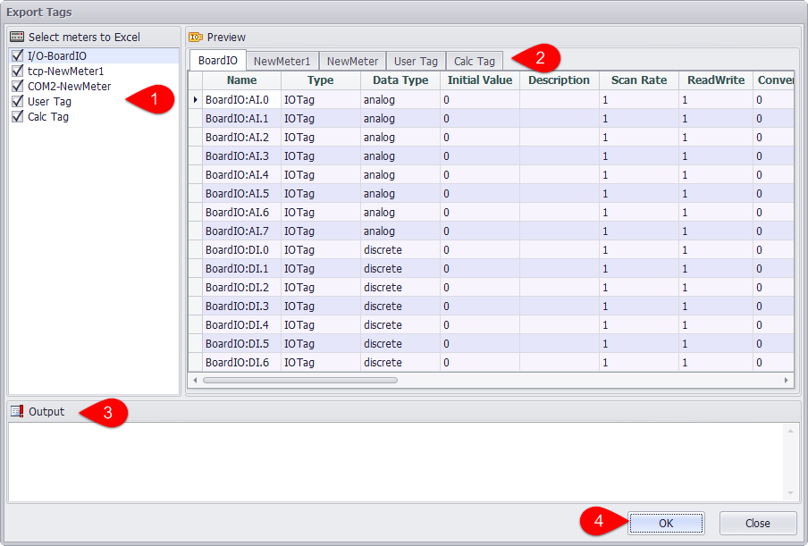

## Device Tag Import and Export ##

EdgeLink Studio supports bulk importing and exporting the IO tags, calculation tags and user tags of a device in Excel format.

###Import from Excel###

The IO tags, calculation tags, and user tags in the Excel table should be saved in the format defined by the project definition, including the sheet name, header name, table data format, and so on. Users select the device to import the tag, click the "import from Excel" button, and select the Excel file to import in the pop-up window.

1.Select the Excel table that you want to import in the left checkbox.

2.In the "Excel Preview" pane, click the tab to preview the data in the table.

3.The system automatically checks whether the selected Excel table file format meets the import requirements and, if not, displays the error content in the export window.

4.If the Excel file format is checked correctly, click the OK button to start importing.

After you start importing, the system will ask whether to update the Tag of the selected device. Click "OK" button to confirm the import.

When the import is successful,the system will pop up a successful prompt.

When you import a device calculation tag, the system will check the calculation tag formula and the variable definition in the Excel table. If the formula is incorrect or the variable in the formula is not defined as the tag in the system, a prompt will be given in the export window so that the user can check the formula and variable definitions.

At this point, the contents of the first line in the Calc Tag table are:

You can see that the formula in the Excel table is "A+B+C", and the variable ParametersC is empty, that is, the Tag corresponding to the variable "C" is not correctly defined in the formula.

###Export to Excel###

Select the device to export tags in the project, click the "export to Excel" button, in the pop-up window, you can export Tags to the Excel file.

1.Select the tag you want to export in the left checkbox.

2.In the "EXcel preview" pane,click the tab to preview the device tag data.

3.The export content is displayed in the export window.

4.Click the OK button to start the export operation.

5.When the export is successful,the system will pop up a successful prompt.

 