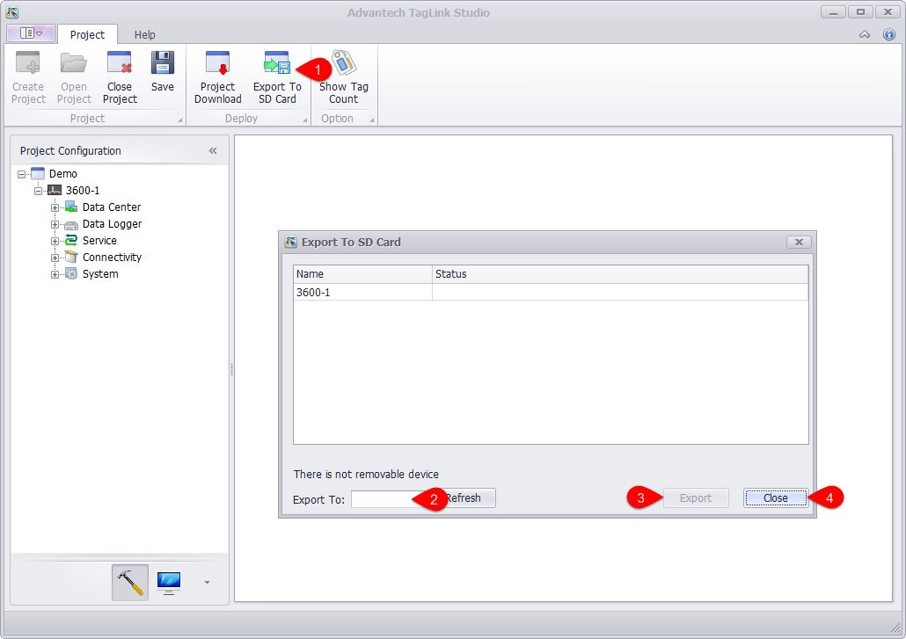

## Export to SD Card 　

This function exports the configured project to the SD card. In the absence of a network connection, the SD card can be plugged into the device to update EdgeLink.

1. No matter the project is selected or not, click "Export to SD Card" will pop up the window listing all devices in the project.

2. Select a target path to export to.

3. Click "Export" button. When the progress bar is complete, export action is successfully completed.

4. Click "Close" button.

Then insert SD card into EdgeLink and power on it to update the project.

>**Note!**: The device with identification method of Node ID can use this feature to update EdgeLink.

