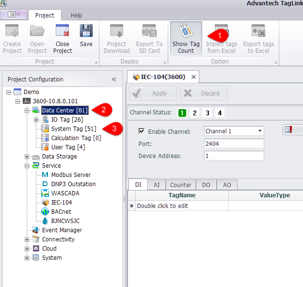

## Show Tag Count 

Click "Show Tag Count" to show the number of the configured tags of each device under a project. 　 

1. Click this button to show/hide the tag number on the left tree menu.

2. The number within the brackets after "Data Center" indicates the total count of tags that have been configured in the selected device.

3. The number within the brackets under "Data Center" indicates the count of tags that have been configured under a certain node.

