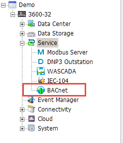
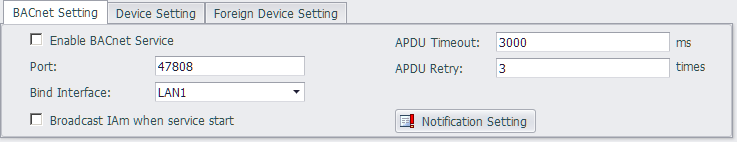
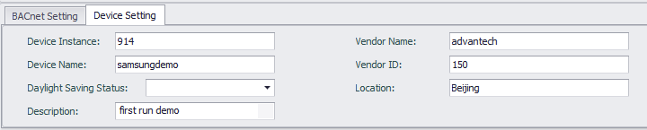
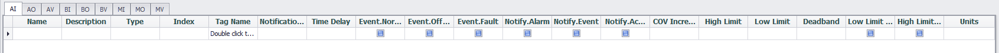
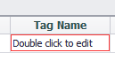
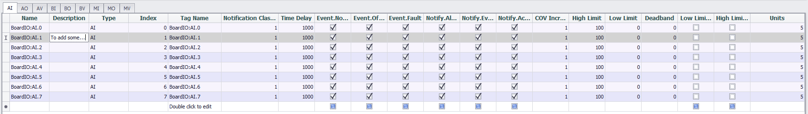
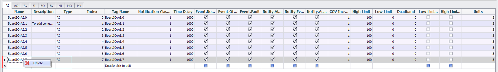
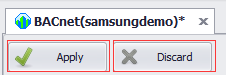

## BACnet Server 　

EdgeLink can work as BACnet Server to exchange data with BACnet Client of HMI/SCADA. Current version of BACnet server is designed to conform to BACnet Advanced Application Controller (B-AAC) level. 

Here will explain the application of BACnet Server in detail.

1. Double-click "BACnet Server" under "Service" item in the left menu tree to pop up the configuration interface.

## The main configuration interface of BACnet server is shown as below. 

 - BACnet Setting: To define the parameters of BACnet IP Server. Current version of BACnet server only supports TCP/IP network communication protocol by default.

		Port: It is the port number of TCP/IP communication on BACnet server. The default number is 47808 (0xBAC0).
		
		Bind Interface: EdgeLink has 2 LAN Port, user should configure which LAN will be bind to do broadcast.
		
		Broadcast IAm when service start[Checkbox]: To configure whether broadcast IAm when the device power on.
		
		APDU Timeout: To define the timeout value of APDU request/response, the unit is millisecond.
		
		APDU Retry: To define the retry times of APDU request/response.
		
		APDU Segment Timeout: To define the timeout of APDU Segment request/response, the unit is millisecond.

 
 - Device Setting: To define the properties of this device object. Please make sure the device instance is the unique in one whole BACnet network.

		Device Instance: As the property [Object_Identifier] of this device object. 

		Device Name: As the property of [Object_Name] of this device Object.

		Daylight saving status: As the Property of [Daylight_Savings_Status] of this device object.

		Description: As the Property of [Description] of this device object.

		Vendor Name: As the Property of [Vendor_Name] of this device object.

		Vendor ID: As the Property of [Vendor_Identifier] of this device object.

		Location: As the Property of [Location] of this device object.

## Next will describe the detailed settings of each object.

##### Note: Please keep the total number of BACnet Server Objects less than 3000 so as to ensure the operating efficiency of EdgeLink.

 - Add new BACnet object
 
	

	User can add new BACnet object by [Double click to edit], then will mapping an EdgeLink Tag to this BACnet Object, and the system will auto create the object instance index for you, please keep the continuity of the index, and the system will start from index 0.

 - Update BACnet obejct

	
	
	User can update and edit the existed BACnet obejct, some property should left click to edit, and some property should do double click to edit such as re-link a new EdgeLink Tag.

 - Delete BACnet obejct

	
	
	User can delete the existed BACnet obejct, select one or more lines and then right click to call [delete] popup menu out then to delete it.

##### Note: When appear the [*] in the title, please save or cancel your operation by the button on the left top.

 - Apply and discard your operation

	

	