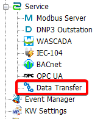
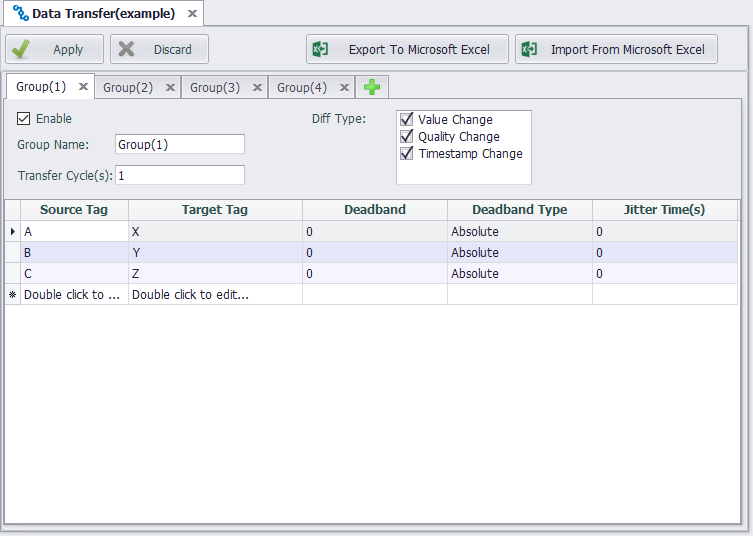

## Data Transfer

Data Transfer is used to write the value of a specified tag to another tag, according to the preset cycle and tag change detection criteria.

### Configuration

1. The user can click the `Data Transfer` node under the protocol service to enter the configuration page.

2. The configuration page of `Data Transfer` is shown in the figure below. Up to 4 groups can be configured, and each group can have a different cycle and change detection configuration. If you have more points, you can use Export/Import Excel function to assist in editing.

According to the configuration in the above figure, the `Data Transfer` program will transfer the tag values (A=>X, B=>Y, C=>Z) per second, or on detection of any change of the source tag's value, quality, and time stamp.
