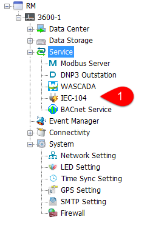
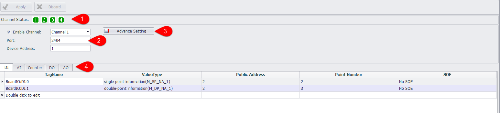
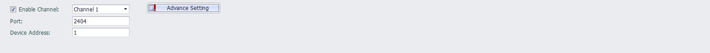
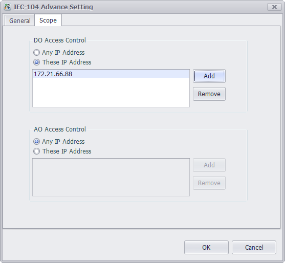
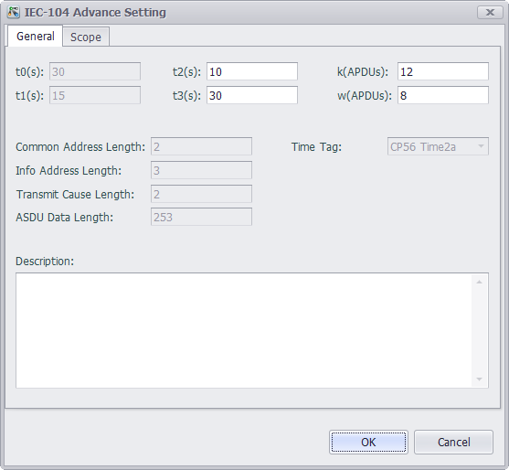
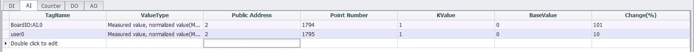
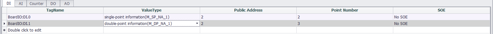

## IEC-104 Server

Double click the IEC-104 in the protocol service to open the IEC104 server settings interface.

----

### Main Interface

Users can configure up to 4 IEC-104 channels in EdgeLink. Each channel parameter needs to be configured independently.

1. The user can choose to enable or not enable the channel. The channel enabled in the channel state is a green background and not enabled is a white background.
2. The channel parameters that need to be configured by the user are placed in the middle area of the interface.
3. At the bottom of the interface is the tag corresponding table, including DI, AI, Counter, DO, AO five types of data tags.

----

### Channel parameter configuration

1. Enable channel: drop box can choose to switch channels, and can also choose whether to enable this channel.
2. Port:the default is 2404, and each channel needs to have a different port number.
3. Advanced parameters: set other properties of IEC-104.
4. Device address: defaults to 1, the public address in the data tag configuration should match the device address of the channel. When the device address changes, the public address in the data tag configuration is automatically updated.

---

Users can set to allow only some IPs to modify the values of DO and AO in IEC-104.

1. When checking check box, do not limit the changes.
2. When unchecked, only allow IP in the list below to modify DO and AO value.
3. DO and AO values are not allowed to modify when the list below is empty.

---

1. t0: Timeout of connection establishment. (Not editable)
2. t1: Timeout of sending or testing APDU. (Not editable)
3. t2: A timeout that is confirmed when no data message is received, t2 <t1.
4. t3: Timeout of sending test frame in long idle state.
5. K: The maximum difference between the sending status variable and the received sequence number.
6. W: The acknowledgment is given after receiving the APD of the I-format.
7. Time stamp format: defaults to CP56 Time2a.(Not editable)

---

### Data Tag Configuration

1. TagName: The name of the tag created in the Utility.
2. ValueType: The numeric type of the variable.
3. Public address: the public address to which the variable belongs should be filled with the same value as the device address.
4. Point Number: the corresponding variable number.
6. KValue, BaseValue: AI: engineering value = BaseValue + acquisition value * KValue, AO: export value = (engineering value - BaseValue) / KValue.
7. Change: this variable is greater than this percentage when uploaded to the server.
8. SOE: records the time at which the failure occurred and the type of event.
