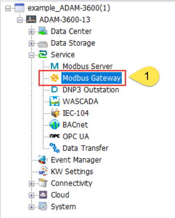
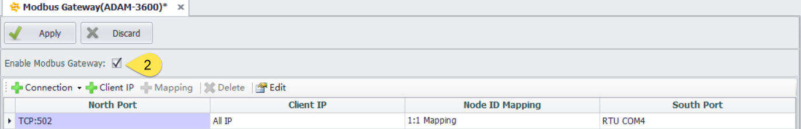
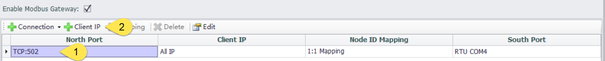
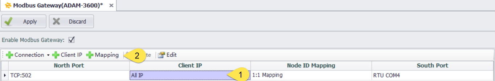
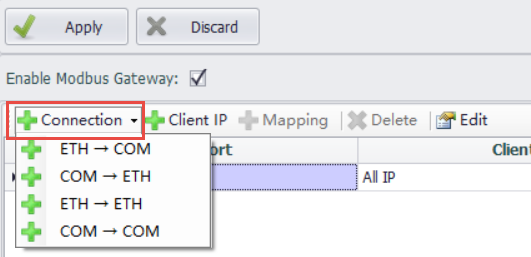
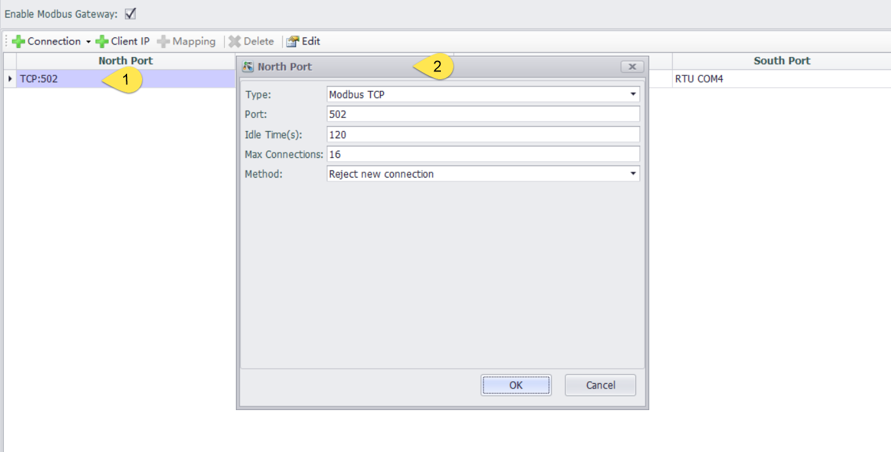
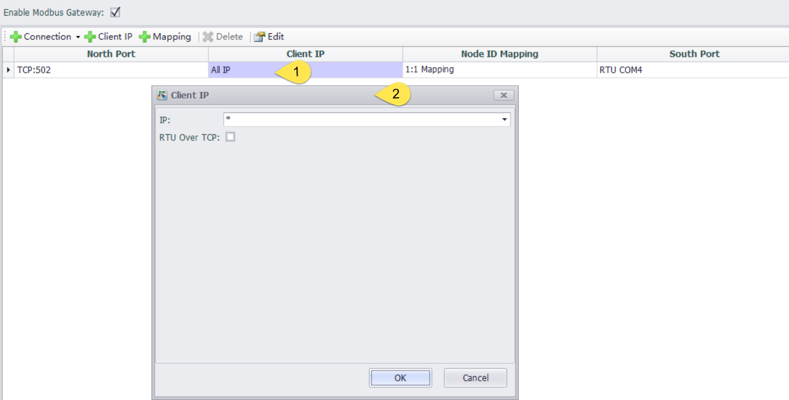
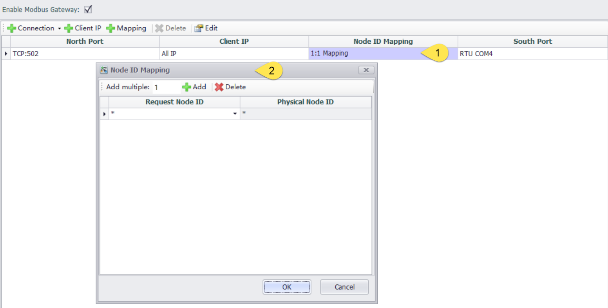
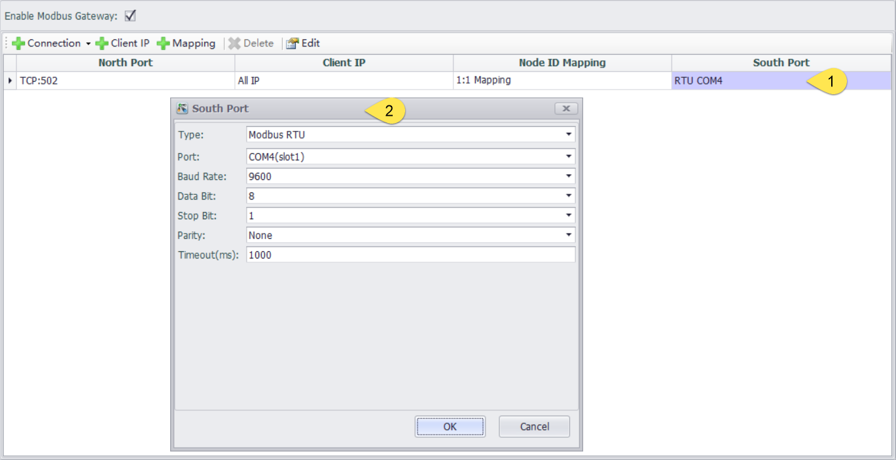

## ModbusGateway

### Architecture

#### The ModbusGateway program primarily performs the conversion between Modbus TCP and Modbus RTU protocols. The Modbus Client on the north side can directly access the Modbus Gateway program on the gateway device to connect to the instruments on the south side.

### Enable

To enable the Modbus Gateway functionality, a connection from ETH to COM will be added by default.

### Default Connection Parameters Description

|  Parameters   | Description                                                                  |
|  --------------  | ------------------------------------------------------------------------  |
| North -direction port  | The port type used by the client to send requests, TCP:502 means the requests are sent through the TCP port to access the Modbus Gateway using port number 502 |
| Client IP  | The IP address of the requesting client. If there are no special restrictions, all IP addresses will be allowed to access |
| Node IP mapping  | The mapping relationship between the requesting client's ID and the south-facing instrument's ID, where 1:1 mapping means that if the requesting client's ID is "a", the request will be forwarded to the instrument with the ID of "a" in the south-facing connection |
| South -direction port  | The port type used to connect to the actual instruments |

### Configuration Instruction

1. Add

When the cursor selects the northbound port, a new connection can be added, and different client IPs can be added under the same northbound port

When the cursor selects any one of the client IP, node ID mapping, or southbound port, a new connection can be added, or a new client IP or node ID mapping and southbound port can be added

2. Connection

There are four types of connection methods

|  Connection type   |  Description                                                         |
|  ------------  | --------------------------------------------------------------------------  |
| ETH-->COM  | Convert the northbound network requests to southbound serial requests |
| COM-->ETH  | Convert the northbound serial requests to southbound network requests |
| ETH-->ETH  | Convert the northbound network requests to southbound network requests |
| COM-->COM  | Convert the northbound serial requests to southbound serial requests |

3. NorthPort

Double-click the northbound port of a specific connection to access the northbound port settings

|  Parameters          |  Description                                                        |
|  -------------------  | ------------------------------------------------------------------  |
| Type  | The type of Modbus request：Modbus TCP/ Modbus UDP / Modbus RTU / Modbus ASCII |
| Port  | The port number needs to be set only when using Modbus TCP or Modbus UDP for access |
| Idle time  | The maximum idle time of a specific connection |
| Max Connection  | The maximum number of connections allowed by Modbus Gateway |
| When the maximum number of connections is exceeded  | he strategy when the number of connections exceeds the maximum: refuse connection / drop the earliest connection |

4. Client IP

Double-click the client IP of a specific connection to access the client IP settings

|  Parameters        |  Description                                                            |
|  ---------------------  | --------------------------------------------------------------------  |
| IP  | Allowed client IP addresses. Using an asterisk (*) allows all IP addresses, while specifying a single IP or an IP range is also possible                      |
| RTU Over TCP | After selecting this option, the protocol type for northbound requests will be Modbus RTU Over TCP                                        |

5. Node ID mapping

Double-click the node ID mapping of a specific connection to access the node ID mapping settings. Using an asterisk (*) represents no ID conversion, meaning a 1:1 mapping

|  Parameters      |  Description                                                              |
|  ----------------------  | -----------------------------------------------------------------  |
| Add multiple  | By default, each click on add will increase the number of ID mappings by one. Clicking add on an empty field allows you to add multiple ID mappings at once               |
| Request Node ID | The node ID of the northbound client when sending requests |
| The actual node ID | The actual ID of the instrument on the southbound side |

6. South Port

Double-click the southbound port of a specific connection to access the southbound settings

|  Parameters      |  Description                                                               |
|  ----------------  | ----------------------------------------------------------------------  |
| Type  | The Modbus protocol type used by the southbound instrument：Modbus TCP/ Modbus UDP / Modbus RTU / Modbus ASCII                                                  |
| Serial number  | The serial port used to connect the gateway to the southbound instrument|
| Timeout  | The timeout time for southbound requests                               |

