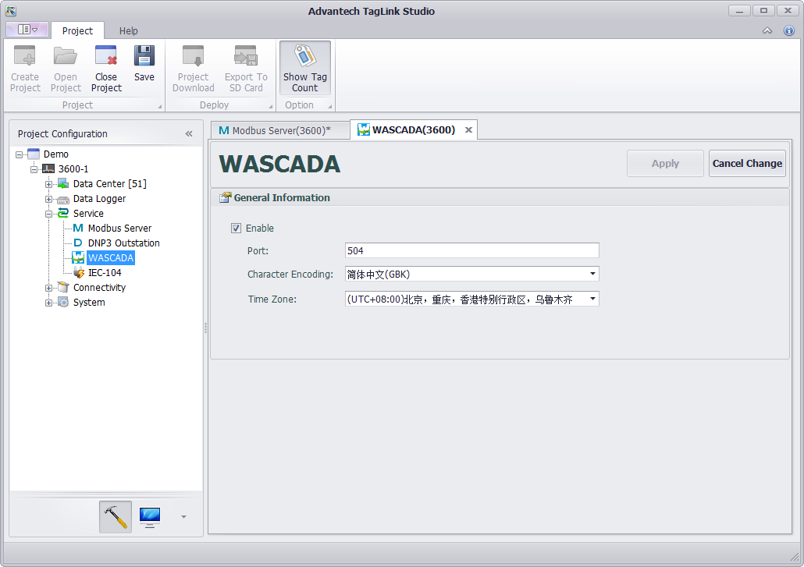
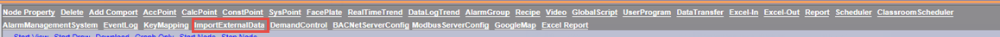
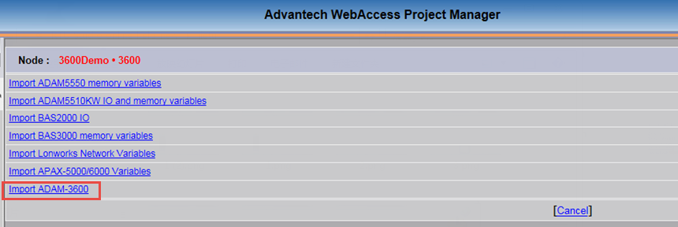
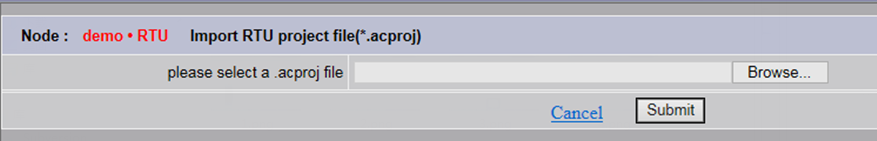
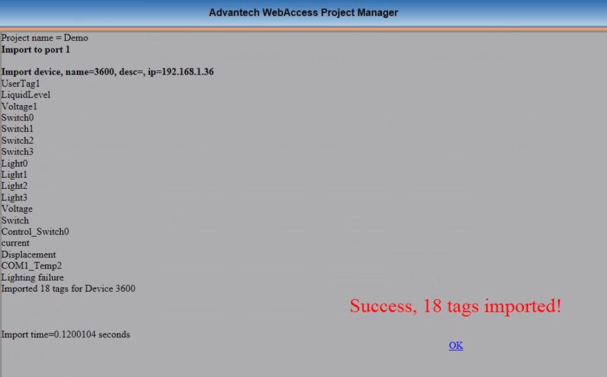
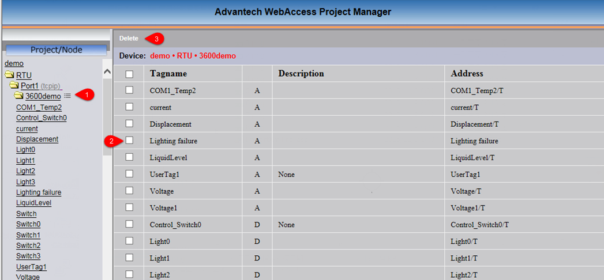
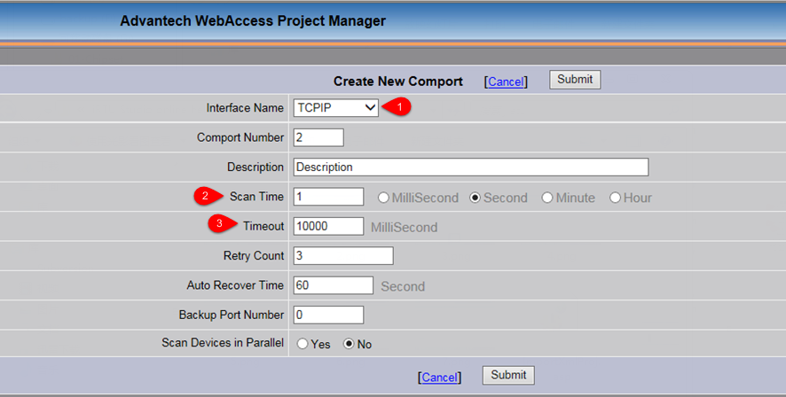
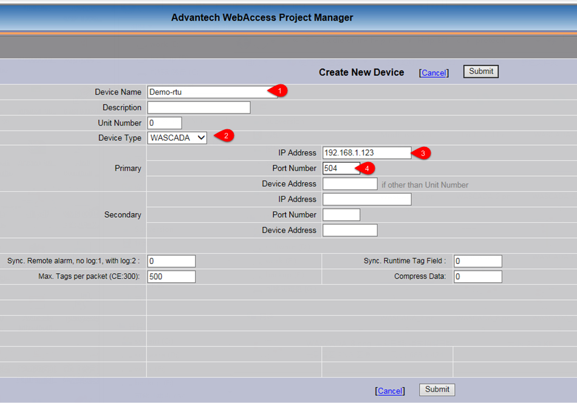
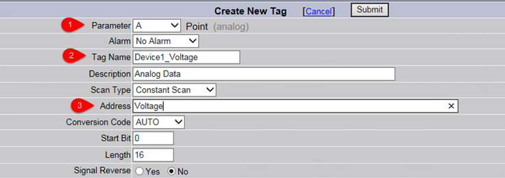

## WASCADA Service

WASCADA protocol is a private communication protocol of WebAccess which can directly access all tags on RTU through TCP connection with the help of WACADA service, with no address mapping needed (such as Modbus service). In addition, the tags supporting periodic data storage will be capable of resuming broken transmission through WASCADA service.

### Basic Configuration of WASCADA

WASCADA service is enabled by default. Barring special circumstances, please do not disable it.

WASCADA has three configuration options:

1. Port: Set the port WASCADA listens on. The default setting is 504.

2. Character Encoding: Select the character encoding of WebAccess from the drop-down list. Please set it base on the real character encoding used by WebAccess, otherwise parse error may occur when it comes to a non-Chinese tag name. If WebAccess is the simplified Chinese version, please keep the default setting "Simplified Chinese (GBK)".

3. Time Zone: Select the time zone for WebAccess server. Sometimes, the time zone of WebAccess server may be different from that of RTU devices. In order to keep the consistency of data time stamp, please set the correct time zone here.

	

### Add RTU Tag on WebAccess

There are two ways to add a tag to WebAccess: 

  - Import a RTU project file; 
  - Add manually.

1. Import a RTU project

	Only the new version WebAccess offers the function of importing a RTU project . If your WebAccess does not support this function, please download the new version or install the function expansion package.

	1.1 Open Advantech WebAccess Project Manager. Then enter the SCADA node property page and click "ImportExternalData" as shown below.

	

	1.2 If your WebAccess supports importing a RTU project file, the option of "Import EdgeLink" should be listed here. Click it to enter the import page.

	

	1.3 Click "Browse" button on this page to select a RTU project file with an extension of .acproj, then click "Submit" button as shown below.

	

	1.4 The page displays "File uploading, please wait...", which means the selected project file with an extension of .acproj is being uploaded.

	1.5 After the upload, the import will be automatically started. When the file has been imported, a window will pop up, showing the information of a successful import and the number of imported tags.

	

	1.6 Delete the unnecessary tags. The import process imports all the tags, some of which are usually unnecessary since they may cause unwanted data traffic, so users need to delete these unuseful tags. Delete method: Please firstly locate the imported device node from the project node, then find the node list icon on its right. [1] Click the icon to open the tag list of the device; [2] Tick the tags to be deleted; [3] Click "Delete" button on the top left of the page to complete the delete operation. 

	

2. Add manually.

	This method is only applicable to two circumstances: a. The installed WebAccess does not support the function of importing a RTU project file; b. Users want to adjust some parameters after the project file has been imported.

	2.1 Create a new SCADA node (If users want to add a new device to the existing SCADA node, please ignore this step).

	2.2 When users create a new comport on the newly-created SCADA node, the following three places should be noticed: [1] The interface name should be TCPIP; [2] Users should set the scan time based on real needs, and the time should not be too short. The default value of 1 second is not useful at most circumstances, so please reset it. [3] The timeout value is set to 1000 milliseconds by default, which is applicable to LAN communication. As for Internet or wireless cellular network communication which has a long transmission delay of link data, 1000 milliseconds is not appropriate any more. Users should modify it to 10000 milliseconds (10 seconds), so as to avoid connection failure due to bad network communication.

	

	2.3 Create a new device for the new comport. The following options should be set: [1] The device name which should be the distinguished name of the RTU by WebAccess. If the RTU is connected with WebAccess through active connection (please refer to "Active Connection"), the device name here should be the same as the distinguished name of WhereIAm in active connection settings; [2] The device type should be set to "WASCADA"; [3] For IP Address, please fill in the real IP address of RTU. If the RTU is connected with WebAccess through active connection, please leave this box blank; [4] The port number is set to 504 by default. It should be consistent with the port number of WASCADA configured in RTU project. For the rest setting options, please leave them unchanged.

	

	2.4 Create a new tag for the new device. [1] For "Parameter" option, "A" refers to analog tags on RTU; "B" refers to discrete tags on RTU; the tags of "Text" type are currently not supported; [2] The tag name should be the same as the tag name used in SCADA on RTU. This tag name is globally unique in SCADA node; [3] For "Address" option, users should input the tag name on RTU. If this tag is configured for periodic storage on RTU, "/T" can be added after the tag name (for example, "Voltage/T"), which means the function of resuming broken transmission is supported. 

	Description of resuming broken transmission: For tags with a "/T" suffix, if "Log Data" is configured to "Yes", WebAccess will reconnect to read the stored data logged on the tag during disconnection to complete the local historical trend data record of SCADA. It should be noted that, the stored data mentioned above could only include the data of minute, hour and day precision. In other words, when users want to view the data during disconnection and the time precision of the historical trend graph is as accurate as second for example, no data curve will be displayed in this graph.

	For the configurations of other parameters, please refer to "WebAccess User Manual".

	

