## 断点续传设置

断点续传功能适用于EdgeLink设备与WebAccess连接的情况，在进行正确的配置之后，如果由于网络连接原因导致实时数据传输中断，则在网络连接恢复后会WebAccess会向EdgeLink设备请求补全断线期间的数据。目前补全的数据为分钟及以上级别的数据记录，因为如果秒级的数据记录如果也要补全的话，可能会造成数据量过大且大多数情况下不会带来显著的好处。

为了能够实现断点续传的功能，配置的系统至少必须满足以下条件：

1. EdgeLink设备必须为需要续传的Tag点配置数据存储，只有这样才能保证断线期间的数据不会丢失。

2. WebAccess与EdgeLink之间的连接协议必须是WASCADA服务协议。

3. WebAccess上设备节点的名称必须与EdgeLink设备的名称一致，如果使用主动连接的方式，则在WebAccess上设备节点的名称必须与主动连接配置项中的Device Identifier一致。

4. WebAccess配置的点地址中，对于需要断点续传的点，必须有"/T"后缀，否则该点不会被断点续传。

5. 对于需要断点续传的点，在WebAccess端的配置项“记录数据”的设定必须为“是”。

6. webaccess工程中需要勾选RTDB.

### EdgeLink Studio上与断点续传相关的配置

#### 周期存储配置

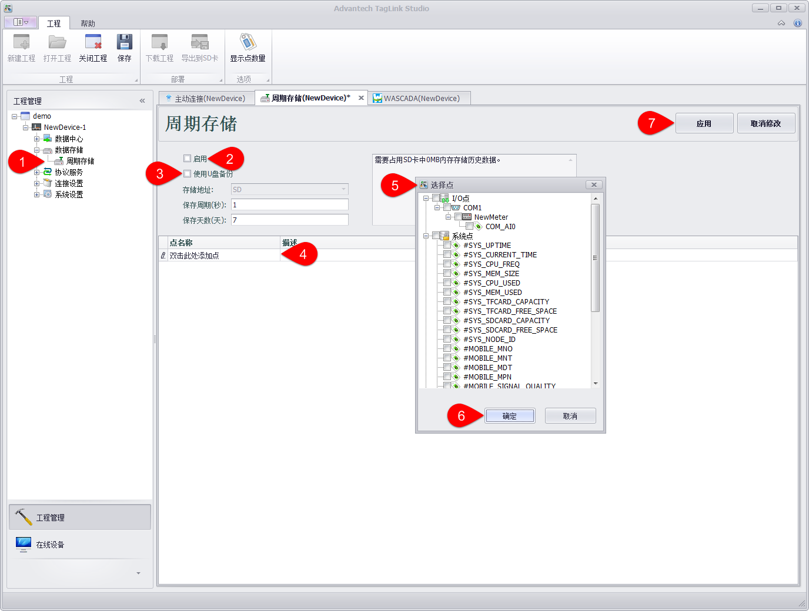

1. 在工程节点中的“数据存储”下找到“周期存储”，双击它打开设置页面。

2. 点击“启用”按钮来启用周期存储，周期存储的参数包括：

 - 存储地址：存储地址目前只能选择SD卡。

 - 保存周期（秒）：保存周期就是将数据存储到SD卡的周期，保存周期的单位是秒。

 - 保存天数（天）：保存天数就是数据能在SD卡中存储的时间，保存天数的单位是天。

3. 点击“使用U盘备份”按钮来启用U盘备份数据。

4. 双击“双击此处添加点”将会弹出选择要进行数据备份的点。

5. 选择需要备份的点。

6. 选择完需要备份的点之后，点击“确定”保存。

7. 上面的步骤都完成之后，点击“应用”保存。

#### 主动连接设置

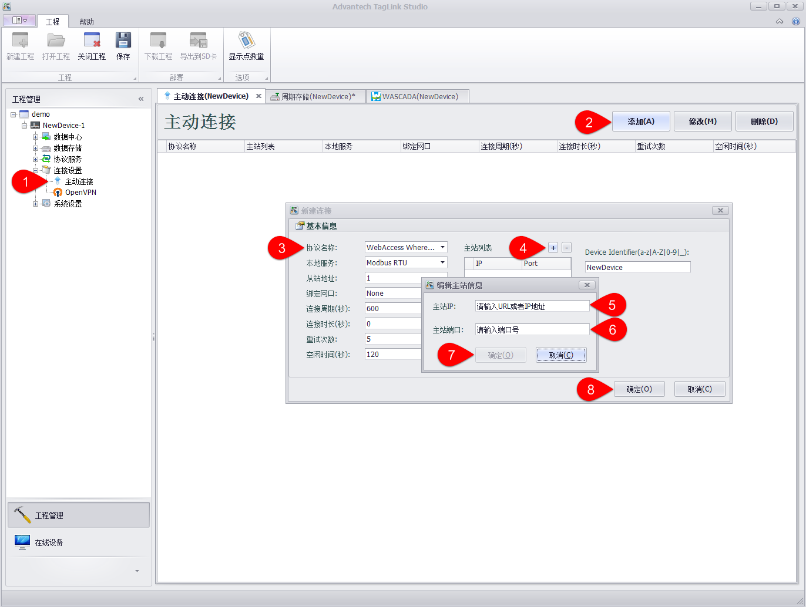

1. 在工程节点中的“连接设置”下找到“主动连接”，双击它打开设置页面。

2. 点击“添加”按钮来新增一个主动连接。

3. 设置主动连接的参数，包括：

 - 协议名称：指定对上连接的协议，其中“WebAccess WhereIAm”用于连接WebAccess服务器，“DTU - Four Faith PROT”用于连接支持四信DTU的服务器。选择不同的服务，在设置页面最右边的扩展参数列会有不同的设置参数，请根据各个协议的配置参数来正确配置。WhereIAm的配置参数只有一个：Device Identifier，指定设备标识，该标识必须与WebAccess工程中配置的设备名称一致，以便WebAccess可以正确识别每一台连上的设备。

 - 本地服务：指定对下连接的服务，其中“Modbus RTU”为通过虚拟串口连接Modbus RTU服务，其他均为通过TCP连接的系统服务。

 - 从站地址：仅在对下连接为Modbus RTU服务时有效，指定Modbus RTU从站地址。

 - 绑定网口：指定主动连接通过那个网口进行数据通信，设置为None表示不绑定。此参数一般用于设备有多个网络连接时，为避免系统默认路由的不确定性，需要明确指定主动连接的数据通道时使用，例如绑定Cellular，就指定了只使用蜂窝无线网络进行数据传输。

 - 连接周期（秒）：指定主动连接每隔多久建立一次对上连接。

 - 连接时长（秒）：指定对上连接建立后持续多久再断开，设置为0表示对上连接建立后不主动断开。

 - 重试次数：指定建立对上连接时失败后的重试次数，超出重试次数后，主动连接将不再尝试连接直到下一个连接周期的到来。

 - 空闲时间（秒）：指定对上连接建立后，如果该连接在指定的空闲时间内没有任何数据传输，程序会断开此对上连接并进行重连。设置为0表示不检查空闲时间。

4. 点击“+”按钮添加对上连接的主站地址及端口号。

5. 输入主站地址，可以使用IP，也可以使用域名地址。

6. 输入主站端口，如果是WebAccess，一般默认是504。

7. 点击确定添加主站信息到主站列表，重复4~7步骤可以添加多个主站，每个主动连接可以设置最多5个主站。

8. 点击“确定”按钮添加该主动连接到列表中。

### WebAccess上断点续传手动添加设置的方式

#### 通讯端口设置

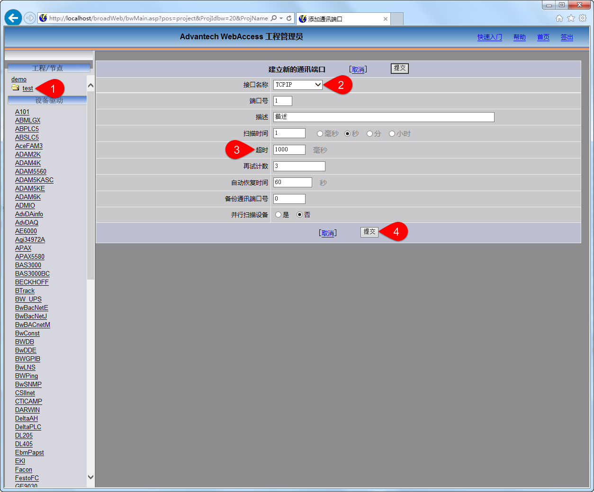

1. 在工程/节点中找到“test”，点击它打开设置页面。

2. 将“接口名称”设置为TCPIP

3. 将“超时”设置成10000

4. 其他参数可以根据自己的需要进行设置，设置完成后点击“提交”保存。

#### 新建设备

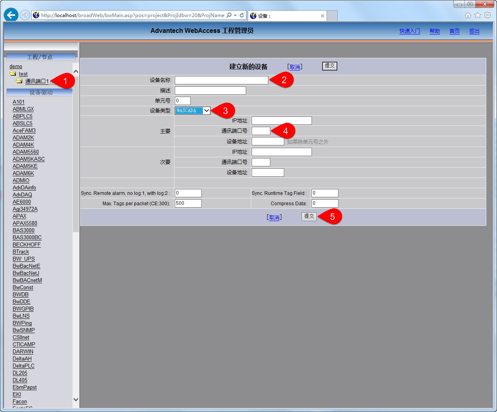

1. 在工程/节点下找到“通讯端口1”单击，在通讯端口1界面中找到“添加设备”按钮单击。

2. 填写设备名称，此处的设备名称要与EdgeLink Studio中的设备名称保存一致。

3. 设备类型，选择选择WASCADA。

4. 通讯端口号一般默认设置为504。

5. 其他参数可以根据需要进行修改，修改完成后点击提交保存。

#### 新建点

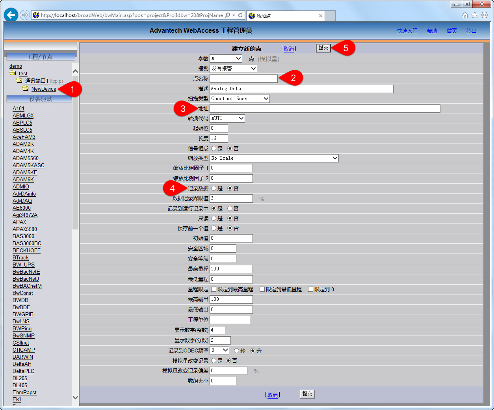

1. 在工程/节点下找到“NewDevice”单击，在NewDevice界面中找到“添加点”按钮单击。

2. 填写点名称，此处的“点名称”要与EdgeLink Studio中的点名称保存一致，此处为COM_AI0。

3. 填写“地址”，地址的格式为“点名称/T”，此处我们填写COM_AI0/T。

4. 记录数据出选择“是”。

5. 其他参数可以根据需要进行修改，修改完成后点击提交保存。

### WebAccess上断点续传从EdgeLink工程文件导入配置的方式

#### 导入EdgeLink工程文件

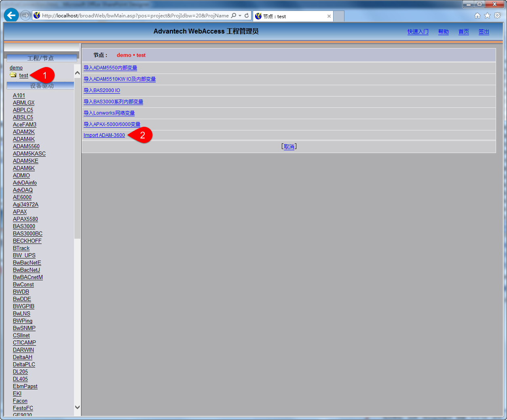

1. 在工程/节点下找到“test”单击，在test界面中找到“外部数据导入”按钮单击，将会调到 该界面。

2. 我们选择“Import EdgeLink”单击（用户需要根据自己的情况进行选择）。

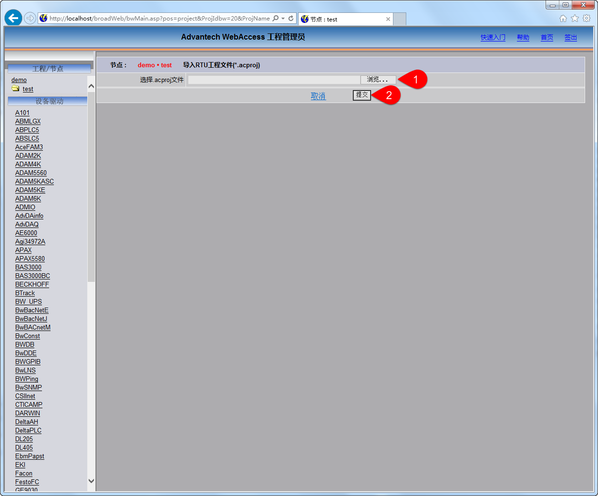

1. 在此界面中，通过单击“浏览”选择自己工程。

2. 完成上步之后单击“提交”即可。

### WebAccess手动配置方式和WebAccess外部数据导入方式都需要的步骤：

#### 历史趋势配置

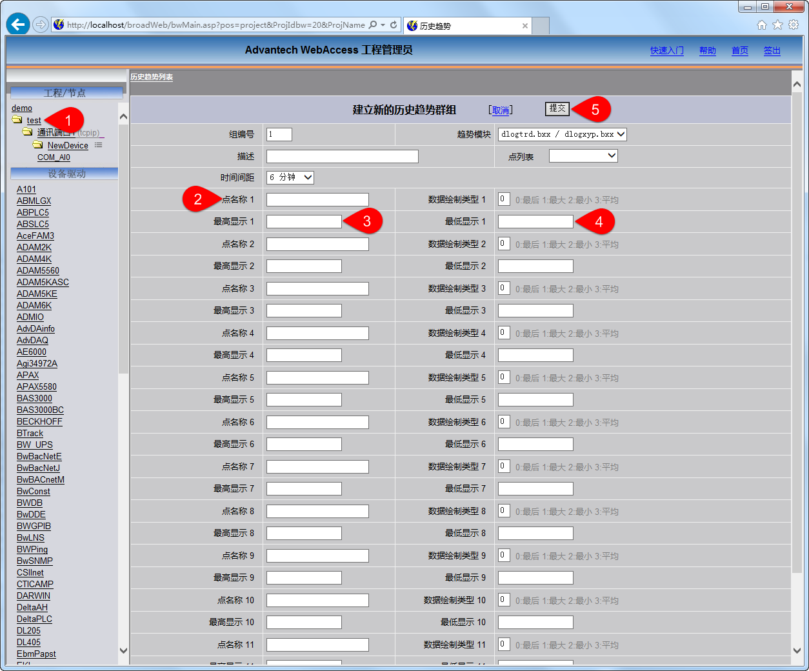

1. 在工程/节点下找到“test”单击，在test界面中找到“历史趋势”按钮单击，在弹出的界面中选择“添加历史趋势”的按钮，将弹出该界面。

2. 点名称1处填入需要监控点的名称，该名称要与EdgeLink Studio中的点名称一致。

3. 最高显示1处填入100（用户需要根据自己的实际情况进行修改）。

4. 最低显示1处填入0（用户需要根据自己的实际情况进行修改）。

5. 可以根据2-4的步骤，为多个点添加历史趋势，添加完成后点击“提交”保存。

#### 下载工程

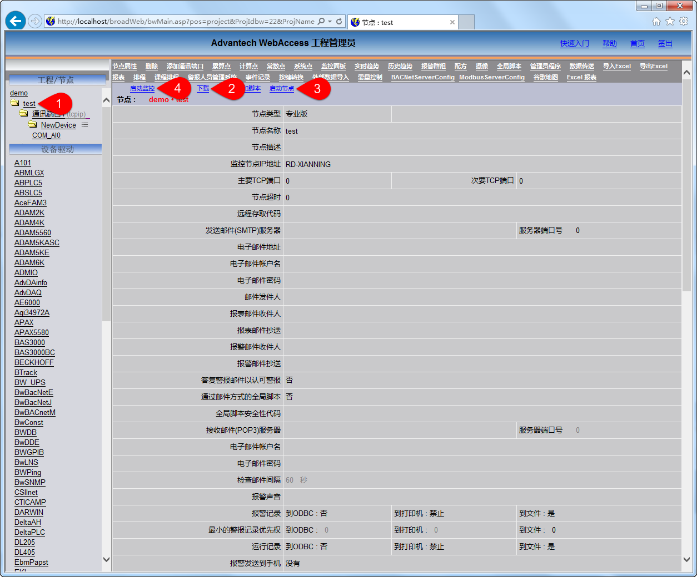

1. 在工程/节点下找到“test”单击。

2. 点击“下载”按钮，在弹出的对话框中点击“提交”等待工程下载完成之后关闭对话框。

3. 点击“启动节点”，在弹出的对话框中点击“提交”按钮等待，工程启动完成之后关闭对话框。

4. 点击“启动监控”，在弹出的对话框中点击Advantech WebAccess，在弹出的对话框中输入管理员名称和密码然后回车。

#### 查看历史趋势

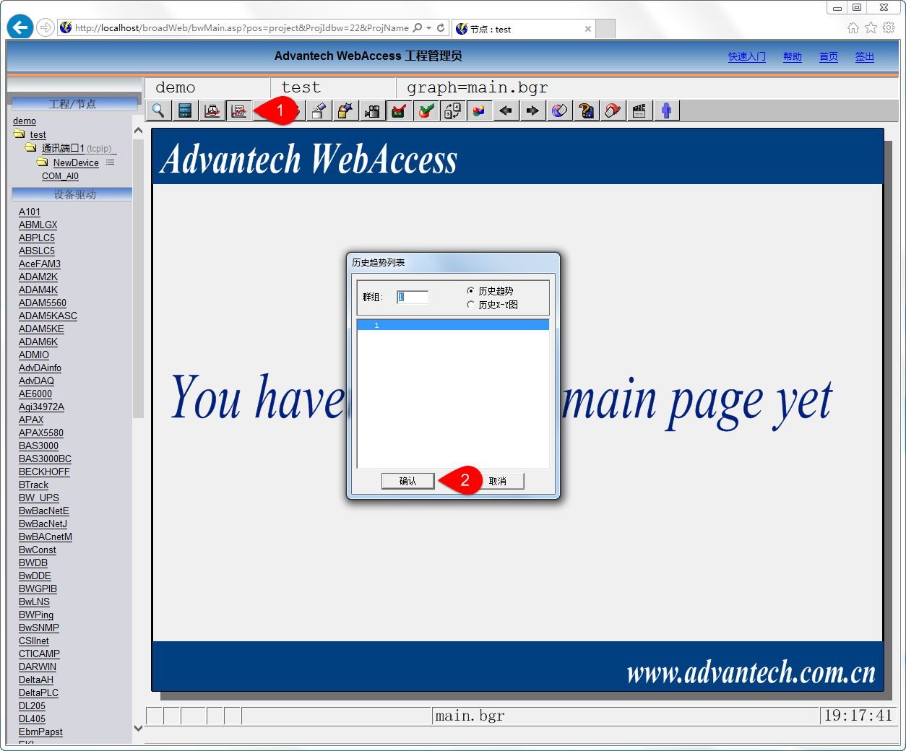

1. 点击历史趋势按钮。

2. 在弹出的对话框中点击“确定”。

#### 历史趋势图

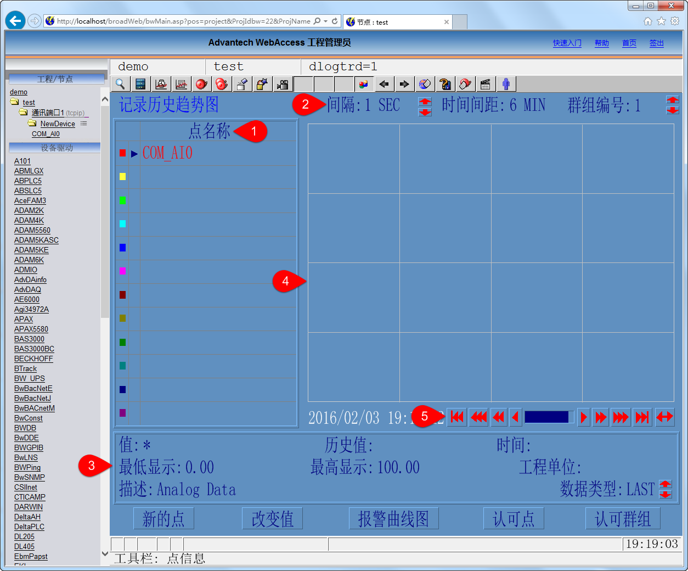

1. 点名称处会显示需要监控点的名称。

2. 间隔处会显示当前监控点的变化的间隔，可以通过上下箭头调整变化的间隔，断点续传的功能只能在间隔大于1分钟的时候才能看出来。

3. 该处显示了监控点的信息。

4. 该处会时时显示监控点的变化状态，并绘制出历史趋势图。

5. 可以通过左右移动4中的历史趋势图。

