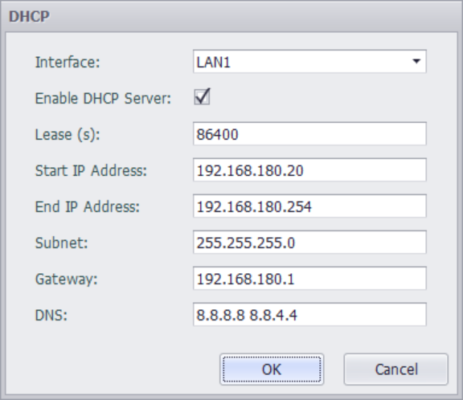

### DHCP Server Settings

DHCP (Dynamic Host Configuration Protocol) is a network protocol of a local area network. It refers to a range of IP addresses controlled by the server. When the client logs in to the server, it can automatically obtain the IP address and subnet mask assigned by the server. When the WIFI of this device is set to AP mode, users need to configure this service if they want the station connected to the AP to automatically obtain IP address and other related information.

Note: If you use this function on a fixed network card, please ensure that there is only one DHCP service in the whole LAN, otherwise it will cause abnormal IP allocation and make the entire LAN unable to work normally.

The user can configure the properties as follows:

- Network port: Select to enable the DHCP Server function on a network port.
- Enable: Choose whether to enable this configuration.
- Lease time: The lease time of the DHCP server.
- Assign IP start address: Configure the start address of the range of IP addresses assigned by the DHCP server to clients.
- Assign IP end address: Configure the end address of the range of IP addresses assigned by the DHCP server to clients.
- Subnet mask: Configure the subnet mask assigned by the DHCP server to the client.
- Gateway: Configure the gateway assigned by DHCP Server to the client, generally the local IP of DHCP Server.
- DNS: Configure the DNS address assigned by the DHCP Server to the client. Multiple DNS addresses are separated by spaces.