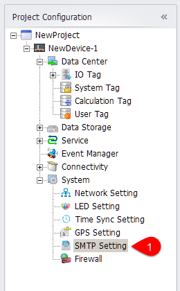
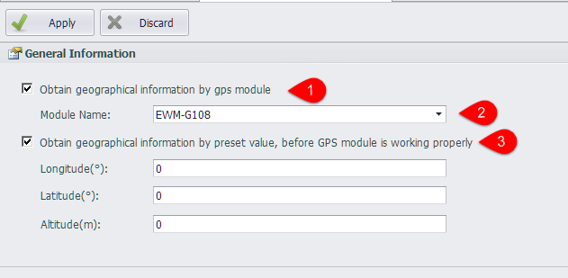
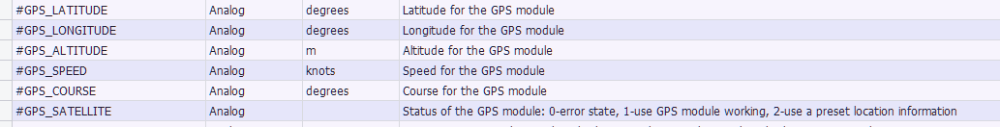
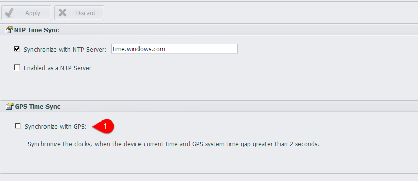

## GPS Settings

In the GPS settings, you can set the GPS module on RTU.

----

### GPS Module

1. Enable: enable the GPS module acquisition function, RTU will collect real-time location information, speed and angle through the GPS module.
2. Module name: the GPS module type that can be selected. The program reads the module information from the configuration file \Resources\GPSInfo.xml. When the module type is switched, the program sets the other properties as default values.
3. The preset latitude and altitude are used as the initial value before the GPS module works properly. 
**Note!** After the GPS module is working normally, if the unexpected situation occurs, such as: when the GPS module is pulled out and the GPS search star number is less than 3 stars, the longitude latitude and altitude value will be retained as the last normal value obtained when the position information is not available

----

### GPS Default Mode

1. The user can choose not to use the GPS module, but the preset RTU location information. Users can also choose not to use preset location information, and GPSManager modules will not be started at RTU.

----

### GPS System Tag

After the GPS function is enabled, location information will be stored in the system tag.

The current working state of the GPS module is saved in GPS_SATELLITE

* When the value is 0, the GPSManager module in RTU is not started, or GPSManager is in error mode. 
* The GPS module works when the value is 1.
* When the value is 2, the default location information is used to set the GPS\ _LATITUDE, GPS\ _LONGITUDE, GPS\ _ALTITUDE, and the GPS\_SPEED and GPS\_COURSE values are 0.

### GPS Time Synchronization

After the GPS function is enabled, you can use GPS to synchronize RTU time

1. You can choose at most one time synchronization mode.
2. When the gap between the GPS time and the RTU time is greater than the "calibration interval", the device time is synchronized with the GPS time.