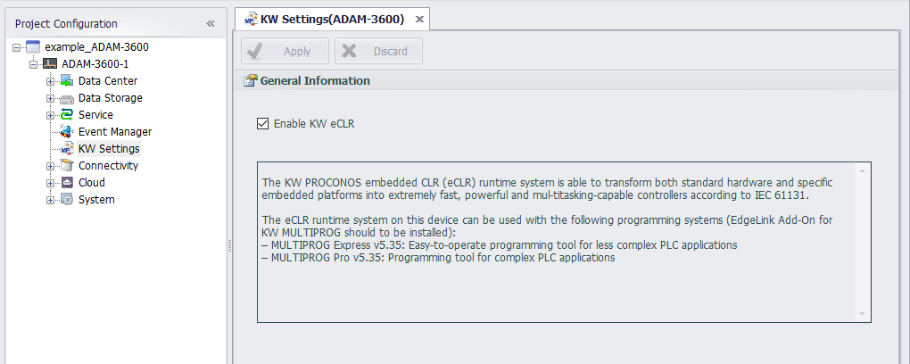

## KW Settings

The KW PROCONOS embedded CLR (eCLR) runtime system is able to transform both standard hardware and specific embedded platforms into extremely fast, powerful and mul-titasking-capable controllers according to IEC 61131.

"KW Settings" allows the user to configure the start and stop of the KW function. When "Enable KW eCLR" is checked, eclr will be enabled when the device starts. If it is not checked, eclr will not be enabled.
