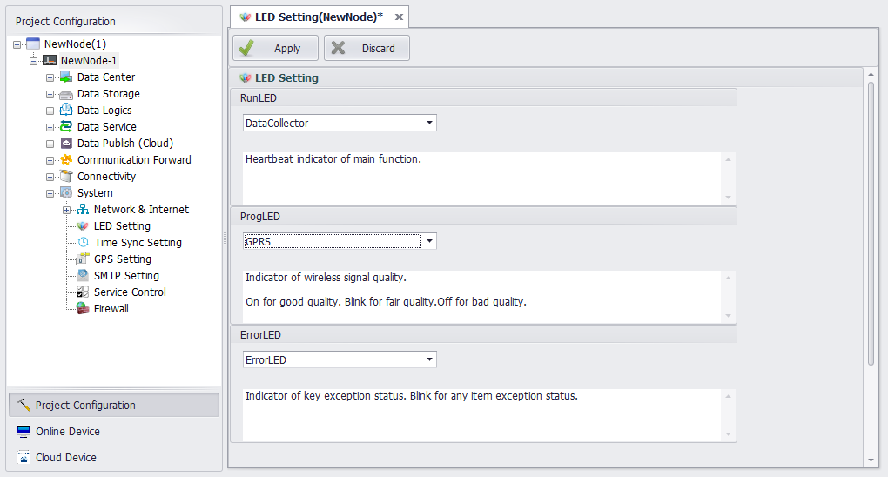

## LED Setting 

In this page, users can set the working modes of LED indicators on RTU, including RUN, PROG and ERROR.

1. In the navigation bar, double-click on "LED Setting" of "System Setting" to open the edit page.

2. In the RunLED and ProgLED selection box, you can choose whether the LED is enabled.

    The RUN LED monitors the data acquisition and KW function. When the RUN flickers, it indicates that the main program is running normally.

    PROG lamp monitors the intensity of mobile signal or WIFI signal. The long light signal is good, the flicker signal is normal, and the signal is not bright.

3. In the ErrorLED selection box, you can choose whether the ERROR lamp is enabled.

    When it is enabled, it will monitor whether the key modules are connected properly. When a module is abnormal, the ERROR light will flash. The modules that can be monitored include data storage module, mobile module and WIFI module.

    When it is not enabled, the ERROR light will not light up, and users can write their own programs to use this light.

