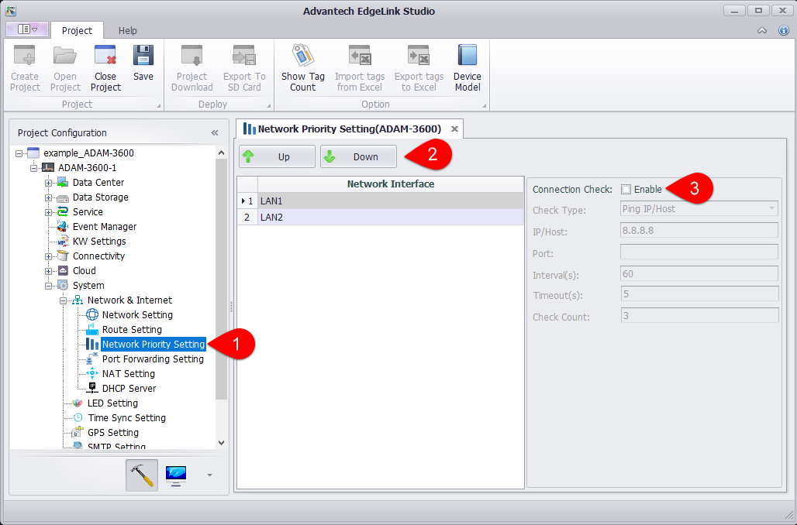
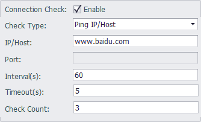
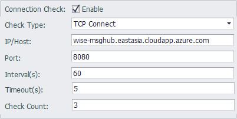

### Network Priority Settings

Users can configure the network priority, which is the priority of the default route. The network cards on existing devices are listed in the network priority setting panel, and users can click the sort button to sort.

1. Open the "System Settings"-"Network and Internet"-"Network Priority Settings" page.

2. Select the network card and click the "Move Up" or "Move Down" button to modify the network priority order.

3. Enable connection checking on the network.

According to the network priority setting, when the high priority network is not available, it will switch to the second priority network and update the routing table; when the high priority network is restored, switch back to the high priority network and update the routing table .

- Inspection method: Ping IP / Host means to check the network connection by ping, and TCP Connect means to specify the TCP port through TCP protocol connection.
- IP / HOST: Users can fill in IP or Domain. It is recommended to fill in the public network IP / HOST. When setting Domain, if the network card is fixed IP, the user must set up a DNS server.
- Port number: Only TCP Connect requires the port number. Please fill in the corresponding port number.
- Inspection interval: the inspection cycle, in seconds.
- Time-out time: Time-out time when the check fails, in seconds
- Number of inspections: Switch the network card after the inspection failure exceeds this value.

Some servers are not allowed to ping. In this case, users can select TCP Connect as the check method. Taking wise-paas as an example, users can set it as follows:

