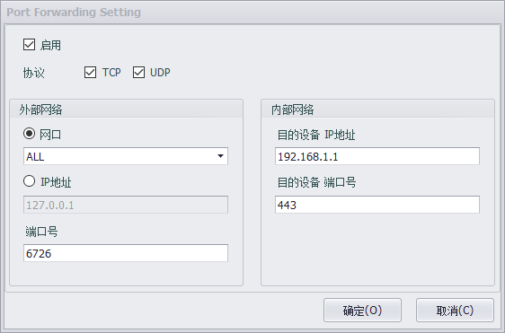

## Gateway Function

When a device is used as a gateway, one network port is used to connect to the external network, and one or more network ports are connected to the internal network. EdgeLink supports port forwarding and NAT to help users manage the network more conveniently.

### Port Forwarding

When a device is used as a gateway, the external network user cannot directly access the devices on the internal network. Users can set the mapping between the port of the external network port and the IP address of the internal network device by setting port forwarding on the router. That is, the gateway forwards the request to a specific port of the external network port of the gateway to the device of a specific IP address of the intranet through the intranet port, and the intranet device can be accessed by the external network.

As shown in the above figure, the device will forward the tcp request of port 80 with the external device IP of 10.5.0.1 to port 80 of the intranet device IP 192.168.10.5.

The device will forward the tcp request of port 8080 with the external device IP of 10.5.0.1 to port 80 of the intranet device IP 192.168.10.6.

The device will forward the tcp request of port 25 with the external device IP of 10.5.0.1 to port 80 of the intranet device IP 192.168.10.7.

The configuration in Studio is as follows:

Convert to iptables script as:

	iptables -t nat -A PREROUTING -d 10.5.0.1 -p tcp --dport 80 -j DNAT --to 192.168.10.5:80
	iptables -t nat -A PREROUTING -d 10.5.0.1 -p tcp --dport 8080 -j DNAT --to 192.168.10.6:80
	iptables -t nat -A PREROUTING -d 10.5.0.1 -p tcp --dport 25 -j DNAT --to 192.168.10.7:80
	iptables -t nat -A POSTROUTING -j MASQUERADE

The attributes that users can configure are as follows:

- Enable: When you select Enable, this configuration will be added to forward.sh.
- Protocol: You can choose to support either TCP / UDP or both.
- External - Interface: Select to forward all access or only forward requests from specific network ports.
- External - IP Address: Select to forward only requests for specific IPs.
- External - Port: Set the port number to be forwarded, that is, the port requested by the external network.
- Internal - Dest IP Address: Set the IP address of the intranet device to be forwarded to.
- Internal - Dest Port: Set the port number of the intranet device to be forwarded to.

### NAT Function

When using the device as a gateway, enable the NAT function to allow the intranet device to access the external network through the gateway.

Convert to iptables script as:

	iptables -t nat -A POSTROUTING -j MASQUERADE -o eth0

The attributes that users can configure are as follows:

- Enable: When you select Enable, this configuration will be added to nat.sh.
- Name: You can choose to support either TCP / UDP or both.
- External - Interface: Select to allow intranet devices to access the external network through a specific interface of the gateway, or access through all interfaces.