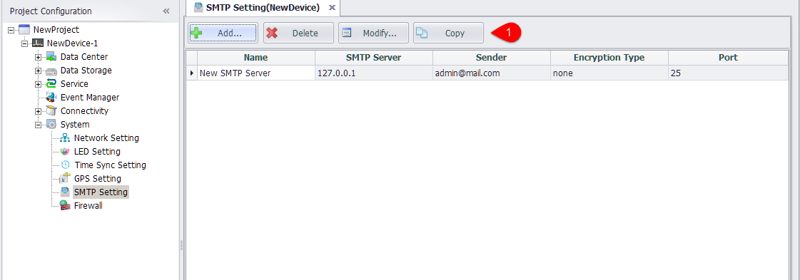
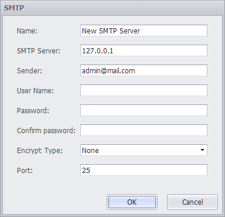

## SMTP Settings

In event management, you need to set up SMTP before sending the time message by mail.

1. In the device -> system Settings ->SMTP Settings node double - click to open the edit interface.
2. Users can add, delete, modify SMTP, and copy existing SMTP settings.
3. The existing SMTP Settings are shown in the list, and double-clicking on the selected row can also open the edit interface

### SMTP Editor

1. SMTP Name: used only in EdgeLink Studio
2. SMTP server: enter IP or domain name
3. Sender: the sender's mailbox address that is displayed when the message is received
4. User name: the user name needed to connect to the SMTP server
5. Password: the password needed to connect to the SMTP server
6. Confirm password: you need to type in the same password again
7. Encryption mode: you can choose either unencrypted or SSL, TLS two encryption methods
8. When the option is encrypted, the default port is 25. When you select SSL encryption, the default port is 465, and when you select TLS encryption, the default port is 587.