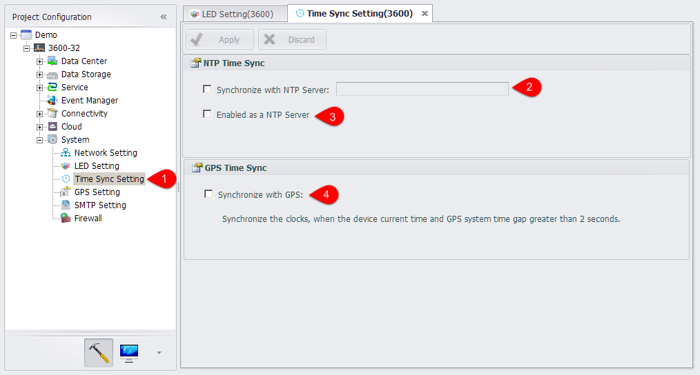

## Time Sync Setting 

In this page, users can perform the time synchronization settings, making RTU time consistent with another time source. Meanwhile, users can also set RTU as a time synchronization source.

1. Double click the Time Sync Setting in the navigation bar to enter the configuration page.

2. The selection of "synchronization with the NTP server" allows the device to synchronize with a source, and the address of the source can be a domain name or a IP address.

3. Check "serve as a NTP server" to enable the device to be a time synchronization source and other devices to synchronize time with this device.

4. The user can choose to synchronize time through GPS.