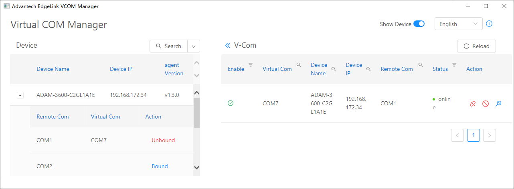

> VCOM Manager Setup File download link: [VCOM Utility](https://www.advantech.tw/support/details/utility?id=1-24KJ5E7){target="_blank"}

## VCOM Instructions

### 1. Introduction

VCOM is Virtual COM, through the VCOM function provided by the gateway, users can map the remote serial port device to the virtual serial port of the PC, as shown in the following figure. In this way, users can directly manage and maintain the device through serial port communication. Generally speaking, the serial port communication software of the managed device can be directly used on the mapped virtual serial port.  

When using VCOM, please note the following:

1. The VCOM function is designed for the purpose of remote device maintenance. It is suitable for applications that are not sensitive to communication delay and not long operation time applications, such as parameter configuration, firmware update, etc. Do not use it as a remote serial server.
2. The delay and stability of the virtual serial port depend on the characteristics of the TCP connection. If the TCP connection is via a cellular wireless network or other high-latency links, please adjust the communication timeout parameters of the serial port device supporting application software.
3. If the serial port on the gateway has been configured as a port occupied by the data acquisition program, then due to the exclusive use of the serial port, after the serial port is bound by VCOM, the data acquisition program will stop data collection until the serial port is unbound, the data collection will be resumed.

### 2. Enable the VCOM function on the gateway

The VCOM function on the gateway is disabled by default. It can be enabled through the VCOM configuration item in the EdgeLink Studio. After downloading the project, the VCOM function can be enabled.  

### 3. VCOM Management Program

The VCOM management program is an independent installation package. You can download the setup file from this site: [VCOM Utility](https://www.advantech.tw/support/details/utility?id=1-24KJ5E7){target="_blank"}.

After the installation is complete, you can find the shortcut of the `Advantech EdgeLink VCOM Manager` program in the startup item of the system start menu, as shown in the figure below.

The main interface of the VCOM management program is shown below. The left half shows the information of the online device, including the device name, device IP, version number of the serial port agent (vcom-agent) and the list of physical serial ports contained in the device. The right half shows the list of virtual serial ports currently created by the management host, including the status of the device serial ports bound to the virtual serial ports.

#### 3.1 Searching for online devices

Click the search button on the interface to search for online devices in the local area network that have enabled the VCOM function. If the device is not in the local area network, you can use the drop-down menu to select `Search by IP` or `Search by IP Range`, the `Reset` command in the drop-down menu can be used to clear the current search criteria and device information list.

#### 3.2 Bound device serial port

In the device list, click on the left of the target device `+` sign button, you can see a list of physical serial ports of the device, click on the right side of the serial bind command to complete the binding. During the binding process, the VCOM management program will create a new virtual serial port on the management host (the system will automatically assign an unoccupied serial port number, which cannot be specified manually).

The bound serial port is displayed in the V-Com list on the right side of the main interface, as shown in the figure below.

For the virtual serial ports that have been bound, there are three operations to choose: Unbound, Disable and Monitor.

- Unbound: Unbound the virtual serial port and the physical serial port, and delete the virtual serial port from the management host.
- Disable: Unbound the virtual serial port and the physical serial port, but retain the virtual serial port in the management host, which can be re-bound if necessary.
- Monitor: Display the monitoring screen of the virtual serial port, from which you can see the data bytes sent and received by the application program using the serial port for debugging.

#### 3.3 Unbound the serial port

As mentioned above, the VCOM function is designed for the purpose of remote device maintenance. When the remote device maintenance task is completed, the serial port binding should be released in time, otherwise it will affect the normal operation of the data acquisition program.

The unbound operation can be completed by unbounding the corresponding physical serial port in the device list on the left half of the main interface. It can also be done through unbounding the corresponding virtual serial port in the V-Com list on the right half. The results of these two operations are exactly the same, as shown in the figure below.

#### 3.4 Disable/Enable serial port bound

If you just want to unbound the serial port temporarily and reserve the virtual serial port for future rebinding, you can use disable, as shown in the figure below.

After disabling, the virtual serial port will not disappear, which means that the virtual serial port still exists. But its status information will become `disable`, as shown in the figure below, the original `disable` button will also become an `enable` button, which is used to rebind the virtual serial port.

It should be noted that the disabling operation will cause the binding relationship between the physical serial port and the virtual serial port to be released. So when the virtual serial port is disabled, the binding operation on the corresponding physical serial port in the device information interface on the left can be executed. If the binding operation is performed on the physical serial port at this time, it will be bound to a newly generated virtual serial port, as shown in the following figure:

1. Click the `Bind` operation on the physical serial port
2. A new virtual serial port will be generated and bound to it
3. At this time, try to re-enable the previously disabled virtual serial port
4. You will receive an error message indicating that the binding failed, indicating that the physical serial port has been occupied

