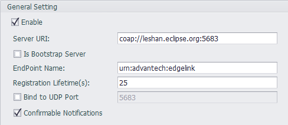
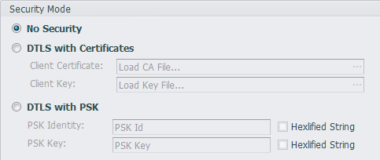
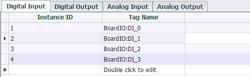
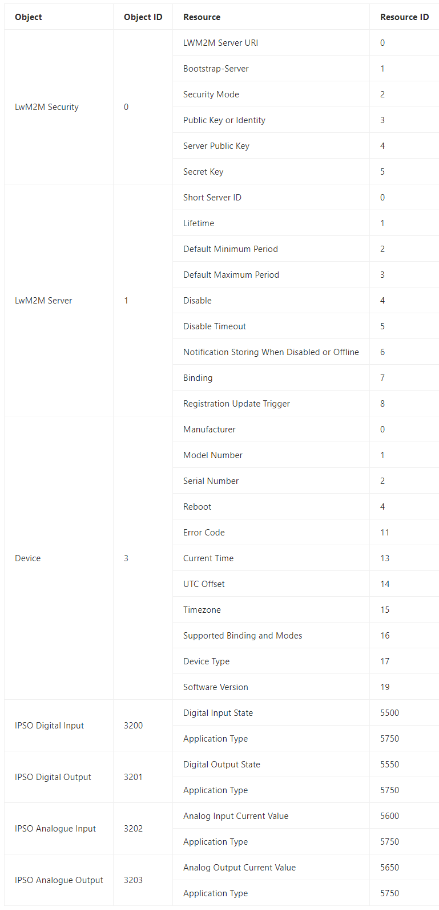

## LwM2M

The LwM2M cloud service plug-in is used to support the OMA Lightweight M2M protocol to implement remote management of devices on the cloud platform. See [Supported Objects and Resources](#supported-objects-and-resources) for the capability of this plug-in.

### Settings

#### General Settings

- **Enable**: Check to enable this plugin
- **Server URI**: Enter the full URI of the server.
- **Is Bootstrap Server**: If the `Server URI` related to a Bootstrap Server, it should be checked here.
- **EndPoint Name**: Enter the end point name of this device. This name should be named according to the management rules of the server.
- **Registration Lifetime(s)**: Specify how often this device is registered with the server, in seconds.
- **Band to UDP Port**: Check this box and fill in the value of 1 ~ 65534 to band the Lightweight M2M device to the specified port.
- **Confirmable Notifications**: Lightweight M2M messages can be sent as a Non-confirmable or as a Confirmable message, you can specify the behavior of the client by this option.

#### Security Mode

- **No Security**：Select this option to use an in-secure connection. In this case, the `Server URI` should be filled with `coap://` instead of the address starting with `coaps://`. Conversely, if you choose the two security options below, then the `Server URI` should be filled with the address starting with `coaps://`.
- **DTLS with Certificates**：Use a secure connection for a given client certificate. Load the client certificate file in the `Client Certificate` and load the client certificate key file in the `Client Key`.
- **DTLS with PSK**：Use the secure connection of the given PSK method. Please fill in the PSK string in `PSK Identity`. If the string is a hexadecimal format string, please check the `Hexlified String` option. Fill the `PSK Key` with the PSK key and check the `Hexlified String` option as appropriate.

#### Tag List Settings

Currently, you can map the tag to the four I/O objects defined by the IPSO (Digital Input, Digital Output, Analog Input, Analog Output). In the four types of tag lists, double-click the tag name field and select the tag to be mapped in the dialog, then the tag will be added to the tag list.

The default `Instance ID` is automatically incremented, you can click the `Instance ID` field to modify it.

### Supported Objects and Resources

