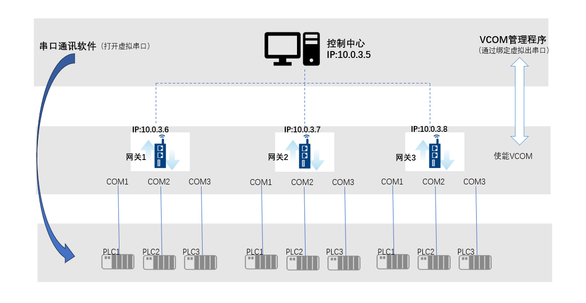

## 串口PLC远程运维

一般场景为 PC 机（控制中心）与网关之间有网络连接（例如VPN），网关下面连接了串口设备（例如PLC），客户期望在 PC 机（控制中心）使用串口设备配套的串口通信软件，对串口设备进行配置

### 应用架构:

#### 操作步骤：

1. 通过EdgeLink Studio开启网关的VCOM功能, 下载配置文件到网关

2. 在PC 机（控制中心）安装 VCOM管理程序，VCOM 管理程序安装包下载链接：[https://www.advantech.tw/support/details/utility?id=1-24KJ5E7](https://www.advantech.tw/support/details/utility?id=1-24KJ5E7) 选择其中的 SetupEdgeLinkVCOM 开头字样的安装包下载即可。

3. 通过VCOM管理程序将网关的串口虚拟到PC 机（控制中心），例如网关1的COM1连接了PLC1，想要对此PLC进行配置，则将网关1的COM1绑定到VCOM管理程序，此时可以在VCOM管理程序中看到被虚拟出来的串口以及串口号

4. 在PC 机（控制中心）通过串口通信软件打开虚拟串口，对串口设备进行配置

**关于VCOM管理程序配置的详细说明请参考[2.9.8 VCOM](../systemsetting/VCOM.html)章节**

