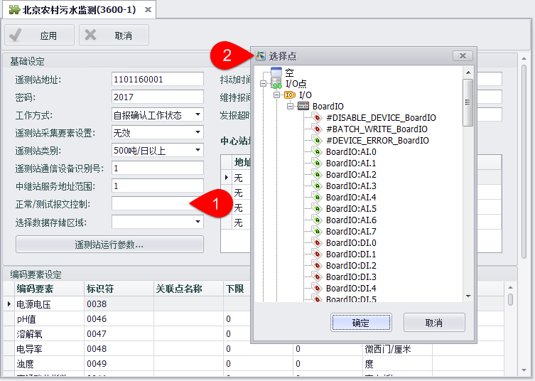
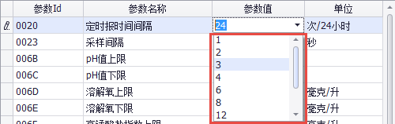

## 北京农村污水监测系统 ##

EdgeLinkStudio系统支持插件式开发，“北京农村污水监测”是实现水务系统相关设定功能的一个插件，包含的内容有基础信息设定、编码要素设定及遥测站状态和报警信息。

###基础设定###

遥测站基础信息、中心站地址和遥测站运行参数在“基础设定”面板中设置。初次设置时，系统将自动给出默认值，如上图所示。

工作方式包括“1-自报工作状态”、“自报确认工作状态”、“查询/应答工作状态”、“调试或维修状态”。

遥测站采集要素设置可选择有“无效”或“有效”。遥测站类别包括“500吨/日以上”、“100~500吨/日”、“100吨/日以下”。

“正常/测试报文控制”中，用户可以双击文本框选择一个Tag点来标识当前设备发送的报文是正常或测试。例如设备中设定DI.0为正常，DI.1为测试，则在系统中将“正常/测试报文控制”点置为DI.0可标识当前为正常发送报文，将“正常/测试报文控制”点置为DI.1可标识当前为测试发送报文。

“抖动时间”是指上一个控制点开关抖动时间，单位毫秒（ms）。“最小间隔”是指报文发送的最小间隔，单位毫秒（ms）。

中心站地址共有4个，每个地址中包括IP地址、端口号和备用地址。用户可以双击地址列表中的一条修改地址。

点击“遥测站运行参数”按钮将弹出设置框，新创建的设备遥测站运行参数具有默认值，其中“定时报时间间隔”为24次/24小时，“采样间隔”为300秒，其他参数均为0。

在遥测站运行参数中，“定时报时间间隔”的取值有1、2、3、4、6、8、12、24、48、96等10种，用户需在“参数值”列的下拉列表中选择相应的取值：

此外，“采样间隔”参数的取值上限为9999；pH值的取值上限为14，下限为0，若输入的参数超出取值范围，则系统将给出提示。

遥测站运行参数中某些参数属于编码要素，若修改这些参数值，则在编码要素列表中的相应数值也会随之修改。例如将“定时报时间间隔”设置为8次/24小时，“采样间隔”设置为500秒，PH值上、下限分别设置为13、6，溶解氧上下限分别设置为12.455、6.7，电导率上下限分别设置为5.15、3.015：

点击“确定”按钮保存设置，则在编码要素列表中对应的值会随之更改。

在遥测站运行参数设置框中点击“恢复出厂设置”按钮将会把所有参数恢复到初始默认值，其中“定时报时间间隔”为24次/24小时，“采样间隔”为300秒，其他参数均为0。

###编码要素设定###

在编码要素列表中用户可以为编码要素指定对应的Tag点，双击“关联点名称”文本框，在弹出的Tag点对话框中选择一个Tag点即可。选择“空”时将会清除Tag点。

###遥测站状态和报警信息###

在遥测站状态和报警信息列表中用户可以为各个监控的状态值指定对应的Tag点，双击“关联点名称”文本框，在弹出的Tag点对话框中选择一个Tag点即可。选择“空”时将会清除Tag点。

在编码要素列表和遥测站状态和报警信息列表中添加了关联点后，会提示用户是否启用系统的周期存储功能，并将存储周期设置为60秒。

点击“Yes”按钮即可完成设置。

