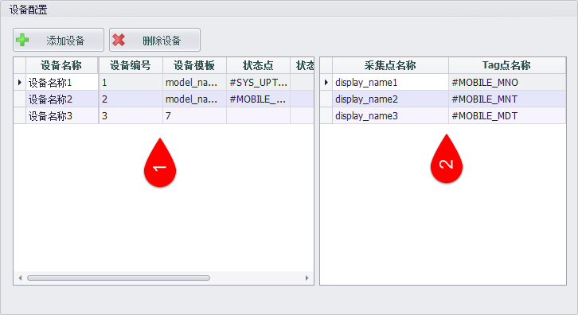

## 航天晨光云网配置 ##

EdgeLink Studio为航天晨光股份有限公司定制开发了航天云网相关数据的配置功能。在航天云网配置界面中，用户可以设置连接航天云网的参数及设备信息，用于采集设备的实时数据并上传到云平台。

1.打开“航天云网”配置页面。

2.选择“启用航天云网”，填写基本配置。

3.完成设备配置。

4.点击应用，完成配置。

###基本配置###

EdgeLink Studio航天云网数据配置是连接设备和云平台的中间环节，设备必须通过航天云网数据配置进行数据上传。在使用航天云网接入设备时，首先在云平台中配置必要的信息，配置完成后，将会获得云平台生成的设备ID（IOT ID）及密钥（Access Key），同时，云平台将为设备接入提供相应的实时数据采集接口和设备状态采集接口，将设备ID（IOT ID）、密钥（Access Key）、实时数据采集接口、设备状态采集接口填写到EdgeLink Studio航天云网数据配置页面基本配置的相应参数中，并指定数据上报周期，云网基本配置就完成了。

###设备配置###

EdgeLink Studio航天云网数据配置中的设备配置结构与云平台中的设备配置结构相同，都分为设备和采集点两个层级。在设备列表中显示和维护设备信息，选择列表中的一个设备后，在右侧采集点列表中显示该设备下的数据采集点及其对应的Tag点信息，用户可以在此列表中维护采集点信息。

在设备接入云平台前，需要在云平台端对准备接入的设备（如设备型号、设备类型等）及设备下包含的需要采集的数据点进行分类整理，常规的设置有四个步骤：①设置接入设备；②接入设备按型号分类；③设置设备型号下的数据采集点；④设置数据采集点的显示名称和数据上传的识别名称。在EdgeLink Studio航天云网数据配置的设备配置中采用与云平台中的设置相对应的设置方法。

####1.设置接入设备。####

点击设备列表上方的“添加设备”按钮，在设备列表的最低端增加一行设备信息，用户可以在设备列表中数据接入设备的“设备名称”、“设备编号”、“状态点”、“状态数值是否在data_url中发送”、“当设备状态非正常时是否发送data数据”等信息。

####2.设置设备模板。####

在设备信息列表的“设备模板”列，用户可以在下拉列表中选择设备的型号，即“设备模板”。设备模板中包含了模板信息及模板下包含的采集点信息。

1.点击设备模板单元格弹出设备模板选择框。

2.在模板较多时，可以通过查询框快速查找模板。

3.当存在可用模板时，点击选择模板，选择完成后模板选择框将自动关闭。

4.若不存在可用模板，点击“Add New”按钮创建新模板或修改现有模板。

5.点击选择框左下角的“×”按钮关闭模板选择框。

为设备选择了模板后，该模板下包含的采集点将添加到该设备。

####3.确定每个型号的数据采集点。####

从模板选择框中可见，设备模板中包含了“模板序号”、“模板名称”、“模板类型”、“生成厂家”和“描述”等信息，除此之外，模板中还包含了各个模板下的采集点信息，点击“Add New”按钮可以在弹出的模板页面中维护模板信息。

用户可以点击“添加设备模板”和“删除设备模板”按钮添加或删除模板，在模板列表中可以直接鼠标点击进入文本框修改模板内容。选中一个模板后，在右侧的采集点列表中将显示该模板下的采集点信息，用户可以点击“添加采集点”和“删除采集点”按钮添加或删除采集点。采集点信息包含“采集点名称”、“显示名称”、“描述”和“数据类型”等信息，其中采集点名称为上传数据时采集点的唯一标识，显示名称为该采集点的实际含义，数据类型分为布尔、整型和浮点型三种，由用户根据采集点的实际情况进行选择。 

点击模板页面右下角的“应用”按钮可以将选中的模板添加到设备。

若设备使用的设备模板被修改，则设备的采集点也会刷新，与最新的设备模板的采集点保持同步，同时，与采集点对应的Tag点也会清空，以便重新设置。

####4.为设备采集点设置对应的Tag点。####

在设备配置区域右侧采集点列表中显示该设备所使用的设备模板下的数据采集点名称及其对应的Tag点名称。双击Tag列单元格，在弹出的Tag点选择框中选择对应的Tag点。

只有为所有采集点设置对应的Tag点才能保存设置，否则将弹出提示：

完成“基本配置”和“设备配置”后，点击“应用”按钮即可保存配置。