## AWS

AWS云服务插件支持与Amazon AWS IoT连接，将tag值上报到云端。

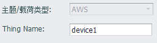

- **Thing Name**: 指定本设备在AWS IoT上对应的`事物`名称。

### 其他配置说明

[点表配置说明](./others/TagList_Setting.html)   

[断点续传配置说明](./others/resume.html)

[点表导入导出配置说明](./others/excel.html)

### 工程配置向导（本说明仅供参考，AWS IoT配置方式请以AWS官方文档为准）

#### 1. 创建策略

   登录AWS IoT Core管理界面，从左边的菜单面板中选择`安全`->`策略`，然后在页面中点击`创建策略`按钮，如下图所示。

   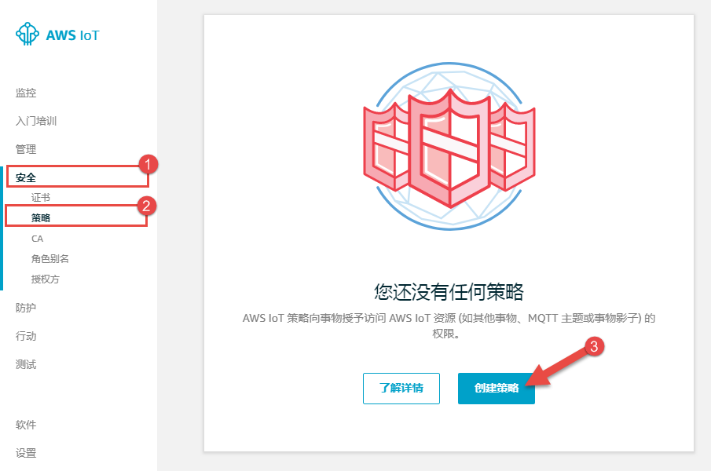

   

   

   

#### 2. 设定策略名称及声明

   在策略创建页面中，`名称`栏位填入相关策略名，本例中是`gateway`；在添加声明的`操作`和`资源ARN`栏位分别填入相关设定值，本例为了方便起见，全部都以`*`填入，并在`效果`设定栏位选择`允许`，然后点击`创建`。

   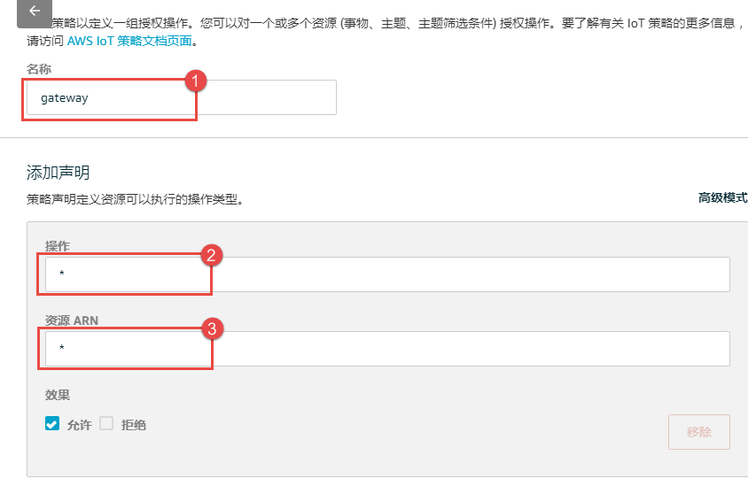

#### 3. 注册事物

   从左边的菜单面板中选择`管理`->`事物`，然后在页面中点击`注册事物`按钮，如下图所示。

   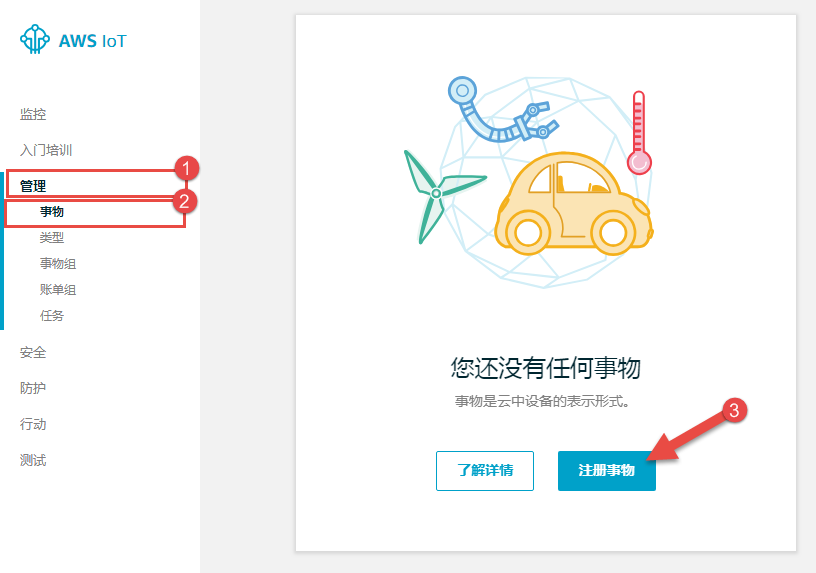

#### 4. 注册单个AWS IoT事物

   在`创建AWS IoT事物`页面中，点击`创建单个事物`按钮，如下图所示。

   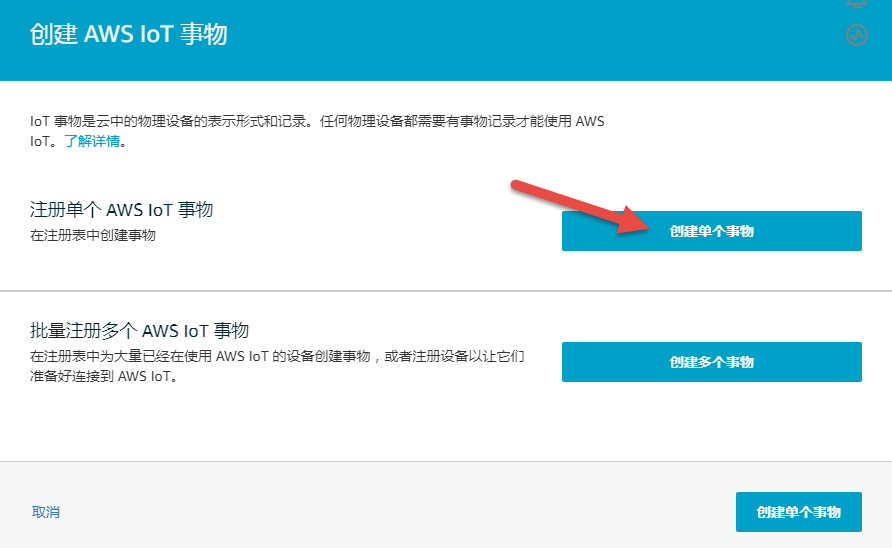

#### 5. 将设备添加到事物注册表

   在`名称`栏位输入事物名称（*EdgeLink Studio工程设置中相应的`Thing Name`栏位将会使用此名称*），本例采用`device1`作为事物名称，然后点击下一步。其他选项视实际情况设置，本例中并未设置。

   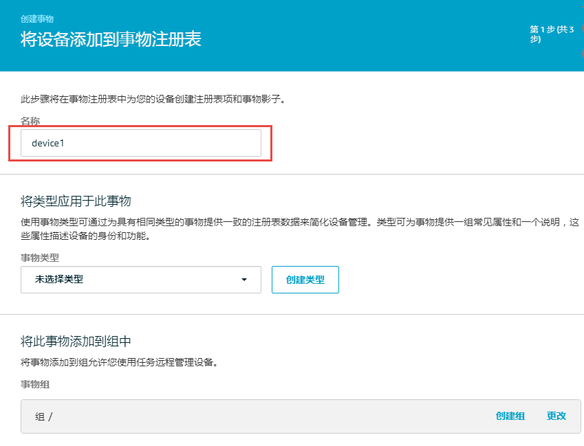

#### 6. 添加事物的证书

   在添加证书的步骤中，本例使用最简单的方式：`一键式创建证书`，如下图所示。

   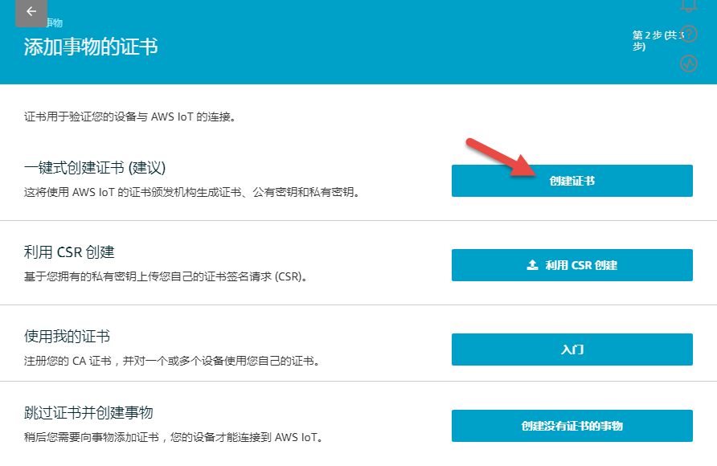

#### 7. 下载及激活证书，并附加策略

   证书创建完成后，将证书及秘钥文件下载到本地（将被用于工程配置），除了事物的证书外，AWS IoT的根证书也要下载（如下图中的2处），在根证书下载页面中，请选择`RSA 2048 位密钥:Amazon Root CA 1`下载，直接下载链接：[Amazon Root CA 1](https://www.amazontrust.com/repository/AmazonRootCA1.pem)。然后点击`激活`按钮来激活事物证书，接着点击`附加策略`按钮。

   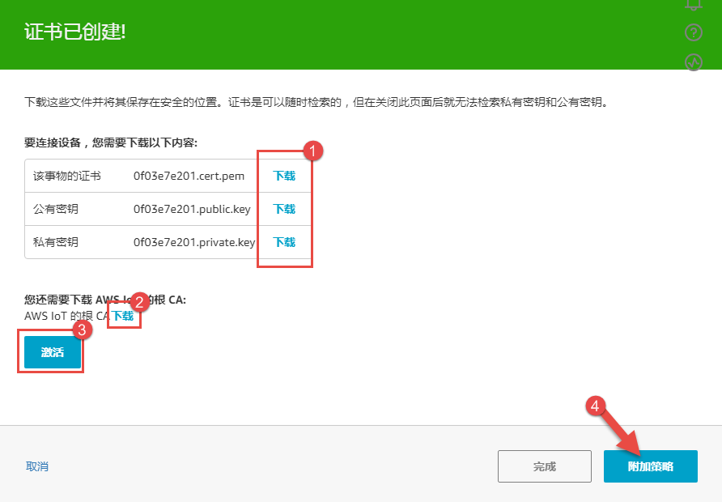

#### 8. 添加事物的策略

   选中之前建立的策略`gateway`，然后点击`注册事物`按钮来完成事物注册，至此，在AWS IoT上注册事物的任务就完成了。

   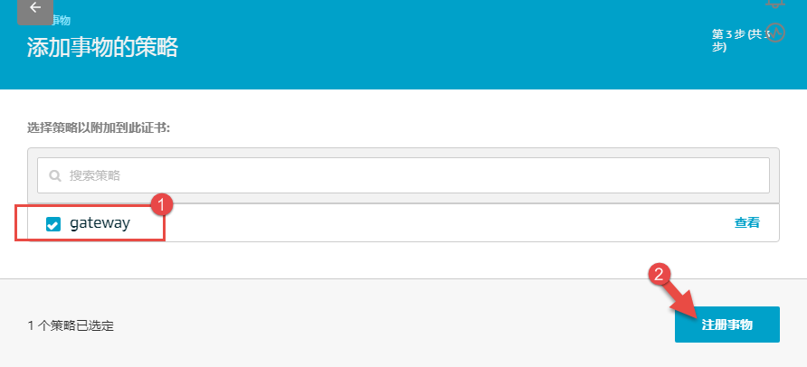

#### 9. 复制专有终端节点地址

   终端节点地址将被用于工程配置中的主机地址栏位，从左边的菜单面板中选择`设置`，然后将`终端节点`中的字符串完整复制出来。

   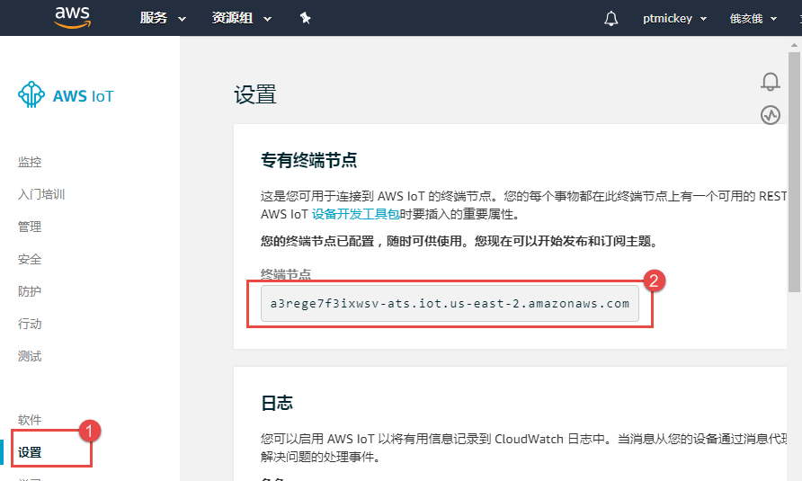

#### 10. 配置EdgeLink工程

   在EdgeLink工程配置中，请注意下图红框位置的选项，其他栏位依工程需要进行配置。

   * 主机：使用上文提到的终端节点地址

   * 端口号：8883

   * 启用SSL：必须启用

   * SSL验证方式：双向验证，`CA File`选择已下载的`Amazon Root CA 1`证书，`Cert File`及`Key File`分别选择已下载的事物证书文件（xxx-certificate.pem.crt）和秘钥文件（xxx-private.pem.key），这些文件都是在上述第7步中下载的。

   * 用户名和密码：留空即可

   *  Thing Name：输入在AWS IoT上建立的事物名称，上述第5步中有提到。
 
   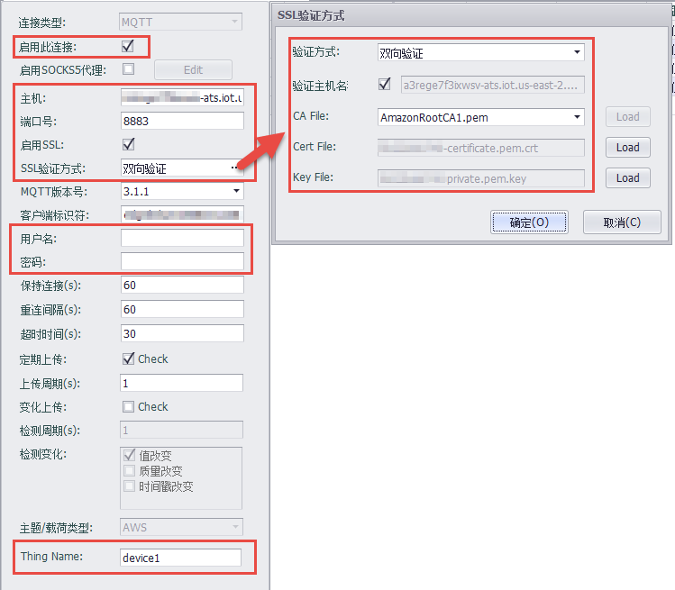

### 参考链接

* [诊断连接问题](https://docs.aws.amazon.com/zh_cn/iot/latest/developerguide/diagnosing-connectivity-issues.html)
* [X.509 证书和 AWS IoT](https://docs.aws.amazon.com/zh_cn/iot/latest/developerguide/managing-device-certs.html)
* [配置并测试规则](https://docs.aws.amazon.com/zh_cn/iot/latest/developerguide/config-and-test-rules.html)
* [AWS IoT SQL 参考](https://docs.aws.amazon.com/zh_cn/iot/latest/developerguide/iot-sql-reference.html)
