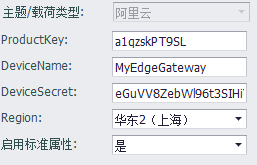
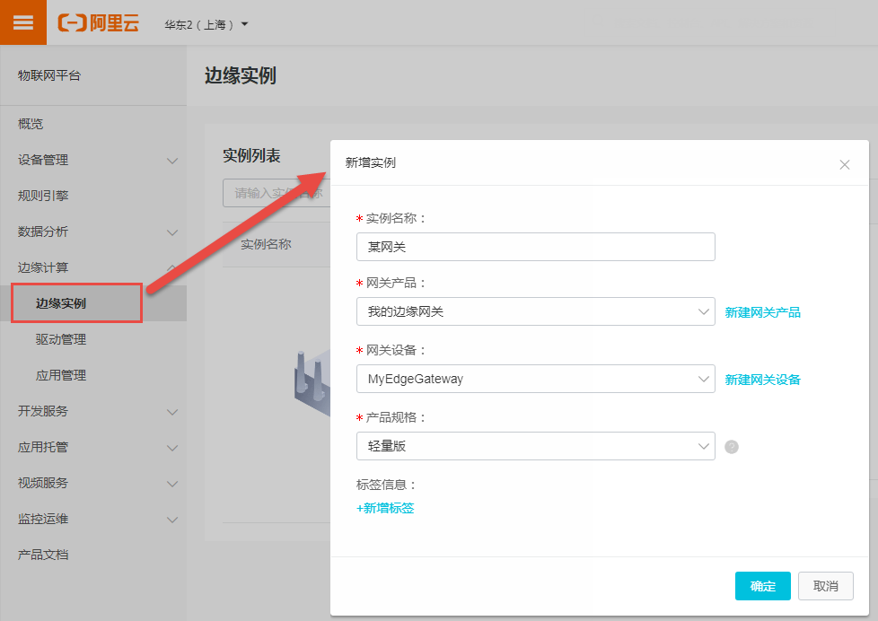
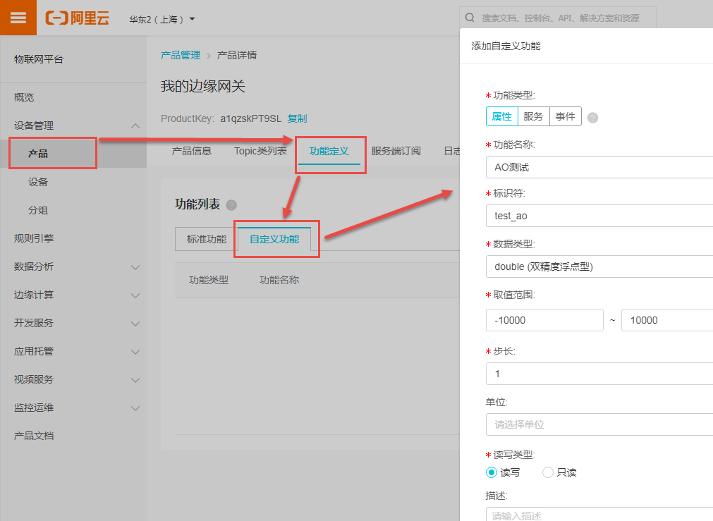
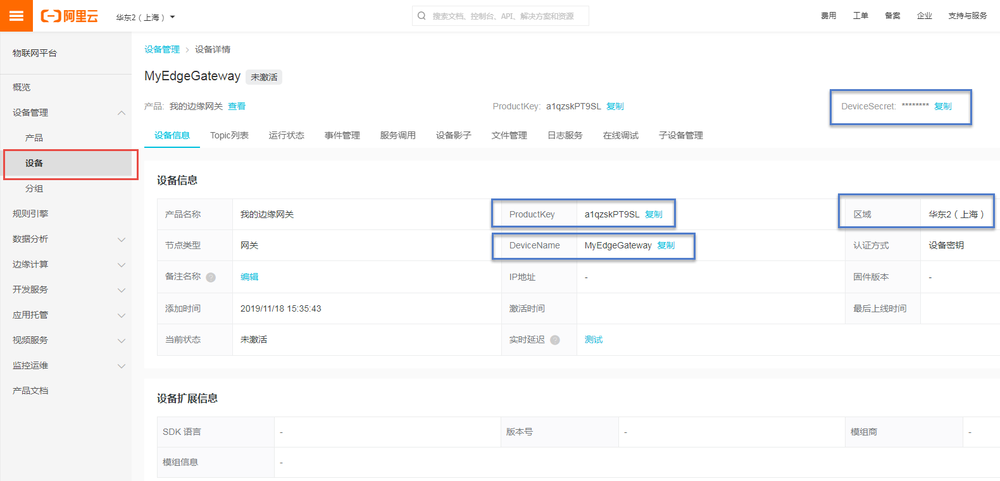

## 阿里云

阿里云插件支持与阿里云物联网平台连接，上报网关属性值并支持远程管理。

- **ProductKey**，**DeviceName**，**DeviceSecret**: 填入阿里云物联网平台上设备详情页面中显示的对应值。
- **Region**: 选择与设备详情中显示的服务区域一致的值。
- **启用标准属性**: 启用后，此MQTT应用将会随周期上报数据上报边缘设备的标准属性（例如`内存使用率`、`CPU使用率`等），默认启用。

### 其他配置说明

[点表配置说明](./others/TagList_Setting.html)   

[断点续传配置说明](./others/resume.html)

[点表导入导出配置说明](./others/excel.html)

### 工程配置向导（本说明仅供参考，实际操作请以阿里云官方界面及文档为准）

#### 1. 新增边缘实例

登录阿里云物联网平台管理界面，从左边的列表中选择`边缘计算`->`边缘实例`，然后在页面中点击`新增实例`按钮，按实际情况填写各个栏位，产品规格请选择轻量版，如下图所示。

   

#### 2. 添加自定义功能（属性）

在物联网平台管理界面左侧列表选择`设备管理`->`产品`，然后选择`功能定义`标签，此处显示的`标准功能`页面中显示的即上述的`启用标准属性`功能需要上传的属性值，因为我们要添加的是非标准的属性，所以要切换到`自定义功能`标签页，然后点击`添加自定义功能`按钮来添加新的自定义属性，如下图。

功能类型务必要选择*属性*（其他类型目前不支持），**功能名称**填写要在网页上显示的名称，本例为`AO测试`；**标识符**填写与网关上配置的tag点名或别名一致的名称，注意必须要符合阿里云的名称字符限制；**数据类型**请在整数和浮点数类型中选择，其他类型的目前不支持，需要注意的是如果选择的是整数，则在网关配置的MQTT点列表中，小数位数要填0，否则会导致云平台解析错误；其他配置项按实际需要填写即可。

#### 3. 配置EdgeLink工程

在物联网平台管理界面左侧列表选择`设备管理`->`设备`，然后在设备列表中选择设备查看，可以进入`设备信息`页面，显示如下，将下图蓝框处标注的几处信息填到EdgeLink配置页面的对应栏位即可。

EdgeLink配置页中MQTT相关的主机、端口号、客户端标识符、用户名、密码都无需修改，本插件会自动根据填入的设备信息自动生成。

如需使用SSL或TLS连接，可勾选启用SSL，选择服务器端验证并使用默认CA文件接口即可。

