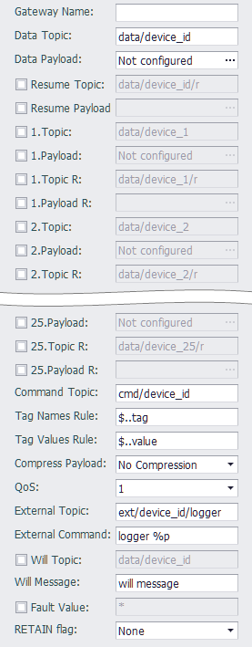

## Custom MQTT

Custom MQTT提供了一种自定义的主题/载荷方案，其中主题/载荷可由用户自定义，用于测试验证MQTT数据通信，或者应用于一些需要自定义载荷的云服务上。
除了Tag数据上传和修改之外，Custom MQTT还支持由服务器下发特定主题的消息来执行指定命令的功能，以便特殊应用的扩展。

---

### 参数设定



- **Gateway Name**:
  
    选填项，用于发布数据模板中使用了子设备模型时，当从点名称无法解析到子设备名称时，将会使用此设定值作为子设备名称。若此名字未指定而又被用到时，将会使用 `_DEFAULT_DEV_NAME_` 作为子设备名。

- **Data Topic**:
  
    必填项，指定用于发布实时数据的主题。为了便于在云服务端解析来自不同设备的数据封包，建议在设定此主题时将设备唯一标识加入到主题中。

- **Data Payload**:
  
    必填项，用于指定发布实时数据载荷格式。
  
    [Payload配置说明](../resume/Libextext.html)

- **Resume Topic**:
  
    选填项，指定用于发布断点续传数据的主题。如果不指定，则使用`Data Topic`栏位的主题。

- **Resume Payload**:
  
    选填项，用于指定发布断线数据载荷格式。如果不指定，则使用`Data Payload`栏位的载荷格式。
  
    [Payload配置说明](../resume/Libextext.html)

- **[N].Topic**<br>**[N].Payload**<br>**[N].Topic R**<br>**[N].Payload R**:
  
    选填项，N 的范围是 1 - 25，表示 25 组可配置的主题载荷，其中:
  
  - **[N].Topic**: 表示实时数据的主题
  - **[N].Payload**: 表示实时数据载荷格式
  - **[N].Topic R**: 表示断点续传数据的主题
  - **[N].Payload R**: 表示断点续传数据的载荷格式。

- **Command Topic**:
  
    选填项，指定用于接收命令的主题。从云服务端往该主题发布数据可以修改设备上的Tag点值，默认支持的数据格式如下示例，Tag点及点值由户自定义，写封包中可以没有时间戳数据（即ts）。此项不填则该设备将不会接受云服务修改点值的命令。
  
    修改点值的封包举例如下：以下封包将会将`AO_1`的值写为12.88，`AO_2`的值写为18.76
  
  ```json
  {
      "w":[
          {
              "tag":"AO_1",
              "value":12.88
          },
          {
              "tag":"AO_2",
              "value":18.76
          }
      ],
      "ts":"2017-12-28T12:22:21+0000"
  }
  ```
  
    如果平台无法使用此格式来发送写点请求，那么可以自行编辑 `Write Names Rule`，`Write Values Rule` 这两个 [JSONPath](https://www.rfc-editor.org/rfc/rfc9535.html) 规则来实现对特定格式写点请求的解析。
  
    如果对 JSONPath 规则不熟悉，可以使用 https://jsonpath.com/ 在线平台来辅助生成所需的规则。

- **Write Names Rule**
  
    设置用于解析自定义报文中 tag 点名的 JSONPath 规则，默认值为 `$..tag`，请保证通过此规则解析出的是一个 JSON 字符串数组，每个字符串对应一个点名（如果在点表中有指定别名，那就要对应别名）。
  
    如果是需要组合子设备名和变量名，那么可以用 `;` 来拼接两个 JSONPath 规则，例如下发的写点值的报文如下，表示要写的点名和点值分别为：`PLC1:Status = 1`，`PLC1:Flags = 88`，`PLC1:PV = 123`，`PLC2:Status = 0`, `PLC2:PV = 456`，那么，将 `Write Names Rule` 设置为 `$..device;$..name`，`Write Values Rule` 设置为 `$..value` 即可正确解析。
  
  ```json
  [{
      "device": "PLC1",
      "data": [{
          "name": "Status",
          "value": 1
      },{
          "name": "Flags",
          "value": 88
      },{
          "name": "PV",
          "value": 123
      }]
  },{
      "device": "PLC2",
      "data": [{
          "name": "Status",
          "value": 0
      },
      {
          "name": "PV",
          "value": 456
      }]
  }]
  ```
  
    如果下发的写点值的报文如下所示，即子设备名称作为数组或对象名称存在，则可以用 `~` 来取这个名称。在上例的基础上，将 `Write Names Rule` 改为 `$[*].*~;$..name` 即可。
  
  ```json
  [{
      "PLC1": [{
          "name": "Status",
          "value": 1
      },{
          "name": "Flags",
          "value": 88
      },{
          "name": "PV",
          "value": 123
      }]
  },{
      "PLC2": [{
          "name": "Status",
          "value": 0
      },
      {
          "name": "PV",
          "value": 456
      }]
  }]
  ```

- **Write Values Rule**
  
    设置用于解析自定义报文中 tag 点值的 JSONPath 规则，默认值为 `$..value`，请保证通过此规则解析出的是一个 JSON 数组，其中的元素为字符串、数值或者布尔值，不能是对象和数据类型，且数组的长度跟 `Write Names Rule` 解析出的数组长度要保持一致。

- **Compress Payload**:
  
    此选项控制用于控制是否使用GZIP来压缩报文payload，默认是不压缩。如果设置为GZIP压缩，则务必确认云平台也采用同样的GZIP方式解压缩，同时，下发的cmd也必须是经过GZIP压缩的报文内容。

- **QoS**:
  
    此选项用于控制发布消息时使用的服务质量，默认值为QoS 1。
  
  * QoS 0: 最多分发一次，消息的分发依赖于底层网络的能力。接收者不会发送响应，发送者也不会重试。消息可能送达一次也可能根本没送达。
  * QoS 1: 至少分发一次，服务质量确保消息至少送达一次。
  * QoS 2: 仅分发一次，这是最高等级的服务质量，消息丢失和重复都是不可接受的。使用这个服务质量等级会有额外的开销。

- **External Topic**:
  
    此选项用于设置外部命令主题，该主题将被此设备订阅，并在接收到该主题的消息后执行下面 External Command 指定的任务。

- **External Command**:
  
    此选项与 External Topic 配合使用，用于指定接收到 External Topic 消息时要执行的命令行及参数。
    例如: `logger %p`, 此命令行将会在收到指定主题时将载荷内容写到系统日志中。<br>
    命令行参数除了常规文本之外，还支持以下三种通配符：
  
  * %t: 主题，该通配符在调用时将会用主题字符串替换。
  
  * %p: 载荷，该通配符在调用时将会用载荷字符串替换。
  
  * %pf: 载荷文件，在调用时会把载荷内容先写到文件，然后用文件名替换此通配符。
    
    > 请注意：在命令行字符串中不要使用这些字符：`换行符, |, &, ;, <, >, (, ), {, }`。
    > 另外因为MQTT主程序是以非root用户身份执行，所以请勿指定只有root用户才可以执行的命令，否则会导致执行失败。

- **Will Topic**:
  
    选填项，用于指定发布遗嘱消息的主题。

- **Will message**:
  
    选填项，用于指定发布遗嘱消息的内容。
  
- **Fault Vlaue**:
  
    当tag点的Quality为bad的时候，上传的数据。默认为\*，可自定义。

- **RETAIN flag**:
  
    设置发布消息的 RETAIN 标记设置策略
  
  - **None**: 表示不设置 RETAIN 标记
  - **For peroidic pub**: 表示为周期发布的数据设置 RETAIN 标记
  - **For diff pub** 表示为变化发布的数据设置 RETAIN 标记
  - **For peroidic & diff pub**: 表示为周期和变化发布数据都设置 RETAIN 标记。

**2.8.4.1开始支持多个TagList，可以分别设置上传方式**

- **重连后上传所有点**: 勾选后，断线重连时上传该TagList下所有tag

- **不上传劣质点**: 勾选后，不上传该TagList下Quality为bad的tag

- **变化上传所有点**: 勾选后，变化上传会上传该TagList下所有tag

### 其他配置说明

[点表配置说明](./others/TagList_Setting.html)

[断点续传配置说明](./others/resume.html)

[点表导入导出配置说明](./others/excel.html)
