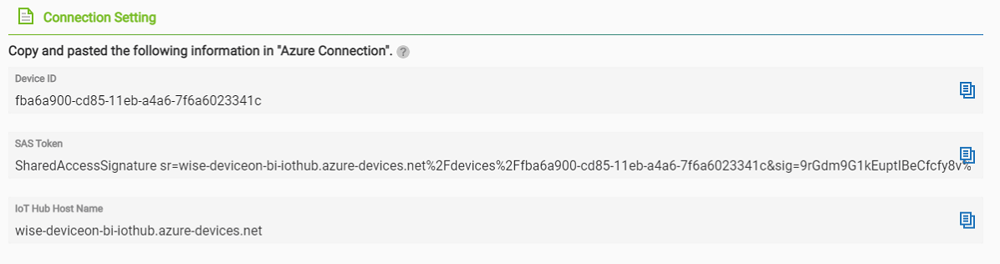
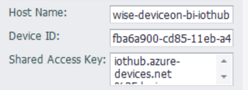

## DeviceOn/BI@Azure

EdgeLink中的DeviceOn/BI@Azure云服务插件支持与Azure IOT中心连接，该插件使用MQTT直连方式进行连接，配置项需要以下参数。

`Host Name：` 必填项，指定为Iot Hub Name

`Device ID：` 必填项，指定为Device ID

`Shared Access Key：` 必填项，指定为SAS Token

`Device Name`为选填项，不指定时，将会使用工程中配置的网关节点的名字

### 其他配置说明

[点表配置说明](./others/TagList_Setting.html)   

[断点续传配置说明](./others/resume.html)

[点表导入导出配置说明](./others/excel.html)

