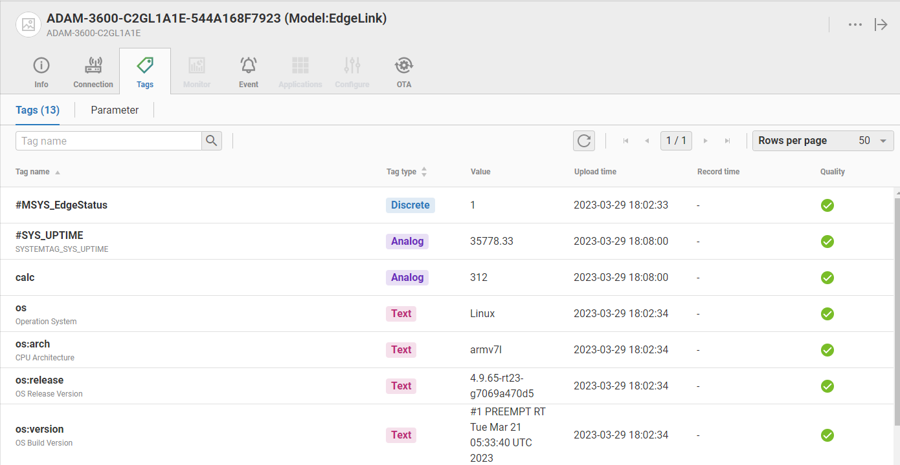
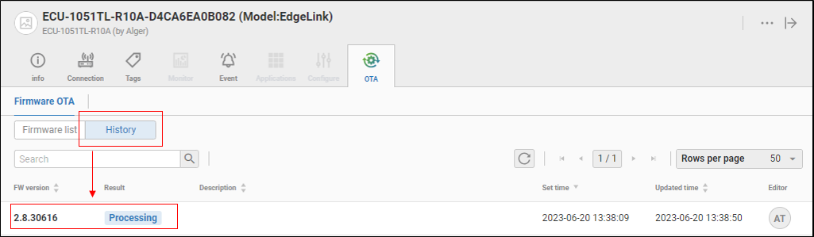

## EdgeSync 360/EdgeHub

### 前提：

$\qquad$ 1.  _网关与EdgeHub建立连接的前提是在EdgeHub建立设备并获取连接字符串_

$\qquad$ 2. _通过EdgeHub给网关下载工程或者升级image的前提是网关与EdgeHub已经建立连接_

### 功能列表：

 - [在EdgeHub获取连接字符串](#获取连接字符串步骤)
 - [网关与EdgeHub建立连接](#建立网关与EdgeHub连接)
 - [上传数据到EdgeHub](#上传数据到EdgeHub)
 - [通过EdgeHub给网关下载工程](#通过EdgeHub给网关下载edgelink-studio生成的工程文件)
 - [通过EdgeHub给网关升级image](#通过EdgeHub给网关升级image)

#### **获取连接字符串步骤：**

1. 在EdgeLink Studio中的在线页面选择您要添加到EdgeHub的网关，右键选择"复制设备信息到粘贴板"

2. 打开EdgeHub登录页面，输入账号密码进行登录

3. 进入Device Management

4. 选择添加EdgeLink设备

5. 点击Paste from Clipboard

6. 点击刚添加的设备，右侧出现设备信息，将Credential拷贝到粘贴板

#### **建立网关与EdgeHub连接：**

1. 打开EdgeLink Studio工程配置EdgeHub页面 "工程-->云服务-->Advantech-->EdgeSync 360/EdgeHub"，启用此连接

2. 将Credential Key粘贴到对应位置

3. 配置连接参数, [参数说明](#参数说明)

4. 配置tag点, [tag点配置说明](#tag点配置说明)

5. 下载工程文件到网关

6. 在EdgeSync 360/EdgeHub查看设备已经上线

#### **上传数据到EdgeHub**

$\qquad$ _网关已经在EdgeSync 360/EdgeHub上线_

1. 单击在线网关---> Tags

2. 其他功能说明可以参考EdgeSync 360/EdgeHub相关文档

#### **通过EdgeHub给网关下载EdgeLink Studio生成的工程文件**

1. 上传工程文件到EdgeSync 360/EdgeHub

    方式一：通过EdgeLink Studio进行上传工程文件到EdgeSync 360/EdgeHub

    步骤1. 保存工程并点击“工程导入EdgeSync 360”

    

    步骤2. 看到“编译成功”字样后，点击复制路径

    

    步骤3. 到EdgeSync 360/EdgeHub的工程加载界面

    方式二：直接在EdgeSync 360/EdgeHub添加EdgeLink Studio生成的工程文件

    步骤1. 在EdgeSync 360/EdgeHub界面点击“FileManagement”

    

    步骤2. 添加工程文件

    

2. 在EdgeSync 360/EdgeHub找到对应的工程文件，点击Add Dispatch

    

3. 添加一个Dispatch，填入Dispatch名称以及选择对应的设备

    

4. 点击Submit确定提交此次dispatch

    

5. 查看dispatch结果

    

#### **通过EdgeHub给网关升级image**

1. 确认设备在线，并点击进入功能页面.
2. 选择 ' OTA ' 功能
3. 点击 ' Firmware OTA ' 下方的 ' Firmware list ' 可以看到所有可以用于升级的文件
4. 点击 2.8.30616 后方的 ' … ' ，选择 ' Download And Upgrade '

    

5. 可以看到 ' Set firmware download success… ' 的信息

    

6. 这时候用户可以点击' Firmware OTA ' 下方的 ' History ' 查看到当前升级的状态

    

7. 点击 ' Refresh ' 按钮可以刷新当前升级的状态，直到看到 ' Success ' 时，表示升级成功

    

*************************

### 参数说明

| 参数 | 参数说明                                                                                                                                 |
| ---- | ----------------------------------------------------------------------------------------------------------------------------------------|
|`连接类型`|MQTT连接，不可修改                                                                                                                     |
|`启用此连接`|勾选代表启动当前页面的连接，当前页面配置生效                                                                                            |
|`定期上传`|定期上传模式：启用，不启用和控制点控制上传                                                                                                |
|`定期上传控制点`|选择定期上传控制点。点值为非0时上传数据；点值为0时不上传数据                                                                          |
|`上传周期`|定期上传周期，单位为秒                                                                                                                  |
|`变化上传`|变化上传模式：启用，不启用和控制点控制上传                                                                                                |
|`变化上传控制点`|选择变化上传控制点。点值为非0时上传数据；点值为0时不上传数据                                                                          |
|`检测周期`|点变化的检测周期                                                                                                                        |
|`检测变化`| 选择检测点的哪些参数变化，可选的参数包括点值、质量和时间戳。tag点值的变化检测会受到在tag点表中配置的阈值类型、阈值宽度和抖动时间这三个参数的影响 |
|`重连后发布所有点`|EdgeLink与云端建立连接时是否将当前所有的点的值上传一次到云端，使能发送不使能不发送，默认使能                                           |
|`启用断点续传`|断点续传的启用开关（如需实现断点续传请先开启数据记录功能[数据记录](../../DataLogger/DataLogger.html) ，并将需要断点续传的数据存储到本地  ）                                                                                                             |
|`断点前数据`|默认0，从断线前n秒开始续传数据                                                                                                                  |
|`重连后数据`|默认0，续传到断线重连后n秒的数据                                                                                                |
|`续传启动延时`|默认120，断线重连后间隔n秒开始续传                                                                                                      |
|`Bad Quality Tag`|Tag Quality不为0（GOOD）的上传模式：Pub * once; Pub * always; Still pub value; Don't pub                                          |

********************************************************

### tag点配置说明

| 参数 | 参数说明 |
| ---- | -----------------------------------------------------------------------------------------------------------------------------------------------|
|`点名称`|双击此栏可以添加设备中的tag点。                                                                                            |
|`别名`|设置上传数据时的名称，别名为空时使用点名称作为数据名称。                                                                                            |
|`点类型`|显示tag点的数据类型，此项为只读项，在此点表中不可修改。如需修改，请到数据中心中修改原始tag点属性。                                              |
|`阈值宽度`|用于配置点值的变化检测方式，共有两种方式：绝对值和百分比。当类型配置为绝对值时，会将tag当前点值与上一次上传的tag点值的差值取绝对值后与 阈值宽度 进行比较，如果超出则认为tag点发生了变化；当类型配置为百分比时，会将tag当前点值与上一次上传的tag点值的差值取绝对值后与上一次上传的tag点值进行比较，如果变化超过 阈值宽度 ，则认为tag点发生了变化。                                                                                                           |
|`阈值宽度类型`|用于指定tag点检测的阈值宽度值，tag点的值变化在阈值内不会触发点值变化。                                                                 |
|`最高量程`|点属性，云连接配置界面不可更改，需在数据中心中修改量程，量程不对EdgeLink限制                                                                |
|`最低量程`|点属性，云连接配置界面不可更改，需在数据中心中修改量程，量程不对EdgeLink限制                                                                |
|`单位`|只读项，当阈值宽度类型为百分比时会显示百分号，用于与绝对值区分。                                                                |
|`抖动时间`|单位为秒，当检测到点值超过 阈值宽度 后，就会开始进行 抖动时间 的验证。当tag点值在指定的 抖动时间 内都被检测为超出 阈值宽度 才会被最终判定为有点值变化，此时才会上传变化的值，否则会被判定为点值抖动，将不被上传。                                                                |
|`小数位数`|用于指定模拟量tag点值的小数点后的数据位数，默认为2，当实际的tag点值只有整数值时，可以将此栏位设置为0以节省数据流量。                                    |
|`描述`|显示tag点的描述，此项为只读项，在此点表中不可修改。如需修改，请到数据中心中修改原始tag点属性。                                                            |

