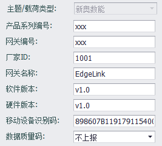
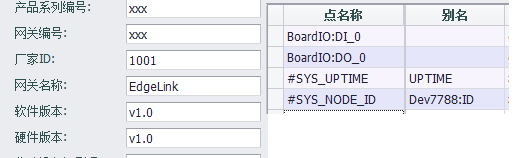

## 新奥数能

新奥数能云服务插件支持与数能IoT云平台连接，将tag值上报到云端。



- **产品系列编号**: 供应商产品系列编号，由新奥数能提供。
- **网关编号**: 物联电表编号、网关编号。
- **厂家ID**: 填入数能IoT平台期望的数值。
- **网关名称**: 上报的设备名称，留空则自动使用工程节点名称。
- **软件版本**: 网关的软件版本标识，视数能IoT平台需求修改。
- **硬件版本**: 网关的硬件版本标识，视数能IoT平台需求修改。
- **移动设备识别码**: 填入网关所使用的移动模块的设备识别码。
- **数据质量码**: 选择是否在上报数据时包含数据质量码，默认不上报。

因为协议规定网关上报的数据是以子设备为单位来组织的，所以在配置点表时需要注意定义子设备。

子设备的定义方式为，在点表中以英文冒号（`:`）来区隔子设备名称和子设备下的点名称。冒号前的名称将作为子设备名，冒号后的名字作为子设备的点名，如果点名或别名中没有冒号，则使用设置中的网关名称作为子设备名。

举例来说，以下的点配置，将会以三个子设备数据上传 **BoardIO**:{DI_0,DO_0}, **EdgeLink**:{UPTIME}, **Dev7788**:{ID}。从例子中可以看出，如果有设置别名，则以别名为准；如果点名中不含冒号（如`UPTIME`），则自动归属在以`网关名称`为名的子设备下。



上报的数据报文片段示例如下：

```json
{
	"ver":"2.1.0",
	"pKey":"xxx",
	"sn":"xxx",
	"ts":1510732255,
    "devs":[
        {
            "dev":"BoardIO",
            "d":[
                {
                    "m":"DI_0",
                    "v":1,
                    "ts":1510732250
                },
                {
                    "m":"DO_0",
                    "v":0,
                    "ts":1510732250
                }
            ]
        },
        {
            "dev":"EdgeLink",
            "d":[
                {
                    "m":"UPTIME",
                    "v":15569,
                    "ts":1510732250
                }
            ]
        },
        {
            "dev":"Dev7788",
            "d":[
                {
                    "m":"ID",
                    "v":15,
                    "ts":1510732250
                }
            ]
        }
    ]
}
```
### 其他配置说明

[点表配置说明](./others/TagList_Setting.html)   

[断点续传配置说明](./others/resume.html)

[点表导入导出配置说明](./others/excel.html)
