## LwM2M

LwM2M云服务插件用于支持OMA Lightweight M2M协议，实现云平台对设备的远程管理，本例实现的Lightweight M2M及IPSO对象及资源请参见[已实现的对象及资源列表](#已实现的对象及资源列表)。

### 参数配置说明

####  通用配置

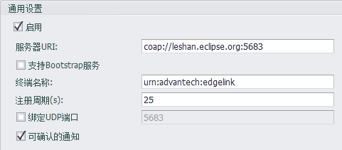

- **启用**： 勾选以使能此插件
- **服务器URI**：输入欲连接的服务器的完整URI。
- **支持Bootstrap服务**：如果服务器URI中输入的是Bootstrap服务器地址，那么此处应勾选，否则留空。
- **终端名称**：输入本设备的终端名称，此名称应遵循服务器端的管理规则来命名。
- **注册周期(s)**：指定每个多久向服务器进行一次设备注册，单位是秒。因Lightweight M2M底层使用的是UDP协议，所以设备是通过NAT方式连接到服务器时，使用较小的注册周期（例如25秒）可以大概率保证服务器发起的请求可以到达设备端。
- **绑定UDP端口**：勾选此项并填入1~65534的值可以让Lightweight M2M设备绑定到指定端口。
- **可确认的通知**：Lightweight M2M设备发送的消息可以是不可确认的（Non-confirmable）或者是可确认的（Confirmable），此选项用于决定发送消息的类型。

#### 安全设置

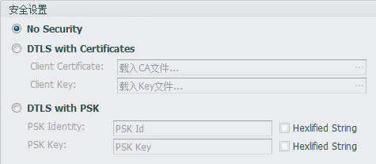

- **No Security**：选择此项表示不使用安全连接，此时在`服务器URI`中应填写`coap://`而不是`coaps://`开头的地址，与之相反，如果选择下面的两个安全选项，那么在`服务器URI`中应填写`coaps://`开头的地址。
- **DTLS with Certificates**：使用给定客户端证书方式的安全连接，请在`Client Certificate`中加载客户端证书文件，在`Client Key`中加载客户端证书秘钥文件。
- **DTLS with PSK**：使用给定PSK方式的安全连接，请在`PSK Identity`中填入PSK字串，如果该字串是需要16进制格式转码的，请勾选后面的`Hexlified String`选项；同时在`PSK Key`中填入PSK秘钥，视实际情况勾选后面的`Hexlified String`选项。

#### 点表配置

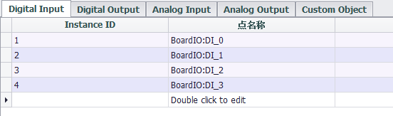

​	目前可以将Tag点映射到IPSO定义的四种I/O对象中（Digital Input, Digital Output, Analog Input, Analog Output），请在四种类型的点表中，双击点名称栏位，选择需要映射的Tag点后即可添加到点表中。

​	默认的Instance ID是自动增长的，如需指定，可以点击Instance ID栏位进行修改。

### 已实现的对象及资源列表

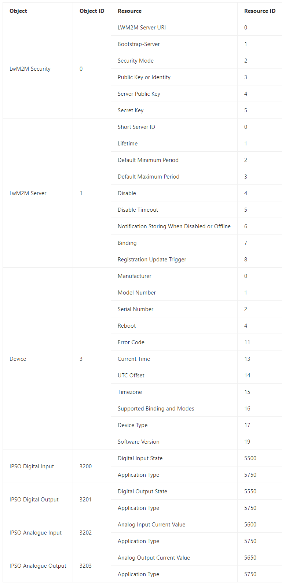

### 用户自定义对象

除以上四种I/O对象外，还可以将自定义对象XML文件导入系统中，并为导入的对象实体指定匹配的Tag点。

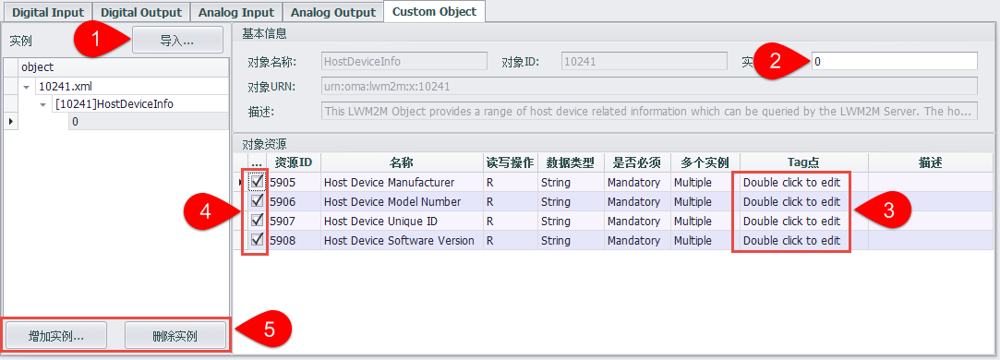

1.在Custom Object选项卡节目中点击`导入`按钮，选择要导入的XML文件，若文件格式正确，将在左侧树形结构中展示对象，并在鼠标选中实例时，在右侧显示实例详情。

2.在实例详情面板中，可以修改实例ID，但ID不能与该对象下的其他实例重复。

3.当`读写操作`选项不为“E”且`数据类型`为Integer、Float或Unsigned Integer的资源可以双击Tag点文本框绑定Tag点。

若`多个实例`选项为Single，则只能选择一个Tag点。

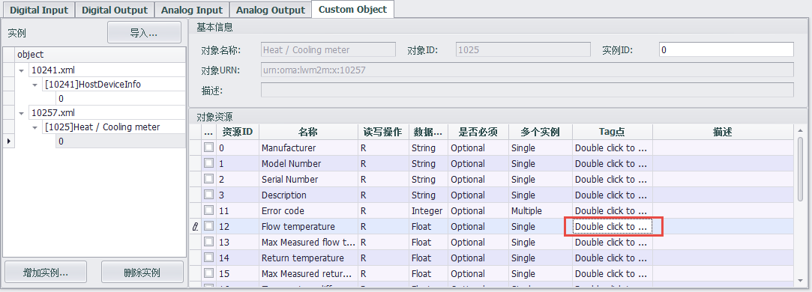

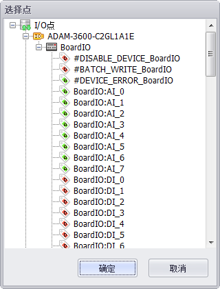

若`多个实例`选项为Multiple，则可以在弹出框中选择多个Tag点并排序。

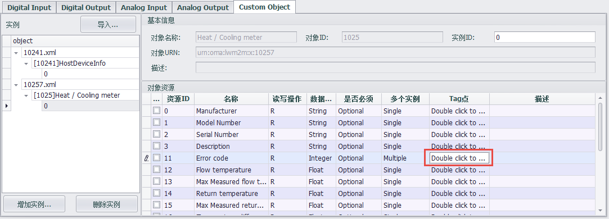

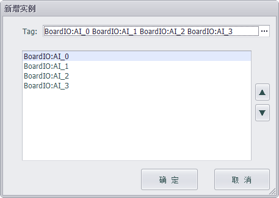

4.勾选资源列表前的复选框选择是否使用该资源，若`是否必须`选项为Mandatory，则必须勾选，且无法取消。

5.导入的对象支持`增加实例`和`删除实例`操作。

点击`增加实例`将增加一条与选中实例相同、instanceID增加1的新实例：

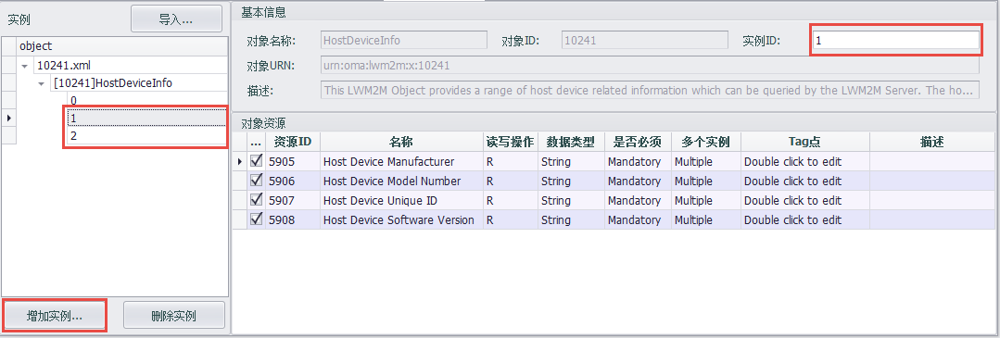

鼠标选中一个`实例`，点击`删除实例`，则弹出提示，点击确认将删除选中实例。

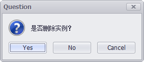

鼠标选中一个`对象`，点击`删除实例`，则弹出提示，点击确认将删除选中对象下包含的所有实例。

鼠标选中一个`XML文件`，点击`删除实例`，则弹出提示，点击确认将删除选中文件下包含的所有对象。

