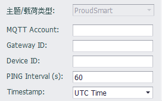

## Proud Smart

连接普奥云服务器时，需要配置接收服务器的连接属性。

- **MQTT Account**: MQTT账户名称。必填项。

- **Gateway ID**: 连接使用的网关名称。必填项。

- **Device ID**: 工程在ProudSmart Cloud中的设备名称。必填项。

- **PING Interval**: 服务器发送PING指令的时间间隔。

- **Timestamp**: 此选项用于控制发布的报文中的时间戳表示格式，UTC Time表示以UTC时间表示，Local Time表示以设备的本地时间表示。举例来说，如果设备的时区设定为东8区（即北京时间），报文的发送时间是北京时间2018年1月1日上午11:30:45，那么以UTC Time表示将会是2018-01-01T03:30:45+0000，而以Local Time表示将会是2018-01-01T11:30:45+0800。

### 其他配置说明

[点表配置说明](./others/TagList_Setting.html)   

[断点续传配置说明](./others/resume.html)

[点表导入导出配置说明](./others/excel.html)