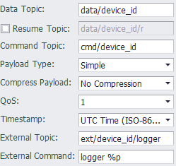

## Simple MQTT

Simple MQTT提供了一种简单的主题/载荷方案，其中主题可由用户自己定义，用于测试验证MQTT数据通信，或者应用于一些需要简单开发的云服务上。
除了Tag数据上传和修改之外，Simple MQTT还支持由服务器下发特定主题的消息来执行指定命令的功能，以便特殊应用的扩展。

默认的Simple MQTT的发布数据载荷格式如下：

```json
{
    "d":[
        {
            "tag":"AI.0",
            "value":12.00,
            "quality":0
        },
        {
            "tag":"AI.1",
            "value":12.00,
            "quality":0
        }
    ],
    "ts":"2017-12-22T08:05:20+0000"
}
```
其中

 - "d"表示一个数组对象，该数组包含所有上报的tag点信息，每个tag点用一个对象来表示，其属性如下

| 属性 |说明  |
|--|--|
| tag | tag名称 |
| value | tag当前值 |
| Quality | tag当前质量值（可通过参数开关选择） |

- "ts"为报文的时间戳，遵循ISO 8601标准。


> SimpleMQTT的断线重传的数据封包与实时数据的数据封包格式完全一样，不同的是时间戳是从数据记录中获取，而不是当前时间。

---

### 参数设定



- **Data Topic**: 必填项，指定用于发布实时数据的主题。为了便于在云服务端解析来自不同设备的数据封包，建议在设定此主题时将设备唯一标识加入到主题中。

- **Resume Topic**: 选填项，指定用于发布断点续传数据的主题。如果不指定，则使用`Data Topic`栏位的主题。

- **Command Topic**: 选填项，指定用于接收命令的主题。从云服务端往该主题发布数据可以修改设备上的Tag点值，数据的格式除了将"d"改为"w"外，其它的与发布格式相同，写封包中可以没有时间戳数据（即ts）。此项不填则该设备将不会接受云服务修改点值的命令。

	修改点值的封包举例如下：以下封包将会将AO\_1的值写为12.88，AO\_2的值写为18.76

```json
{
    "w":[
        {
            "tag":"AO_1",
            "value":12.88
        },
        {
            "tag":"AO_2",
            "value":18.76
        }
    ],
    "ts":"2017-12-28T12:22:21+0000"
}
```

- **Payload Type**:  此选项用于控制报文格式，共有三个选项：
   * `Simple` 默认格式，不带质量值
   
   * `Simple with quality` 默认格式，带质量值

   * `Compact` 精简模式，不带质量值，报文格式如下所示：
   
     ```
     {"ts":1451649600512, "values":{"tag1":"value1", "tag2":"value2"}}
     ```
   
- **Compress Payload**: 此选项控制用于控制是否使用GZIP来压缩报文payload，默认是不压缩。如果设置为GZIP压缩，则务必确认云平台也采用同样的GZIP方式解压缩，同时，下发的cmd也必须是经过GZIP压缩的报文内容。

- **QoS**: 此选项用于控制发布消息时使用的服务质量，默认值为QoS 1。

   * QoS 0: 最多分发一次，消息的分发依赖于底层网络的能力。接收者不会发送响应，发送者也不会重试。消息可能送达一次也可能根本没送达。
   * QoS 1: 至少分发一次，服务质量确保消息至少送达一次。
   * QoS 2: 仅分发一次，这是最高等级的服务质量，消息丢失和重复都是不可接受的。使用这个服务质量等级会有额外的开销。

- **Timestamp**: 此选项用于设置发布的报文中的时间戳表示格式，共有四个选项：

   * `UTC Time (ISO-8601)` 以UTC时间表示，ISO-8601格式，如`2018-01-01T03:30:45+0000`
   * `Local Time (ISO-8601)` 以设备的本地时间表示，ISO-8601格式，如`2018-01-01T11:30:45+0800`
   * `UNIX Time` 以UNIX时间数值表示，如 `1600058903`
   * `UNIX Time w/ MS` 以带毫秒值的UNIX时间数值表示，如 `1600058903001`

- **External Topic**: 此选项用于设置外部命令主题，该主题将被此设备订阅，并在接收到该主题的消息后执行下面 External Command 指定的任务。

- **External Command**: 此选项与 External Topic 配合使用，用于指定接收到 External Topic 消息时要执行的命令行及参数。
例如: `logger %p`, 此命令行将会在收到指定主题时将载荷内容写到系统日志中。<br>
命令行参数除了常规文本之外，还支持以下三种通配符：

	* %t: 主题，该通配符在调用时将会用主题字符串替换。
	* %p: 载荷，该通配符在调用时将会用载荷字符串替换。
	* %pf: 载荷文件，在调用时会把载荷内容先写到文件，然后用文件名替换此通配符。

	> 请注意：在命令行字符串中不要使用这些字符：`换行符, |, &, ;, <, >, (, ), {, }`。
	另外因为MQTT主程序是以非root用户身份执行，所以请勿指定只有root用户才可以执行的命令，否则会导致执行失败。

### 其他配置说明

[点表配置说明](./others/TagList_Setting.html)   

[断点续传配置说明](./others/resume.html)

[点表导入导出配置说明](./others/excel.html)