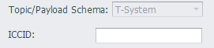

## T-System

连接云平台Cloud Of Thing.

SSL需要Enable，SSL Scenario选用Server Authentication，端口8883.

- **ICCID**: 设备唯一ICCID标识.

### 其他配置说明

[点表配置说明](./others/TagList_Setting.html)   

[断点续传配置说明](./others/resume.html)

[点表导入导出配置说明](./others/excel.html)