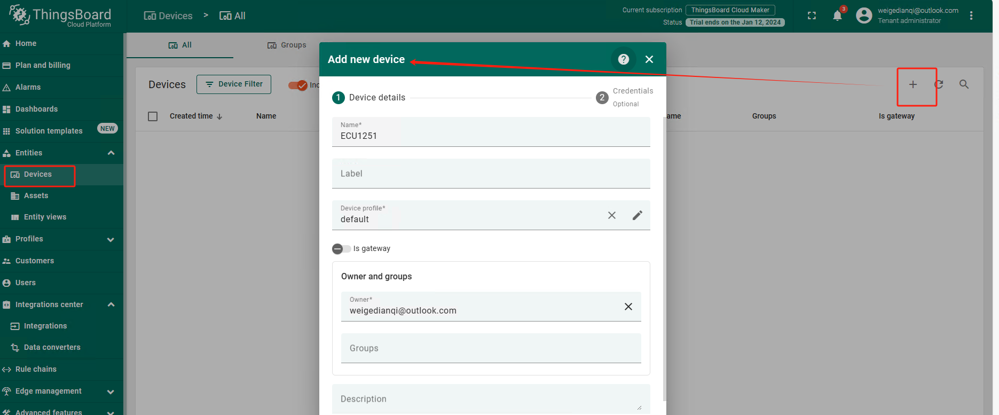
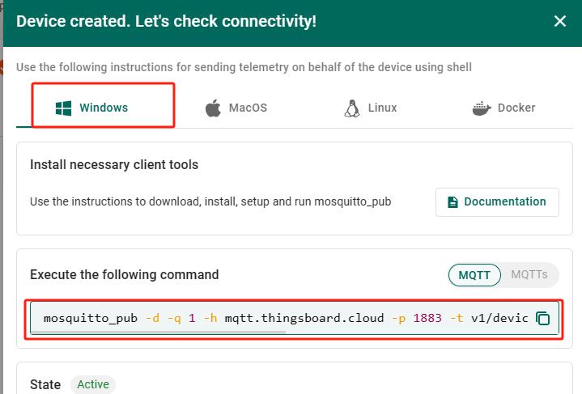
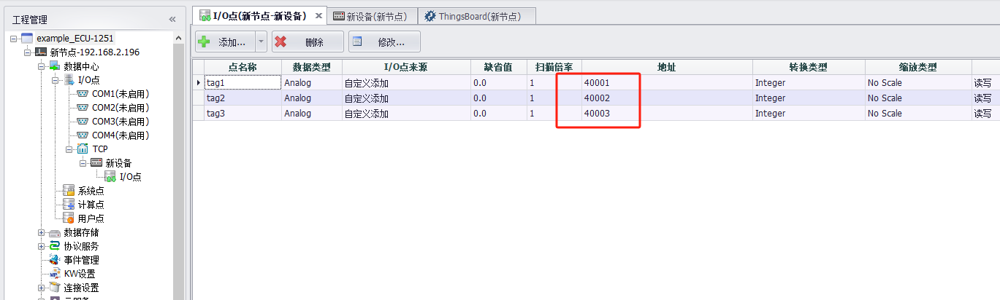
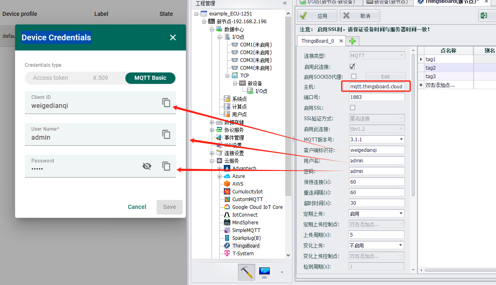
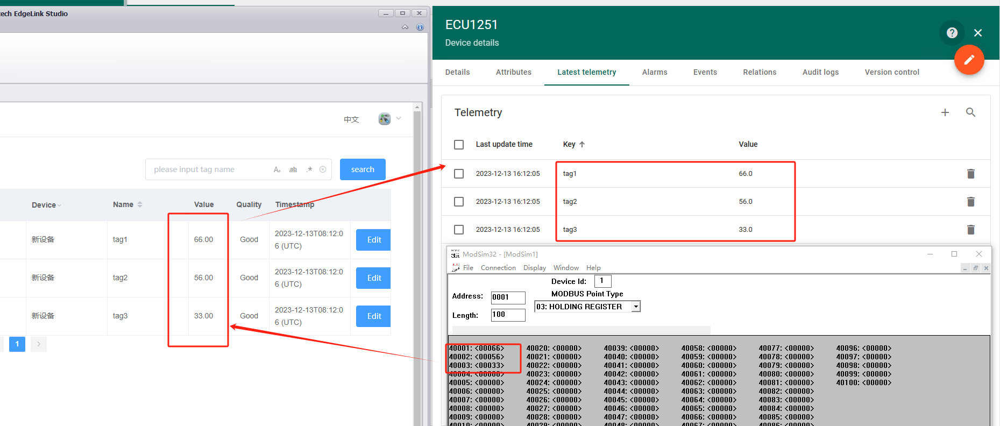

## ThingsBoard

ThingsBoard 是用于数据收集、处理、可视化和设备管理的开源物联网平台。它支持通过 MQTT、CoAP 和 HTTP 等协议实现设备连接，并支持云和私有部署。

### 其他配置说明

[点表配置说明](./others/TagList_Setting.html)   

[断点续传配置说明](./others/resume.html)

[点表导入导出配置说明](./others/excel.html)

操作步骤：

1. 登录thingsboard服务器，创建网关设备

2. ThingBoard连接

