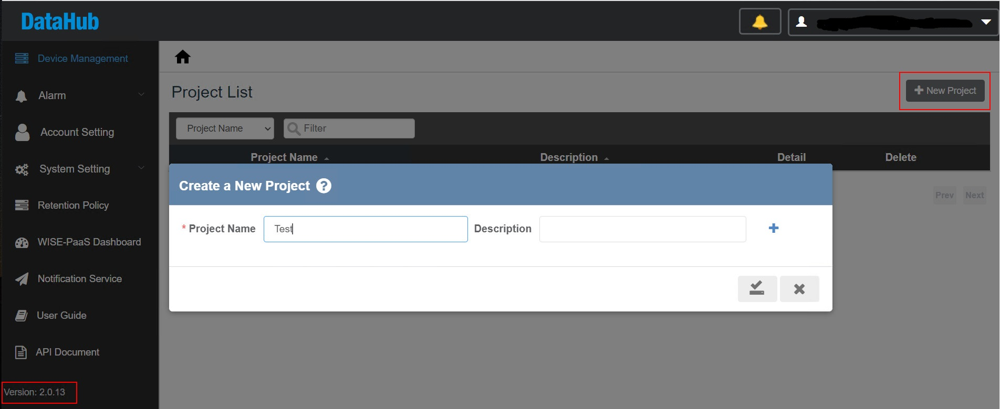
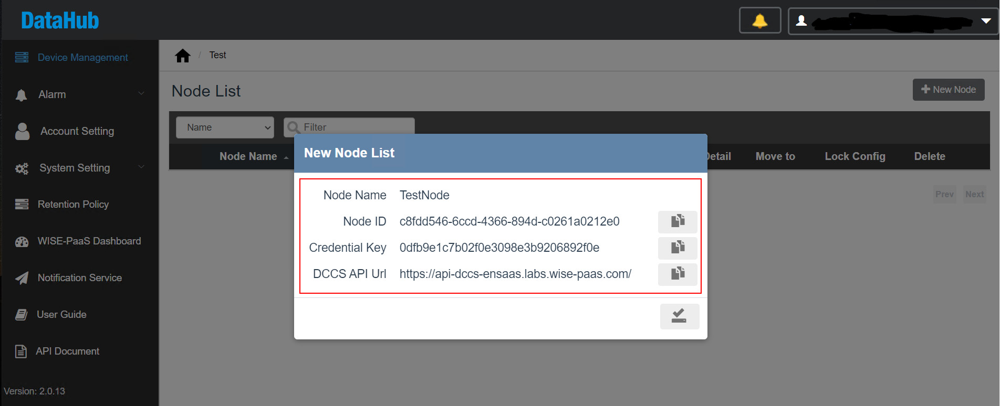
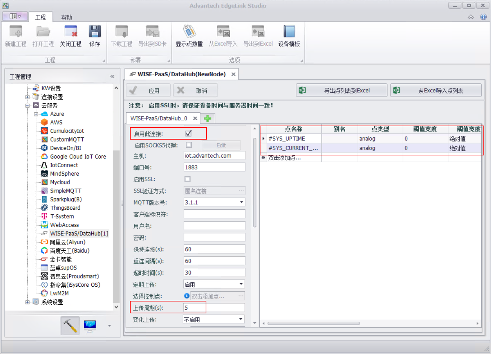
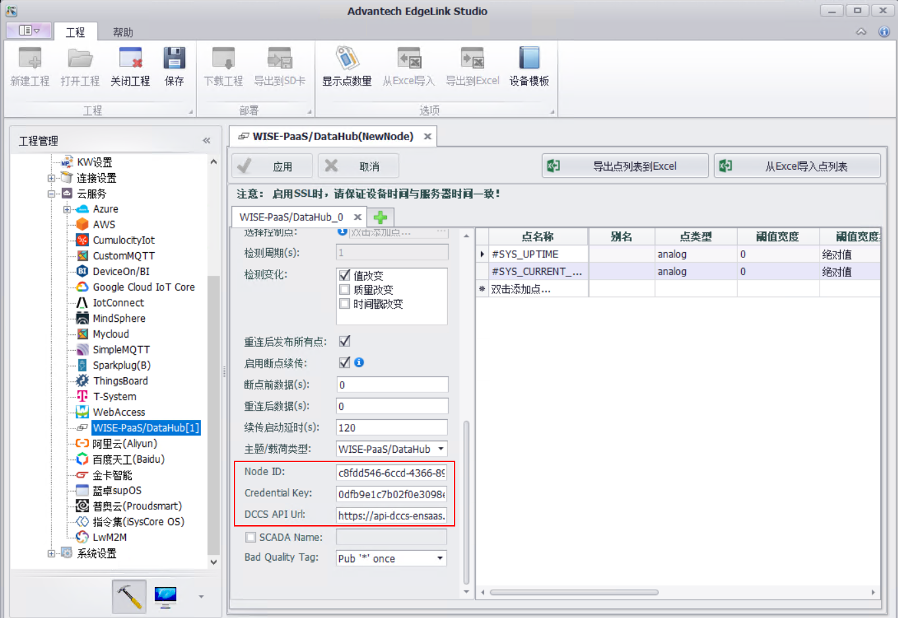
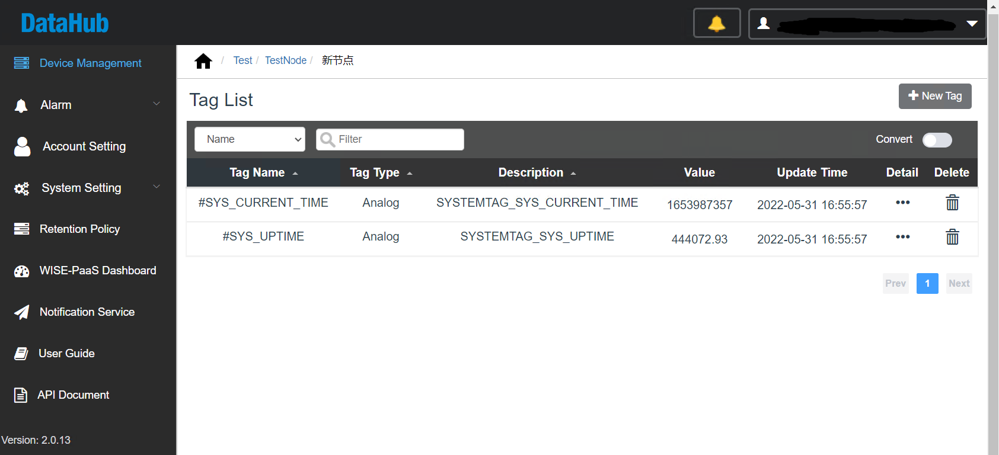
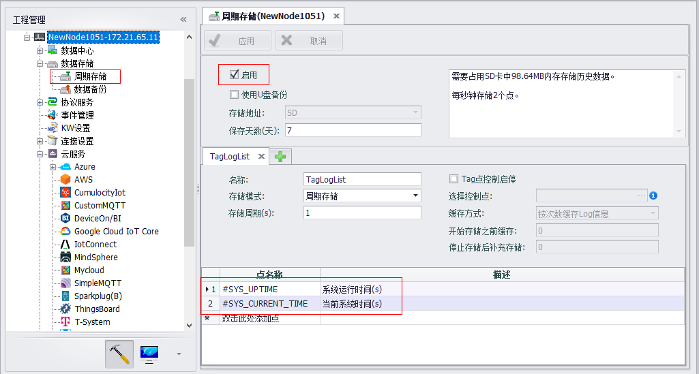
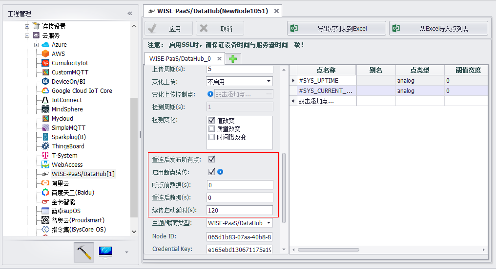

## WISE-PaaS/DataHub

&emsp;&emsp;EdgeLink中的WISE-PaaS云服务插件支持与WISE-PaaS/DataHub连接，支持Plug&Play设备配置数据上传，不支持从DataHub修改设备配置。从EdgeLink_v2.2.0开始支持。

###1. 快速连接

&emsp;&emsp;建立上传周期为5s的周期上传连接，以此为例说明EdgeLink与WISE-Paas/DataHub连接建立及验证操作过程；其他设置项查看[Edgelink工程配置说明详解](#jump1)。

(1) 获取WISE-PaaS/DataHub连接信息

- WISE-Paas/DataHub添加Project；
- Project里添加Node，添加Node会生成`DataHub ID`，`Credential Key`和`DCCS API Url`；

(2) 设置EdgeLink工程

- 双击EdgeLink Studio 工程配置界面左侧云服务里的WISE-Paas/DataHub，配置WISE-Paas/DataHub_0；
- 启用连接；
- 修改上传周期为5s；
- 添加需要上传到WISE-Paas/DataHub的点列表；

- 将步骤一WISE-Paas/DataHub生成的`DataHub ID`，`Credential Key`和`DCCS API Url`填写到EdgeLink Project相应栏位；

- 其他连接参数保持默认。

(3) 验证连接成功

- 下载EdgeLink工程；
- 重启成功后，WISE-PaaS/DataHub界面可看到实时数据，EdgeLink连接WISE-PaaS/DataHub并上传数据成功。

###2. 注意事项

- 检查EdgeLink硬件设备时间，设备时间与服务器时间需要一致

- 检查EdgeLink硬件设备网络，需要能与外网进行通信

- 检查EdgeLink硬件设备系统内证书是否存在，大小不为0，证书系统位置/home/sysuser/project/default-ca-certificates.crt

- 如果服务器证书过期，需要更新证书，请联系WISE-PaaS维护人员

###3. EdgeLink工程配置说明详解

| 参数 | 参数说明 |
| ---- | ----------------------------------------------------------------------------------------------------------------------------|
|`连接类型`|MQTT连接，不可修改|
|`启用此连接`|勾选代表启动当前页面的连接，当前页面配置生效|
|`启用SOCKS5代理`| 如果EdgeLink需要代理服务器才能连接到MQTT Broker，则需要启用SOCKS5代理。启用后需设置SOCKS5服务器信息|
|`主机`|输入MQTT Broker的IP或者域名，此参数与DCCS二选一，DCCS优先|
|`端口号`|输入MQTT Broker的监听端口号，默认1883。EdgeLink目前不支持WebSocket方式的连接|
|`启用SSL`|启用SSL|
|`SSL验证方式`|依据Broker提供的配置来从三种验证方式中选择|
|`MQTT版本号`|指定通信双方遵守的MQTT规范版本，一般情况下，使用默认的3.1.1版本即可，如果Broker有特殊要求，可按照其要求进行配置|
|`客户端标识符`|客户端标识符用于Broker区别多个与之连接的客户端，默认为空，由Broker自动分配，如有需要可手动填写唯一的标志符|
|`用户名`|连接所用的用户名|
|`密码`|连接所用的密码|
|`保持连接`|单位为秒。依MQTT协议规定，当设备在一定时间内与Broker之间没有任何的通信，则必须向Broker发送MQTT PING报文以保持连接。这项参数的设定应遵从实际项目需要并结合Broker的配置来确定|
|`重连间隔`|单位为秒。定义客户端与云端重连的时间间隔，当设备与Broker无法建立连接或者连接中断后，会以此间隔不断进行重连尝试直至连接成功|
|`超时时间`|单位为秒。客户端发送信息到云端响应的最大时间间隔，客户端超过时间没有得到响应后会主动中断连接|
|`定期上传`|定期上传模式：启用，不启用和控制点控制上传|
|`定期上传控制点`|选择定期上传控制点。点值为非0时上传数据；点值为0时不上传数据|
|`上传周期`|定期上传周期，单位为秒|
|`变化上传`|变化上传模式：启用，不启用和控制点控制上传|
|`变化上传控制点`|选择变化上传控制点。点值为非0时上传数据；点值为0时不上传数据|
|`检测周期`|点变化的检测周期|
|`检测变化`|选择检测点的哪些参数变化，可选的参数包括点值、质量和时间戳。tag点值的变化检测会受到在tag点表中配置的阈值类型、阈值宽度和抖动时间这三个参数的影响，详见[tag点表配置说明](./others/TagList_Setting.html)|
|`重连后发布所有点`|EdgeLink与云端建立连接时是否将当前所有的点的值上传一次到云端，使能发送不使能不发送，默认使能|
|`启用断点续传`|断点续传的启用开关|
|`断点前数据`|默认0，从断线前n秒开始续传数据|
|`重连后数据`|默认0，续传到断线重连后n秒的数据|
|`续传启动延时`|默认120，断线重连后间隔n秒开始续传|
|`主题/载荷类型`|WISE-PaaS/DataHub|
|`Node ID`|**必要连接参数**，WISE-PaaS/DataHub创建Node时生成|
|`Credential Key`|**必要连接参数**，WISE-PaaS/DataHub创建Node时生成|
|`DCCS API Url`|**必要连接参数**，WISE-PaaS/DataHub创建Node时生成|
|`SCADA Name`|无子设备配置时以此做为WISE-PaaS/DataHub中的设备名称，选填项，不填写时，将会使用工程中配置的网关节点名称作为设备名称|
|`Bad Quality Tag`|Tag Quality不为0（GOOD）的上传模式：Pub * once; Pub * always; Still pub value; Don't pub|

###4. 进阶操作

####4.1 断点续传

- 前提条件：必须将需要断点续传的点配置到DataLogger进行本地存储，设备必须有存储卡，存储设置参考数据存储说明

- WISE-PaaS/DataHub界面启用断点续传，以下配置表示断线重连后会立即发布所有点的当前值，重连120s后开始上传断点期间的数据，只补充断线期间的数据，不上传断点前和重连后的数据。

- 工程配置下载生效后，如设备运行期间有与WISE-PaaS/DataHub断开的情况，重连后则会进行数据续传。

####4.2 隐藏参数

修改studio安装目录下配置文件：
C:\Program Files (x86)\Advantech\EdgeLink Studio\Resources\Cloud\armv7-linux-gcc\common\WISE-PaaS.xml可开放参数

| 参数 | 参数说明 |
| ---- | ----------------------------------------------------------------------------------------------------------------------------|
|`Data Worker`|参数名 x_data_worker，默认值SCADA v1.0.16，用于选择WISE-PaaS/SCADA的MQTT版本规范，除非可以确认部署的SCADA dataworker是遵循v1.0.12规范的旧版本，则可以选择SCADA v1.0.12，否则就使用默认值。高低版本的主要差异是WriteTag的命令格式不同，所以如果选择的版本不匹配，会造成从云端无法写值到网关，但不影响连接与数据上传。|
|`Verify Peer`|参数名：x_skip_peer_veriåcation，可选值：Yes(=0) No(=1)，默认Yes，此选项用于DCCS API请求中验证服务器的安全证书，当DCCS API服务器使用的证书无法通过网关内置的根证书库的验证时，可以将此选项设置为No，以取消服务器证书验证的步骤。|
|`Verify Hostname`|参数名：x_skip_hostname_veriåcation，可选值：Yes(=0) No(=1)，默认Yes，此选项用于DCCS API请求中验证服务器的主机名是否与安全证书中描述的相符。|
|`Child Device`|参数名：x_enable_subdev 可选值：Enabled（=1）, Disabled（=0） 默认值：Enabled，此选项用于使能子设备模型设置。|
|`Keep full tag name`|参数名：x_keep_whole_name 可选值：Yes（=1）, No（=0） 默认值：Yes，此选项用于在子设备模型中保持点的全名称。|
|`Heart Beat Period(s)`|参数名：x_heart_beat_period 可选值：0 ~ 65535，单位秒 默认值：90，此选项用于设置心跳周期，当在心跳周期内没有数据发布时，就会发布一条心跳到云端提示设备还在线，该值不能大于超时时间，设置为0表示不发送心跳。|
|`Heart Beat On Idle`|参数名：x_hb_on_idle 可选值：Yes（=1）, No（=0） 默认值：No，此选项用于设置仅当没有数据的时候发布心跳。|
|`Tags per Message`|参数名：x_tags_per_msg 可选值：0 - 100000 默认值：0，此选项用于限制一条信息里包含的最多点数，当点数超出设置，会拆分为多条信息上传到云端，默认不限制。|
|`Publish Ctrl`|参数名：x_pub_limit 可选值：None（=0）, DOn/DOf（=1） 默认值：None，此选项用于选择是否使用DOn/DOf命令控制数据发布，仅用于Webaccess |
|`Timestamp`|参数名：x_local_time 可选值：UTC Time（=0）, Local Time（=1） 默认值：UTC Time，此选项用于设置时间戳的时区。|

####4.3 设置多个连接

同类型云连接可以设置多个，点击连接标签页右边的加号可以添加，最多4个，连接的总个数应用后会显示在列表。

####4.4 点表导入导出

- EdgeLink studio 云服务配置界面支持点列表导入导出功能

- excel格式

####4.5 子设备模型

WISE-PaaS/DataHub支持使用子设备模型上传数据。Edgelink子设备模型匹配方式为：

- 优先使用点别名中的冒号（`:`）来区分，冒号前的名称将作为子设备名，冒号后的名字作为实际上传的点名

- 没有点别名，则使用点名称中的冒号来区分

- 点名称与别名中都没有冒号，则使用`SCADA Name`作为子设备名

- 不设置SCADA Name的情况下，使用工程节点名称作为子设备名

设置子设备后，会在WISE-PaaS/DataHub的Device list界面显示子设备名称，子设备里会有分属自己的点数据。

###5. 调试手段

- 查看系统日志，方法有三种：
（1）查看EdgeLink studio在线监控中的系统日志信息
（2）命令行使用指令`tail -F /var/log/messages`查看系统日志
（3）如有查看更多关于云服务连接的日志，可操作手动启动MQTTClient程序，命令行使用指令
`killall AdvProgramMgr`
`killall MQTTClient`
`MQTTClient -log TRACE`
上述调试操作结束后，需要恢复程序运行状态，命令行执行指令
`AdvProgramMgr -d`

- 使用第三方工具辅助调试，例如MQTTspy

 
