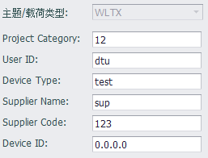
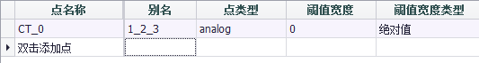

## WLTX

WLTX云服务插件支持与物联天下云平台连接，将tag值上报到云端。因为此插件的设置部分与云平台的配置息息相关，需要从云平台处获取相应的配置信息来填写，故此处不做详细说明。

需要注意的是，在物联天下的数据模型中，每个采集点由三部分组成，称为FULL TAG，以Device Address(被采集设备地址, 1字节) + Channel (被采集设备通道编号, 1字节) + TAG(1字节) 构成。为了在上报的数据报文中包含这三个字段，Tag的命名必须以下划线分隔的方式来定义这三个字段，如果Tag名称不能采用这种格式，那么在WLTX的tag列表中，必须此格式的别名来支持FULL TAG。

如下图所示，`CT_0`被定义了一个别名`1_2_3`，表示`CT_0`这个tag点对应的是物联天下云平台上定义的 Device Address = 1，Channel = 2， TAG = 3 的采集点。

### 其他配置说明

[点表配置说明](./others/TagList_Setting.html)   

[断点续传配置说明](./others/resume.html)

[点表导入导出配置说明](./others/excel.html)
