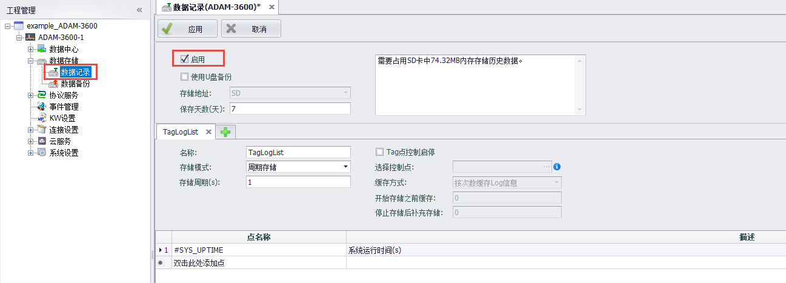
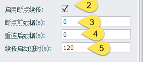

## 断点续传设置

断点续传功能适用于EdgeLink设备与云平台（MQTT）连接时，由于网络环境问题出现断网的情况下，可以将断线期间的数据进行补全

- 前提条件：必须将需要断点续传的点配置到DataLogger进行本地存储，设备必须有存储卡，存储设置参考[数据记录](../../DataLogger/DataLogger.html)说明

 &emsp;&emsp;&emsp; 

- 云服务界面启用断点续传

 &emsp;&emsp;&emsp; 

 | 参数 | 参数说明 |
 | ---- | ----------------------------------------------------------------------------------------------------------------------------|
|`重连后发布所有点`|EdgeLink与云端建立连接时是否将当前所有的点的值上传一次到云端，使能发送不使能不发送，默认使能|
|`启用断点续传`|断点续传的启用开关|
|`断点前数据`|默认0，从断线前n秒开始续传数据|
|`重连后数据`|默认0，续传到断线重连后n秒的数据|
|`续传启动延时`|默认120，断线重连后间隔n秒开始续传|   
        

- 工程配置下载生效后，如设备运行期间有与云服务断开的情况，重连后则会进行数据续传。