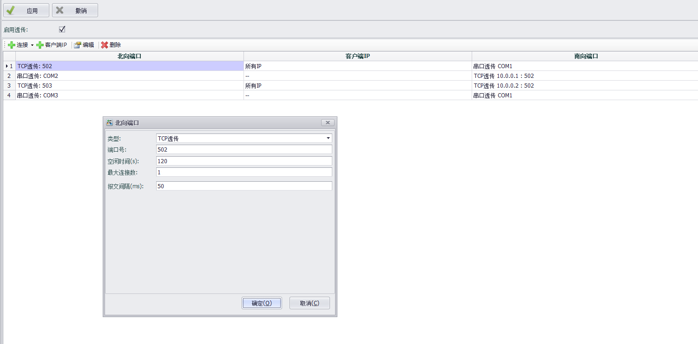
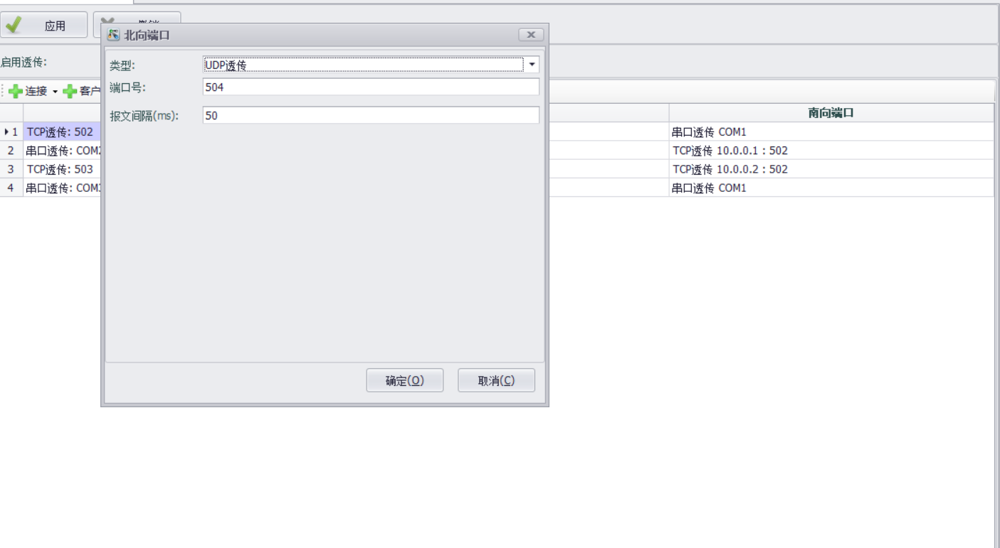
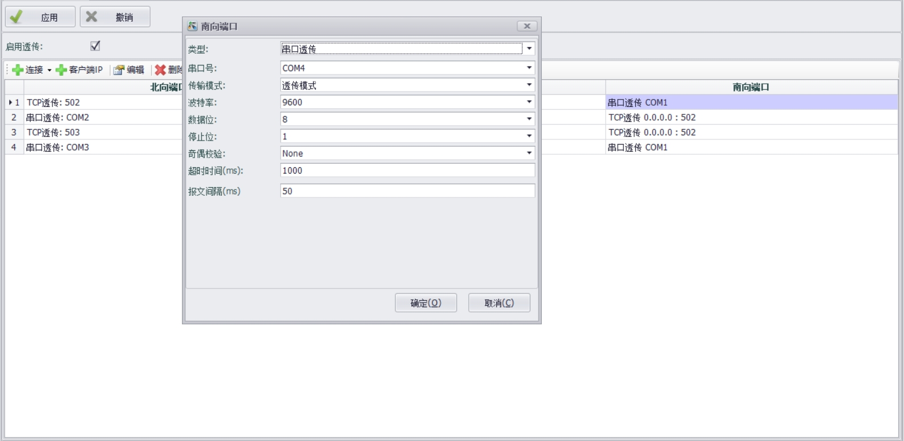

## 透传功能　

透传功能实现了南向设备与北向设备直接进行数据交互。

### 透传功能有三种模式：

*	透传模式，南向和北向设备可以进行自由通信。
*	应答模式，既北向设备发出请求，等待南向设备的应答，当南向设备应答后，数据会传输至北向设备。
*	监听模式，北向设备不会也不能主动发送请求，而南向设备会主动发送数据到北向。

### 连接设置

启用透传功能后，选择合适的连接

#### 北向端口配置

可以设置北向端口的各种参数，如端口号，波特率，起始位，停止位等。

串口号：北向设备要连接的串行端口，下拉列表中显示的是当前设备的所有可用端口。

波特率：指定串行传输的波特率，默认值为9600。

数据位：指定串行传输的数据位，默认值为8。

停止位：指定串行传输的停止位，默认值为1。

奇偶校验：指定串行传输的奇偶校验规则，默认值是None，表示不进行奇偶校验。

空闲时间：默认120秒。在北向tcp类型的端口中，若北向设备在120秒内没有数据发出，则判断该设备空闲，程序会将该连接踢出。

空闲时间：指定当TCP连接建立之后，允许客户端无任何读写操作的最长时间，默认值是120秒，超出此时间后服务器会自动断开与客户端的连接。将空闲时间设置为0表示不做此项检查，服务器不会主动断开连接。

报文间隔：默认50毫秒，该参数用作分割每条报文的帧间隔依据。

#### 客户端ip配置

选择合适的ip白名单，可以选择所有ip，单一ip，ip范围，和子网掩码格式。其中‘\*’代表所有ip均可访问。

#### 南向端口配置

可以设置南向端口的模式、参数，如端口号，波特率，起始位，停止位等。

串口号：北向设备要连接的串行端口，下拉列表中显示的是当前设备的所有可用端口，如果某个端口没有在列表中，说明该端口已经被其它服务占用，需要在数据中心手动删除被占用的COM口，才可以配置此端口。

波特率：指定串行传输的波特率，默认值为9600。

数据位：指定串行传输的数据位，默认值为8。

停止位：指定串行传输的停止位，默认值为1。

奇偶校验：指定串行传输的奇偶校验规则，默认值是None，表示不进行奇偶校验。

空闲时间：默认120秒。在北向tcp类型的端口中，若北向设备在120秒内没有数据发出，则判断该设备空闲，程序会将该连接踢出。

空闲时间：指定当TCP连接建立之后，允许客户端无任何读写操作的最长时间，默认值是120秒，超出此时间后服务器会自动断开与客户端的连接。将空闲时间设置为0表示不做此项检查，服务器不会主动断开连接。

报文间隔：默认50毫秒，该参数用作分割每条报文的帧间隔依据。

超时时间：默认为1000毫秒，当透传为应答模式时，在北向发送的请求通过南向转发后开始等到南向设备的应答，当超过1000毫秒无应答后即判定为超时。

传输模式：一般情况默认为透传模式。
当选择透传模式时：南北向可自由通信。
当选择监听模式时：数据交互方式为自由通信模式。
当选择应答模式时，该南向设备为应答模式，数据交互方式为北向主动向南向发送请求，等待南向应答后返回至北向。

注意：当通信链路北向为网络通信时，北向TCP最大连接数为1，或北向UDP/TCP在IP白名单中配置了指定的唯一IP时，透传模式才可启用。

