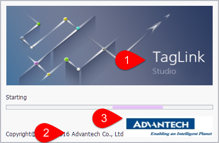
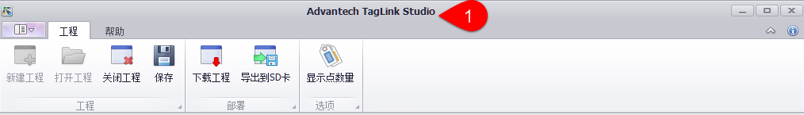
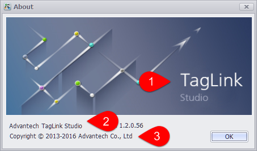

## 支持OEM界面

允许客户修改软件名称和展示图片等信息，以满足客户的OEM需求。
有以下三个位置可以修改，客户通过修改相应位置的文字或图片，再重启软件后即可被修改。

### Loading界面

1. 背景图为(/Resources/loadingMain.png)

2. 公司名称可修改Customization.xml文件中的CompanyName

3. 公司图标可修改(/Resources/loadingFooter.png)

### 主界面Title

1. 软件名称可修改Customization.xml文件中的ProductName

### About界面

1. 背景图为(/Resources/loadingMain.png)

2. 软件名称可修改Customization.xml文件中的ProductName

3. 公司名称可修改Customization.xml文件中的CompanyName

