# IEC61850 Client (采集驱动)

## MMS   
   
### 1. 添加设备   
   
**数据中心 → I/O点 → TCP: 右键 → 添加设备**   
   
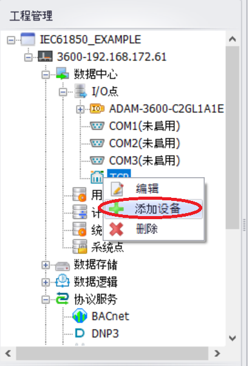   
   
**IEC-61850 MMS设备属性配置**   
   
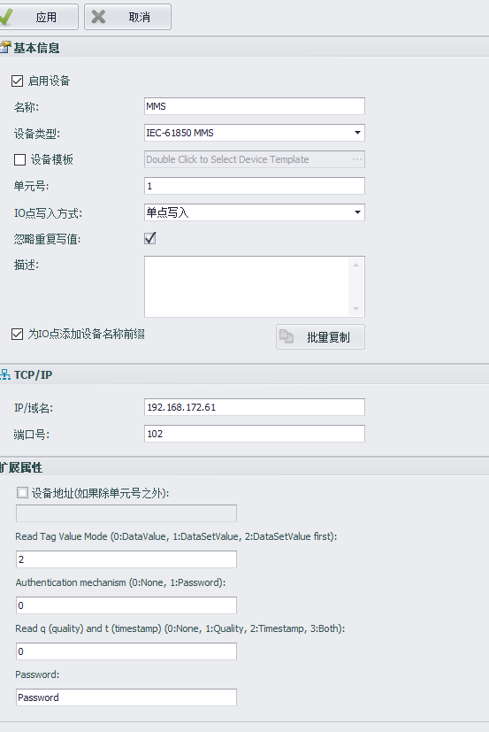   
   
| **参数**        |**说明**                                                          |
|----------------------------|---------------------------------------------------------|
| ​**设备类型**  | `IEC-61850 MMS`                                                     |
| ​**IP/域名**   | IEC-61850服务器IP地址                                                         |
| ​**端口号**    | IEC-61850服务器端口（默认：`102`）                                            |
| ​**设备地址**  | 若与单元编号不同则填写，否则留空                                     |
| **Read Tag Value Mode**| 获取IEC-61850数据属性值的方式。`0` (使用GetDataValues服务读取DataAttribute值; 使用SetDataValues服务写入DataAttribute值, `1`(创建数据集，通过读数据集来获取DataAttribute值, `2`(优先采用模式 `1`)|
| ​**Authentication mechanism**  | 认证机制。`0`（无认证），`1`（密码认证）                                       |
| ​**Password**      | 当认证机制=1时必填（例如：`Password`）                               | 
| **Read q (quality) and t (TimeStamp)**| `0` (不读取),`1` (只读取Quality), `2`(只读取时间戳), `3` (Quality和时间戳都读取)|


### 2. 添加tag点  
  
  
#### 2.1 **点地址格式**:   
```
[Logical Device]/[Logical Node]$[Functional Constraint]$[Data]$[Attribute]
```  
进入I/O点配置页面，点击**“添加...”**按钮  
   
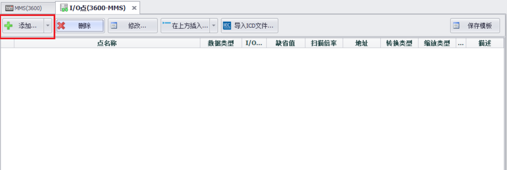   
   
**在Tag配置页面，输入MMS DataAttribute 地址**     
   
**Example**:   
```
IED1LDevice1/MMXU2$MX$TotW$mag$f
```  

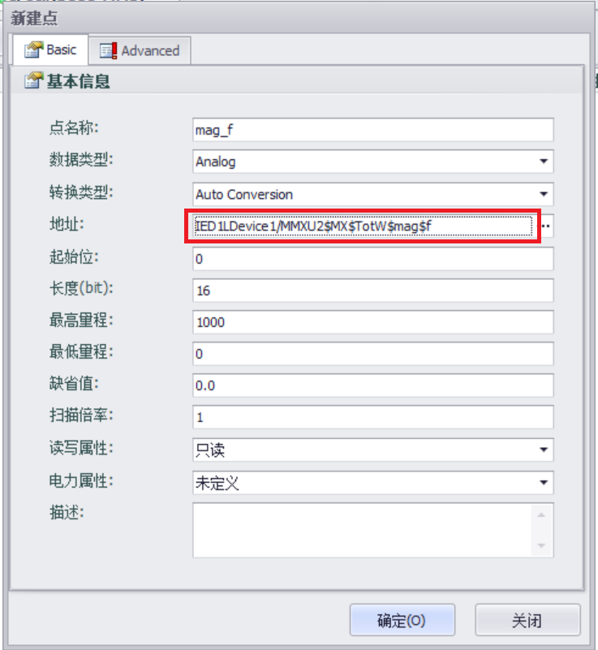   
   
#### 2.2 **Import ICD File**:   
   
导入icd文件，DataAttribute的MMS地址将自动添加   
   
进入I/O点配置页面，点击**“导入ICD文件...”**按钮  
   
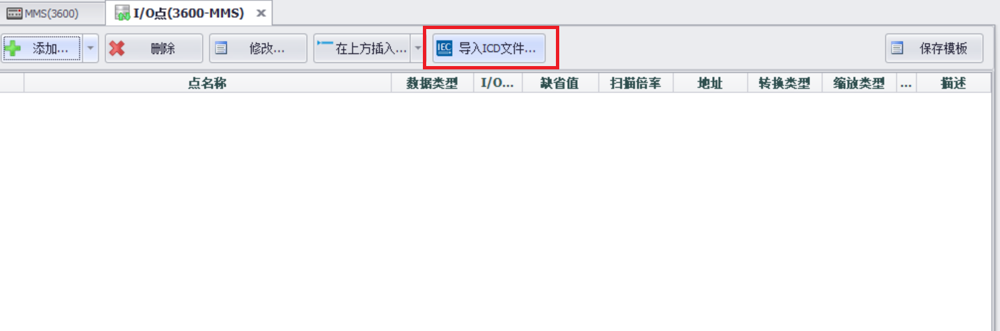   
   
选择需要导入的ICD文件，点击**“Open”**按钮  
   
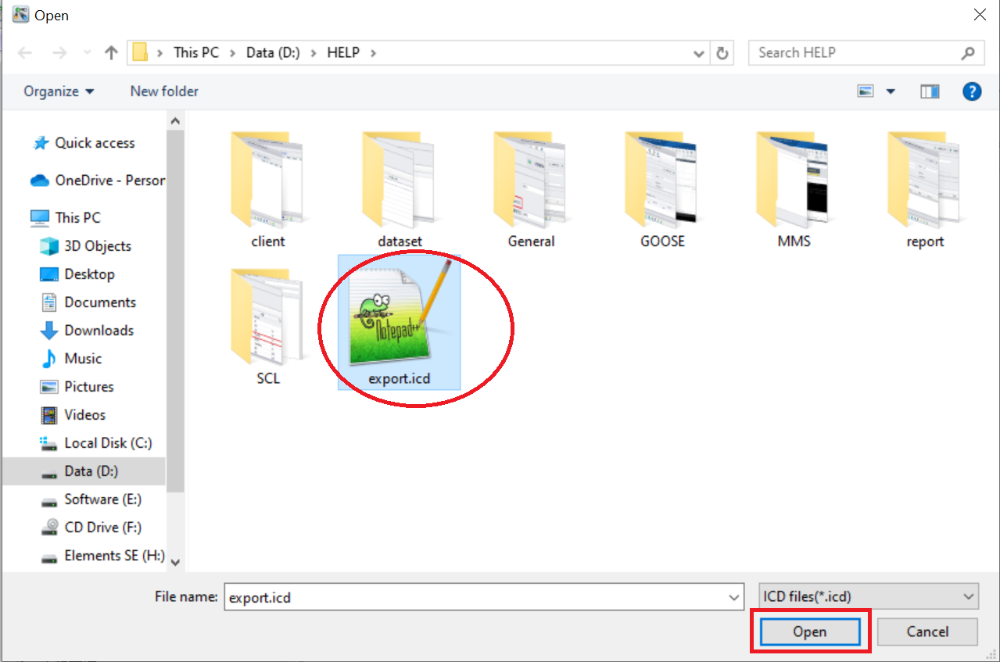   
   
**选择需要采集的DO或者DA**  
   
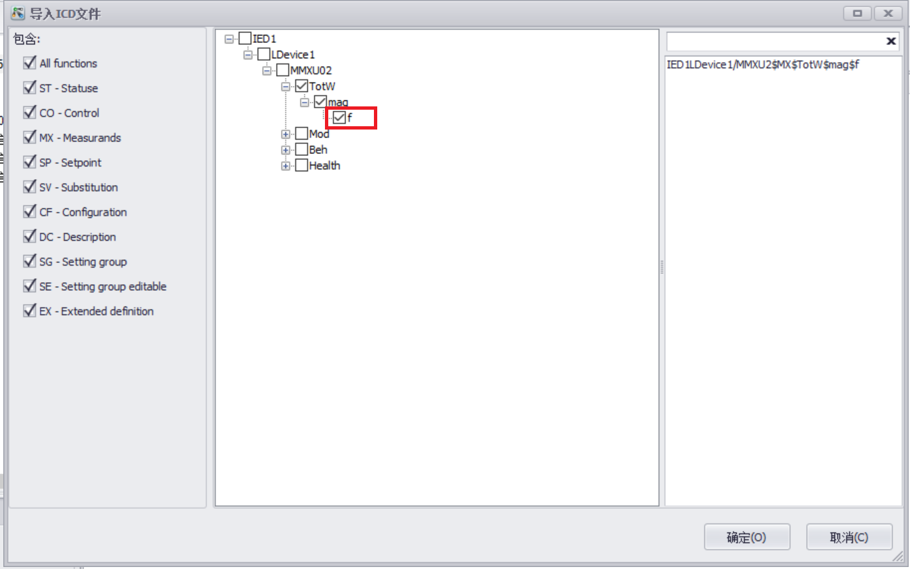   
   
点击**“确定”**按钮  
   
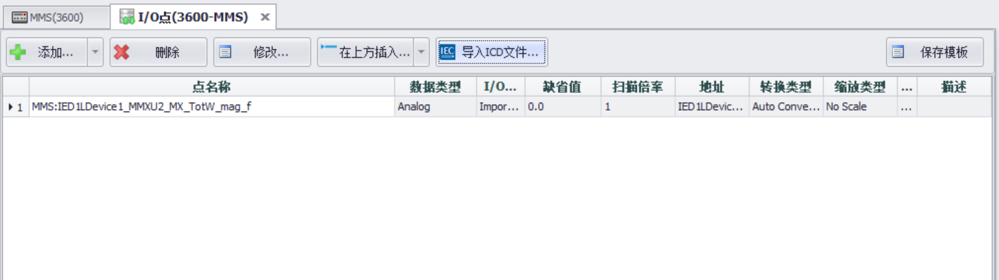   
   
**下载工程，查看采集值**  
   
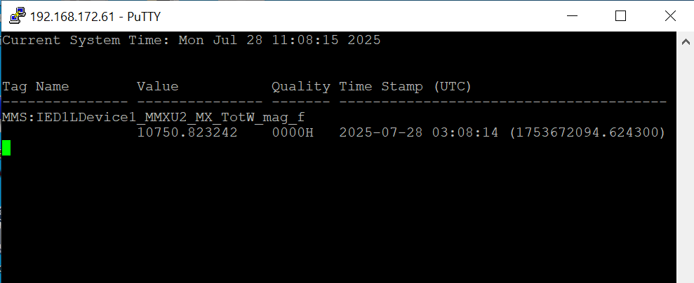   
   
## GOOSE   
   
### 1. 添加端口   
   
#### **1.1 GOOSE采集需先添加 API (IEC-61850 GOOSE) 端口**   


  **数据中心 → I/O点: 右键 → 添加端口**

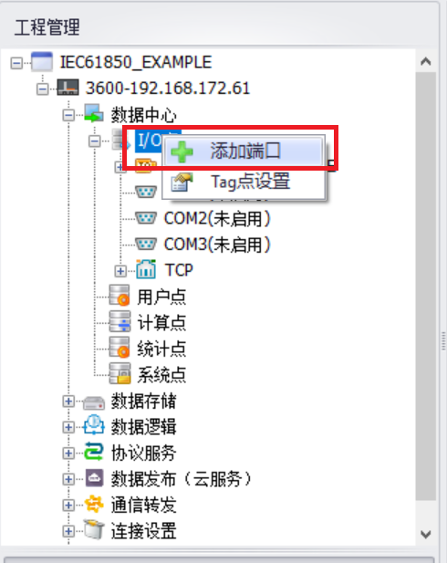   

**选择端口类型：API (IEC-61850 GOOSE)**     
   
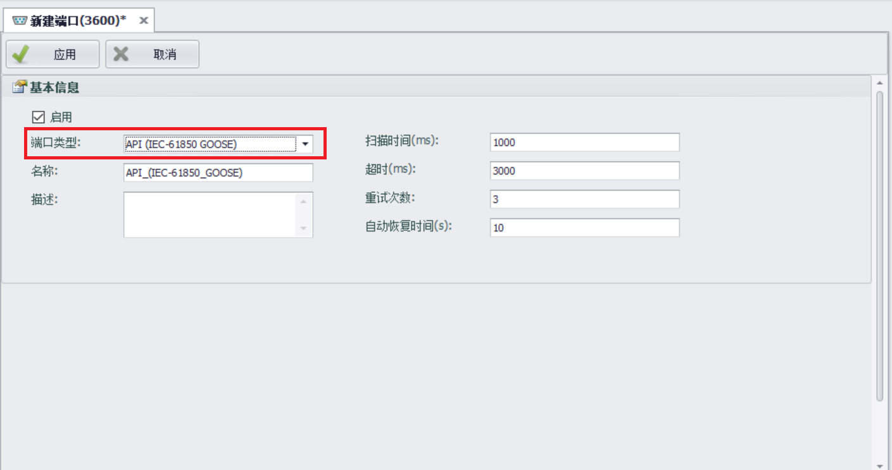   
   
### 2. 添加设备   
    
#### **2.1 添加设备**   
   
**数据中心 → I/O点 → API_(IEC-61850_GOOSE): 右键 → 添加设备**   

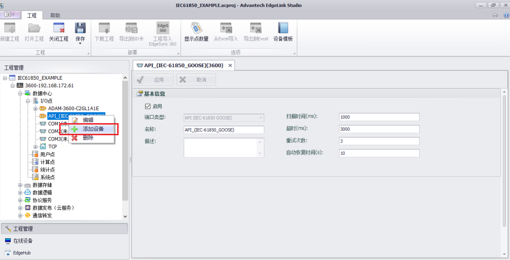   
   
**IEC-61850 GOOSE 设备配置属性**   
   
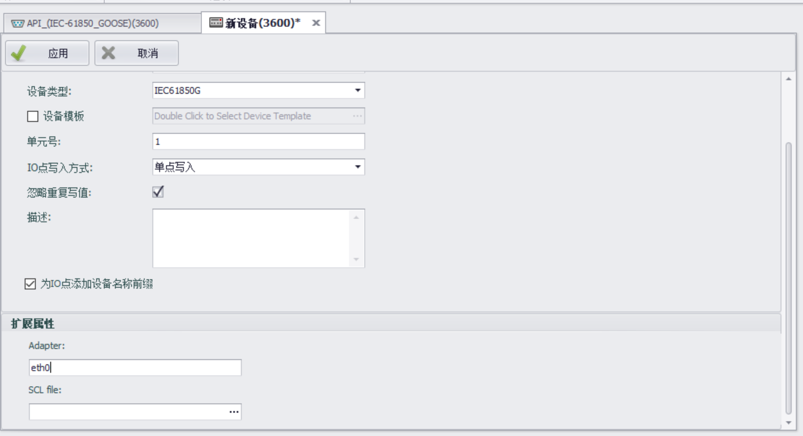   
   
| **参数**        |**说明**                                                          |
|---------------|----------------------------------------------------------------------|
| ​**设备类型**  |`IEC61850G`                                                     |
| ​**Adapter**   | GOOSE通信用的物理网卡                                                      |
| ​**SCL file**    | 选择GOOSE 通信所需的SCL文件                                       |
   
   
配置**Adapter**，并选择已有的**SCL file**   

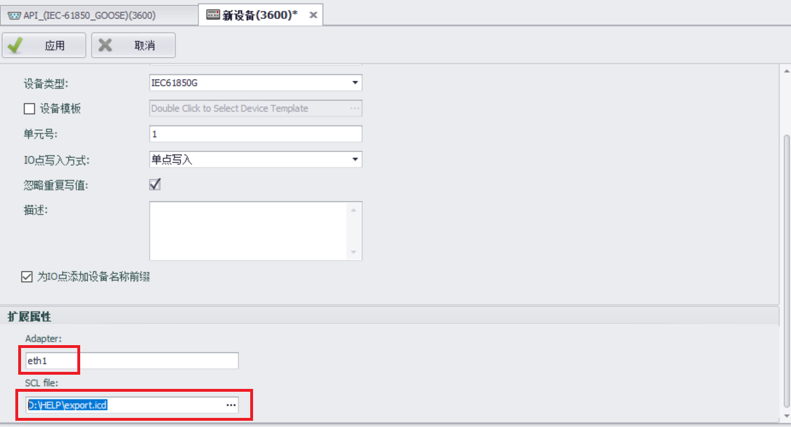   
   
### 3. 添加tag点  
   
#### 3.1 **导入ICD File GOOSE配置**:   
   
进入I/O点配置页面，点击**“导入GOOSE配置...”**按钮  
   
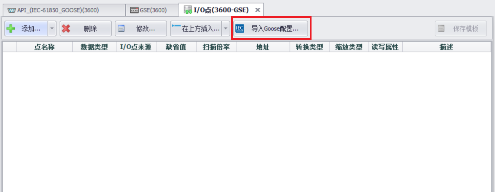   
   
**进入DO或者DA选择页面** 
   
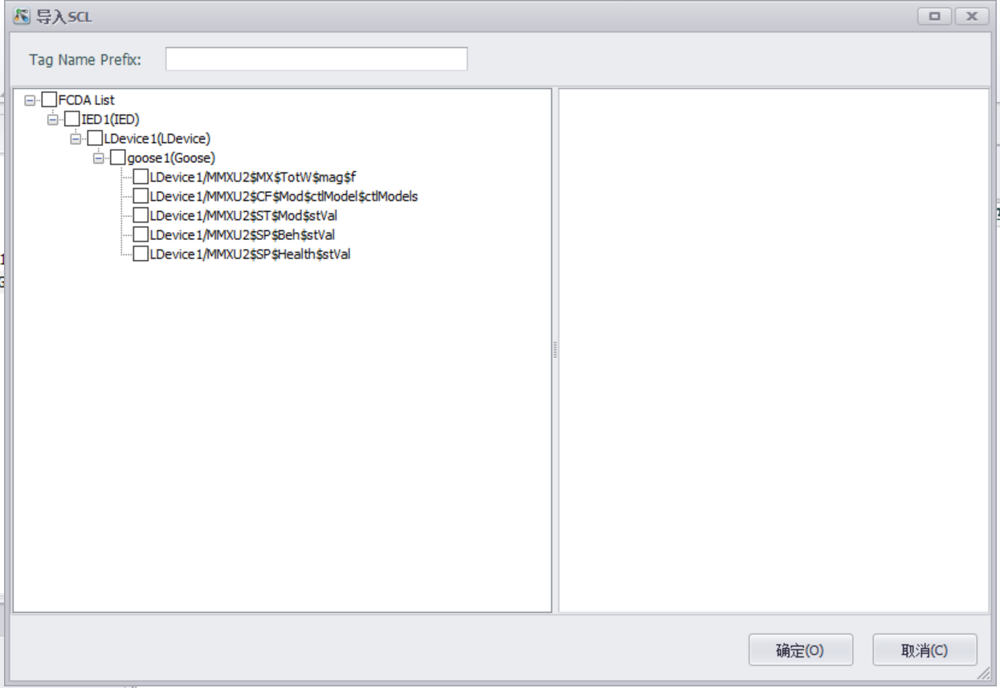   
   
**选择需要采集的DO或者DA**  
   
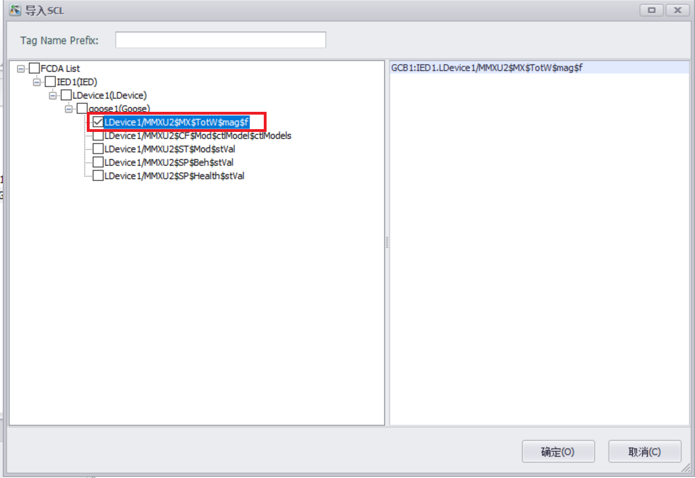   
   
点击**“确定”**按钮  
   
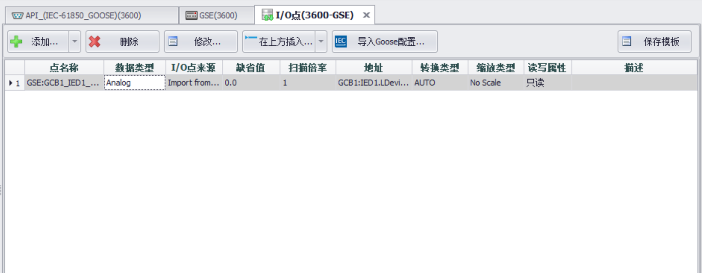   
   
**下载工程，查看采集值**  
   
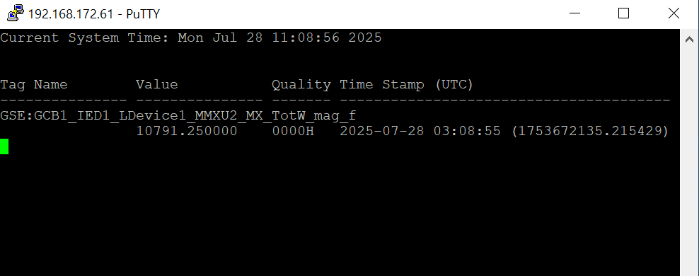   
   
