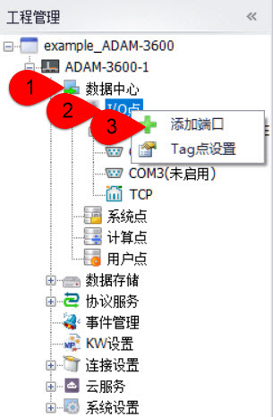
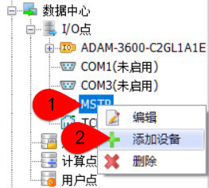
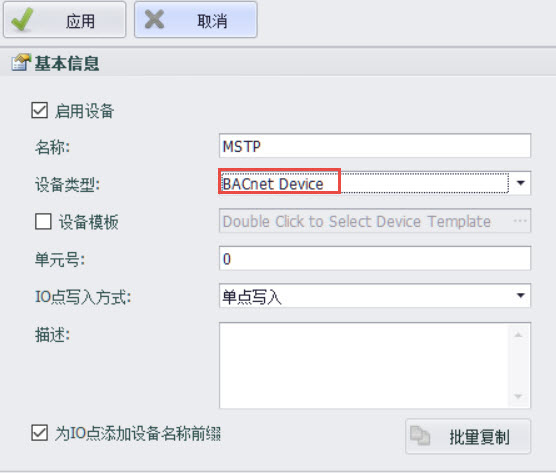
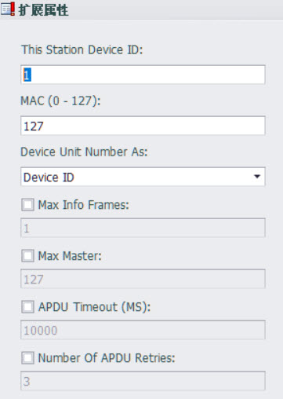
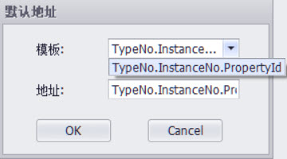

## BACnet MS/TP

### 一、驱动支持开始的版本号：v2.8.0

### 二、快速连接

  1.添加端口

- 数据中心--->I/O点--->添加端口

- 端口类型：选择“Serial(BACnet MS/TP)”--->名称：按个人喜好填写(本文档中填写的为“MSTP”)

2.配置端口

- 串口号：实际使用的网关端串口号

- 其他参数：根据设备特性配置
- 配置完之后，点击“应用”

3.添加设备

- 数据中心--->I/O点--->MSTP--->添加设备

4.配置设备

- 设备类型：选择“BACnet Device”--->名称：按个人喜好填写(本文档中填写的为“MSTP”)--->点击“应用”

5.添加tag点

6.下载工程，即完成了BACnet MS/TP的快速配置。

### 三、配置说明详解

1.配置端口界面扩展属性详解

- This Station Device ID：设备的ID。

- MAC(0~127)：设备的MAC地址，默认为127。

- Device Unit Number As：设备配置中的Unit Number 值是设备ID还是设备的MAC地址。

- Max Info Frames：指定节点在必须传递令牌之前可以发送的最大信息帧数。

- Max Master：网络中主节点允许的最高地址，默认为127。

- APDU Timeout(MS)：用来指示需要确认的APDU重新传输之间的时间量（毫秒），但未收到确认。对于允许修改此参数的设备，此属性的建议值为10000毫秒。否则，默认值应为60000毫秒。

- Number of APDU Retries：指示APDU应重新传输的最大次数。此属性的建议值为：如果此设备不执行重试，则此属性应设置为零。如果此属性的值大于零，则应在设备对象APDU_Timeout属性中放置一个非零值。

2.配置设备界面扩展属性详解

- Max Property/ Request：每次请求包所包含的最多tag 个数。

3.tag点地址详细说明

tag点地址格式为：TypeNo.InstanceNo.PropertyId

具体地址说明可参考BACnet IP中的说明。
