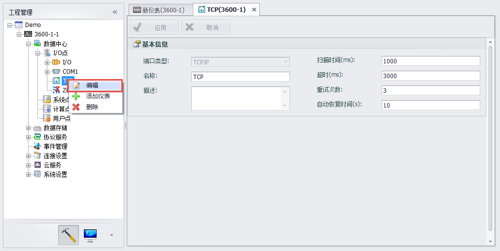
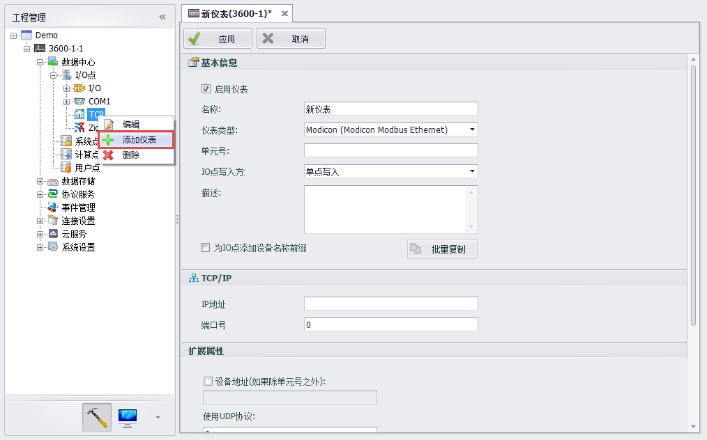
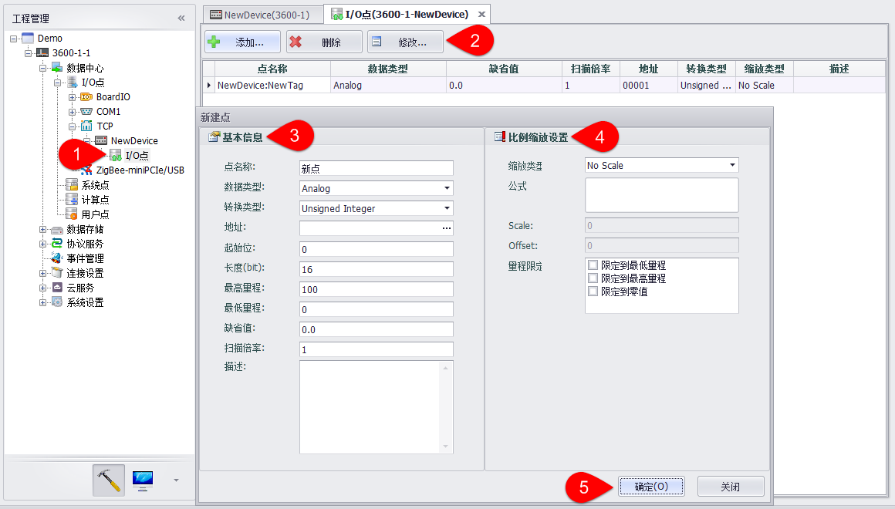
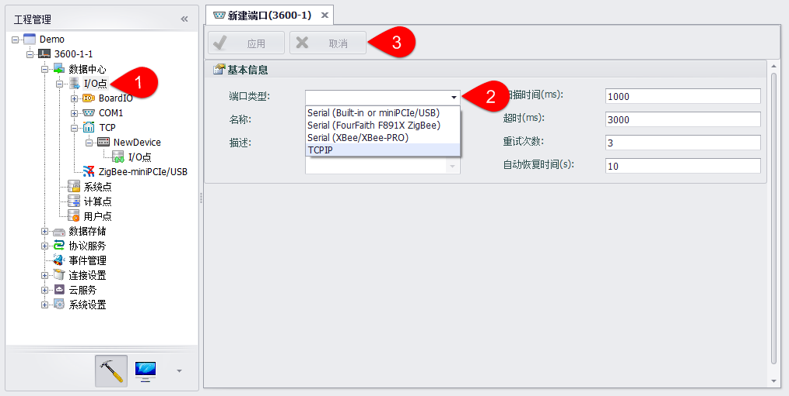

## 以太网采集设备点配置

ADAM-3600主体具备2个以太网口，EdgeLink Studio支持对2路以太网端口进行编辑、删除及添加设备的操作。

1. 右键网口，可选择“编辑”功能，编辑网口信息过程如图，且图中描述了具体网口信息。　

注！ 该TCP 端口为软件端口，数量并不局限于两路实体端口。客户可以依据应用需求添加。

2.	右键TCP网口，可选择“删除”操作，确认后即删除该网口。　

3.	右键TCP网口，可选择“添加设备”功能，该功能支持配置以太网设备，具体设备信息说明如下图。

4.	新建网口设备后需要配置IO点，配置步骤与板载IO配置过程相似，如下图。

5.	如需要删除新建的网口设备，只需在设备名称上右键选择“删除”，即可删除新建的串口设备。　

特别的是，EdgeLink Studio 默认支持1 路以太网端口配置，若同时需要2 路及以上以太网端口采集数据，需要再添加以太网端口，操作过程是右键“I/O点”，选择添加端口，如下图：

1. “I/O点”上右键，添加端口

2. 选择端口类型并设置端口名称、添加描述（选填）。

3. 设置完成后，点击应用完成添加。点击取消撤销修改。

以太网设备支持以设备模板方式配置tag点，具体说明见[2.2.16](DeviceTemplate.html)设备模板部分。

在添加以太网设备时，若不指定使用设备模板，则可以根据设备类型读取对应的配置文件为设备添加预设tag点，具体说明见[2.2.17](TagTemplate.html)通过配置文件添加预设Tag点部分。

