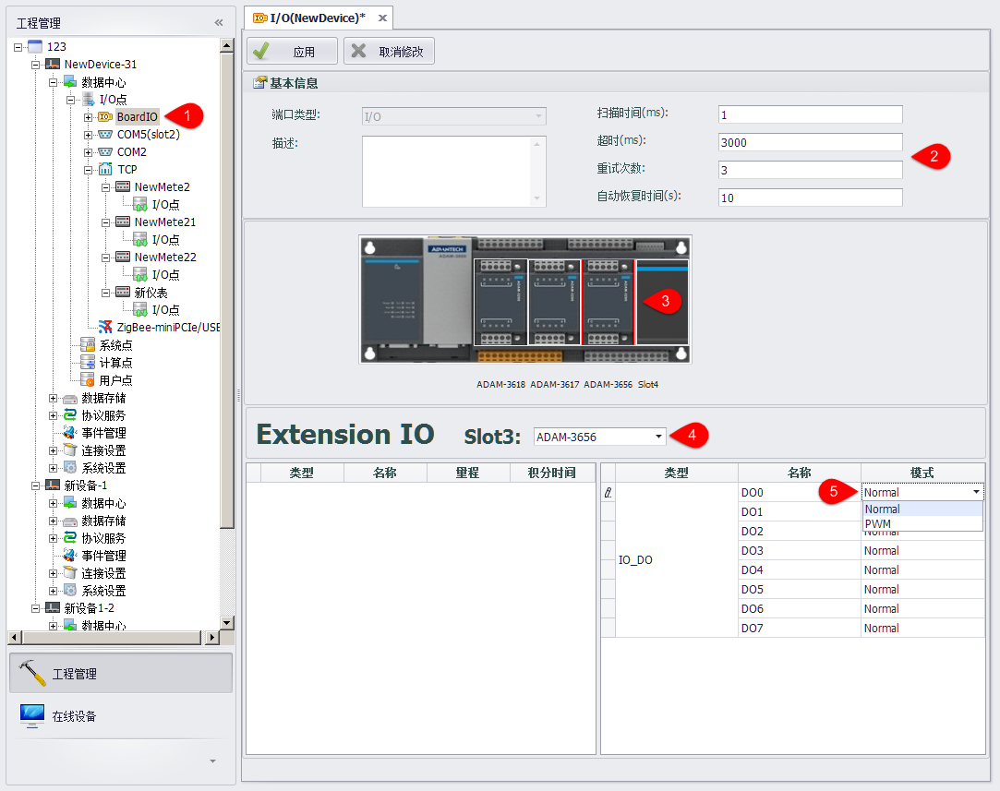

## 扩展模块添加

EdgeLink支持多种扩展模块，包括DO，DI，AI，AO等各种类型，具体添加操作如下图：　

1. 双击打开BoardIO节点　
2. 修改BoardIO端口的基本属性
3. 可以在EdgeLink示意图上选择Board或Slot图片，编辑IO点属性和slot类型　
4. 点击Slot图片后， 可以选择ExtensionIO的模块类型。
5. AI点支持+/-10V、+/-2.5V、0-20mA、4-20mA四种量程选择。DI支持Normal、Counter两种工作模式。DO支持Normal、PWM两种工作模式。

