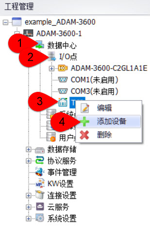
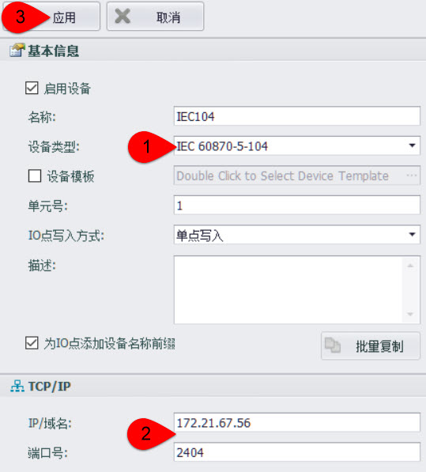
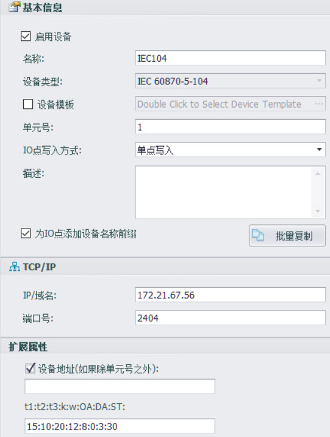

## IEC104

### 一、驱动支持开始的版本号：

### 二、快速连接

1.添加设备

- 数据中心--->I/O点--->TCP--->右键：添加设备

2.配置设备

- 选择设备类型：IEC 60870-5-104--->填写IEC104服务器IP及端口号：如172.21.67.56、2404--->点击“应用”

3.添加tag点

4.下载工程，即完成了IEC104的快速配置。

### 三、配置说明详解

1.配置界面详解

- 名称：按自己的喜好填写即可。

- 设备类型：选择IEC 60870-5-104。

- IP/域名：IEC104服务器的IP。

- 端口号：IEC104服务器的端口号。

- t1:t2:t3:k:w:OA:DA:ST：
  - [ ] t1：1~255 秒, 参照IEC104协议。
  - [ ] t2：1~600 秒, 参照IEC104协议。 
  - [ ] t3：1~600 秒, 参照IEC104协议。
  - [ ] k： 1~32767, 参照IEC104协议。
  - [ ] w： 1~32767, 参照IEC104协议。
  - [ ] OA：主站地址。
  - [ ] DA：从站公共地址。
  - [ ] ST：扫描时间. 范围1~3000 秒。

2.tag点配置详细说明

    There are three types of Tag.

      A.	Read Only Tag
              Format: R:Read Address / Read Data Type / Read Command  
              Example: R:402 / M_BO_NA_1 / n

      B.	Write Only Tag
              Format: W:Write Address / Write Command  
              Example: W:2300 / C_RC_NA_1
              Note: Always show value 0 for this kind of tag

      C.	Read And Write Tag
              Format: R:Read Address / Read Data Type / Read Command / W:Write Address / Write Command 
              Example: R:400 / M_BO_NA_1 / n / W:2400 / n

**Note**: Add /SE after Write Command to change “Direct Execute” to “Select and Execute”
- Read And Write Tag
Format: R:Read Address / Read Data Type / Read Command / W:Write Address / Write Command / SE
Example: R:100 / M_SP_NA_1 / n / W:2100 / n / SE
- Write Only Tag
Format: W:Write Address / Write Command / SE
Example: W:2100 / C_SC_NA_1 / SE

