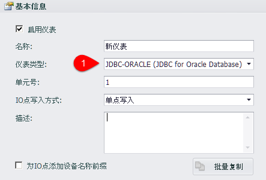
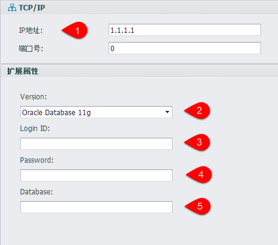
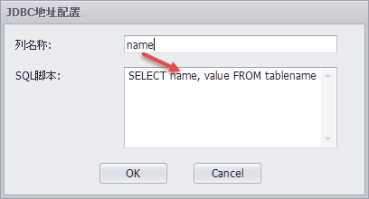

## JDBC设备

1. 在设备界面选择设备类型为JDBC-Oracal，可以配置通过在线JDBC服务器采集数据

	

2. 在设备界面中输入JDBC服务配置

	

	1. 服务器IP地址.
	2. Oracle的版本，可选择Oracle Database 10g、Oracle Database 11g、Oracle Database 12c等
	3. 登陆Oracal服务器需要的用户名。
	4. 登陆Oracal服务器需要的密码。
	5. 需要登录的数据库名名称。

3. 数据采集脚本

	

	点击Tag点编辑界面的地址栏可以编辑数据采集的SQL脚本。
	
	其中"SQL脚本"中输入SQL查询教本，"列名称"中输入查询结果的列名称。