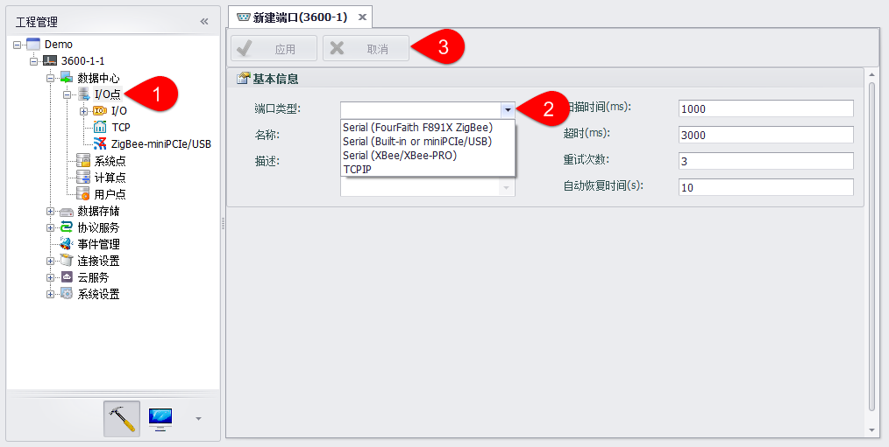
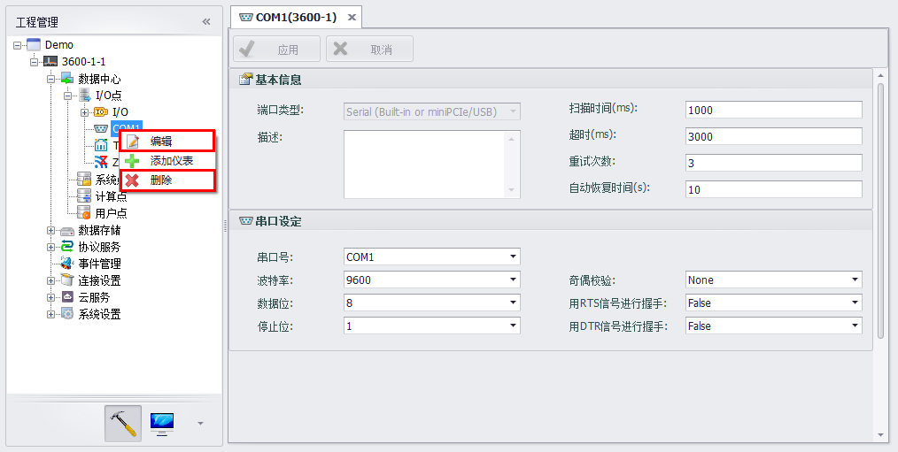
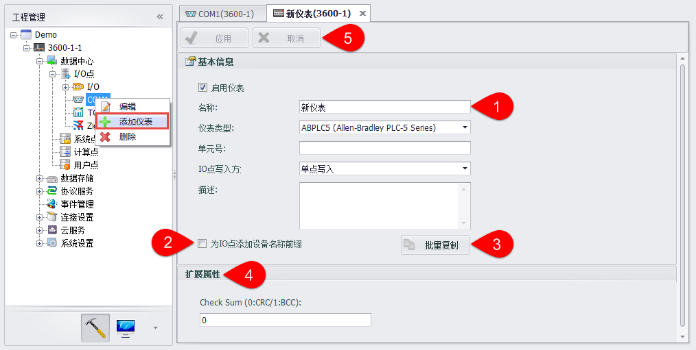
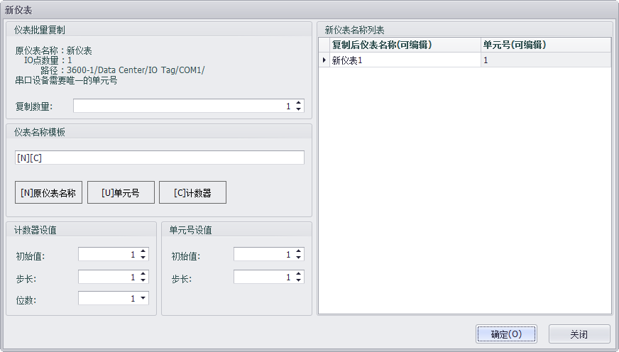
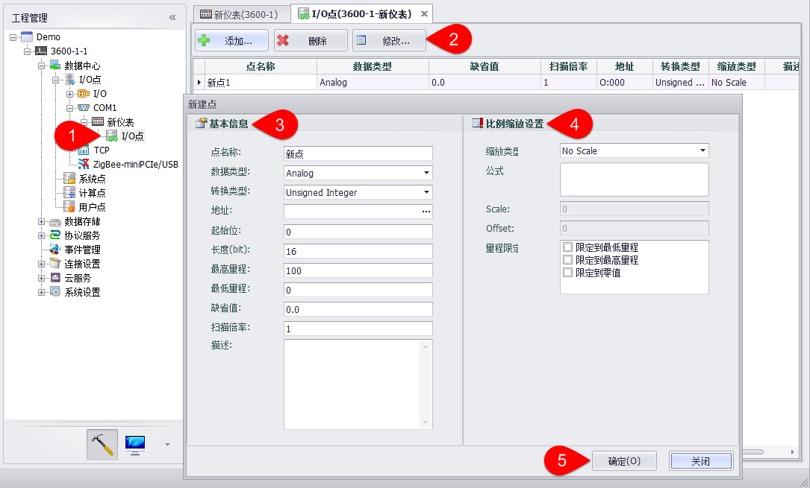

## 串口采集设备点配置　

ADAM-3600主体具备3个串口 (1*RS232/RS485, 2*RS485)，在创建设备时会同时创建这三个串口且处于不启用状态。添加串口信息及操作如下图中标明：　

1. 右键选择I/O点，添加端口。

2. 选择端口类型之后会相应的列出串口通讯相关的参数配置信息，可以根据需求自行设定。

3. 设置完成后点击应用保存串口配置信息，点击取消撤销之前的操作。

添加串口后，可对3路串口端口进行编辑、删除及添加设备的操作。　

 - 右键串口，可选择“编辑”功能，编辑串口信息过程如图，且图中描述了具体串口信息。　

    

 - 右键串口，可选择“删除”操作，确认后即删除该串口。　

 - 右键串口，可选择“添加设备”功能，该功能支持配置串口设备，具体设备信息说明如下图。　

    

    1.填写设备名称信息、选择设备类型、设置设备单元号、IO点写入方式，填写描述信息（选填）。

    2.选择是否为IO点添加名称前缀，如果选择“是”，则在该设备下添加Tag点时，Tag点的命名由“设备名称：Tag点名称”组合而成。

    3.是否批量复制本设备下的Tag点，按钮只有在选择了为IO点添加名称前缀时才可用。
    
    

    4.填写扩展属性。根据不同的协议或有对应的配置，请参考对应协议信息　

    5.添加完成后，点击应用，完成添加。点击取消，撤销操作。

 - 新建串口设备后需要配置IO点，配置步骤与板载IO配置过程相似，如下图。　

    

 - 如需要删除新建的串口设备，只需在设备名称上右键选择“删除”，即可删除新建的串口设备。　

串口设备支持以设备模板方式配置tag点，具体说明见[2.2.16](DeviceTemplate.html)设备模板部分。

在添加串口设备时，若不指定使用设备模板，则可以根据串口类型和设备类型读取对应的配置文件为设备添加预设tag点，具体说明见[2.2.17](TagTemplate.html)通过配置文件添加预设Tag点部分。