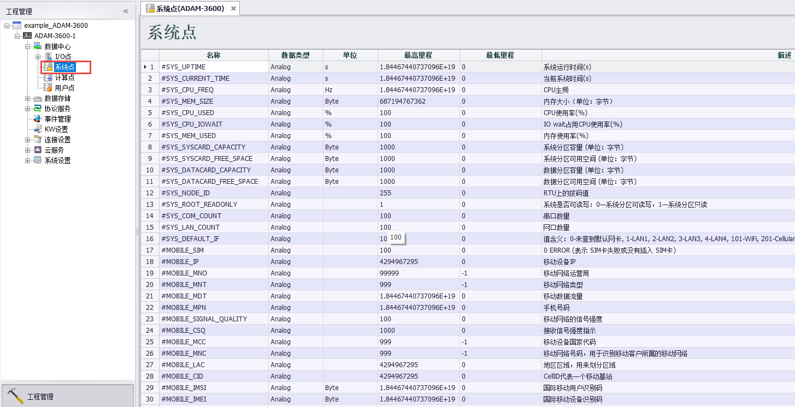

## 系统点

系统点分为[**常规系统点**](#常规系统点说明只读)和[**特殊系统点**](#特殊系统点说明)：

**常规系统点**：一般为只读。系统相关信息、模块（4G、Wifi、GPS）信息、串口、网口信息等

**特殊系统点**：部分可以读写

1. 在数据中心添加一个仪表后会生成3个系统点，表示仪表的相关信息。
2. DatLogger程序相关信息

### 具体说明如下：

### 常规系统点说明（只读）

- **#SYS_UPTIME** ： 系统运行时间(s)
- **#SYS_CURRENT_TIME** ： 当前系统时间(s)
- **#SYS_CPU_FREQ** ： CPU主频
- **#SYS_MEM_SIZE** ： 内存大小(单位：字节)
- **#SYS_CPU_USED** ： CPU使用率(%)
- **#SYS_CPU_IOWAIT** ： IO wait 占用CPU使用率(%)
- **#SYS_MEM_USED** ： 内存使用率(%)
- **#SYS_SYSCARD_CAPACITY** ： 系统分区容量(单位：字节)
- **#SYS_SYSCARD_FREE_SPACE** ： 系统分区可用容量(单位：字节)
- **#SYS_DATACARD_CAPACITY** ： 数据分区容量(单位：字节)
- **#SYS_DATACARD_FREE_SPACE** ： 数据分区可用容量(单位：字节)
- **#SYS_NODE_ID** ： RTU拨码值
- **#SYS_ROOT_READONLY** ： 系统是否可读写：0--系统分区可读写，1--系统分区只读
- **#SYS_COM_COUNT** ： 串口数量
- **#SYS_LAN_COUNT** ： 网口数量
- **#SYS_DEFAULT_IF** ：系统默认网卡 0-未查到默认网卡，1-LAN1，2-LAN2，3-LAN3，101-WiFi，201-蜂窝网络
- **#MOBILE_SIM** ： 0--ERROR, 标识SIM卡检测失败或没有插入SIM卡；1--SIM卡状态正确
- **#MOBILE_IP** ： 移动设备IP
- **#MOBILE_MNO** ： 移动网络运营商
- **#MOBILE_MNT** ： 移动网络类型
- **#MOBILE_MDT** ： 移动数据流量
- **#MOBILE_MPN** ： 手机号码
- **#MOBILE_SIGNAL_QUALITY** ： 移动网络信号强度
- **#MOBILE_CSQ** ： 接收信号强度指示
- **#MOBILE_MCC** ： 移动设备国家代码
- **#MOBILE_MNC** ： 移动网络号码，用于识别移动客户所属的移动网络
- **#MOBILE_LAC** ： 地区区域，用来划分区域
- **#MOBILE_CID** ： CellID代表一个移动基站
- **#MOBILE_IMSI** ： 国际移动用户识别码
- **#MOBILE_IMEI** ： 国际移动设备识别码
- **#MOBILE_IMEI_RAW** ： 国际移动设备识别码--原始数据
- **#MOBILE_USBID** ： usb设备 vendor id，product id
- **#MOBILE_DATA_DAY** ： 蜂窝数据，当天已用流量
- **#MOBILE_DATA_MONTH** ： 蜂窝数据，当月已用流量
- **#MOBILE_DATA_YEAR** ： 蜂窝数据，当年已用流量
- **#WLAN0_SIGNAL_QUALITY** ： WLAN0信号强度
- **#WLAN0_SIGNAL_LEVEL** ： WLAN0信号功率
- **#WLAN0_SIGNAL_NOISE** ： WLAN0网口的背景噪声
- **#WLAN0_SIGNAL_BITRATE** ： WLAN0网口的传输速率
- **#WLAN0_AP_MAC** ： Wifi AP模式的MAC，即BSSID
- **#ICDM_COM1_SCORE** ： icdmanager功能使用，串口1分数
- **#ICDM_COM2_SCORE** ： icdmanager功能使用，串口2分数
- **#ICDM_COM3_SCORE** ： icdmanager功能使用，串口3分数
- **#ICDM_LAN1_SCORE** ： icdmanager功能使用，网口1分数
- **#ICDM_LAN1_LINK** ： icdmanager功能使用，网口1连接状态
- **#ICDM_LAN2_SCORE** ： icdmanager功能使用，网口2分数
- **#ICDM_LAN2_LINK** ： icdmanager功能使用，网口2连接状态
- **#GPS_LATITUDE GPS** ：模块采集到的纬度
- **#GPS_LONGITUDE GPS** ：模块采集到的经度
- **#GPS_ALTITUDE GPS** ：模块采集到的海拔
- **#GPS_SPEED GPS** ：模块采集到的速度
- **#GPS_COURSE GPS** ：模块采集到的方向
- **#GPS_SATELLITE GPS** ：模块的工作状态：0--错误状态、1--正常工作、2--使用预设的位置信息
- **#SYS_BATTERY_LOW** ： 电池电量：1--电池电量低、0--电池电量正常
- **#SYS_TIME_SECOND** ： 秒(0~59，当有闰秒时60)
- **#SYS_TIME_MINUTE** ：分钟(0~59)
- **#SYS_TIME_HOUR** ： 小时(0~23)
- **#SYS_TIME_DAY** ： 日(1~31)
- **#SYS_TIME_MONTH** ： 月(1~12)
- **#SYS_TIME_YEAR** ： 年
- **#SYS_TIME_WDAY** ： 星期(0~6，0--周日、1~6--周一~周六)
- **#SYS_TIME_YDAY** ：从每年的1月1日开始的天数(0~365，0--1月1日、1--1月2日，以此类推)
- **#SYS_TIME_ISDST** ： 夏令时标识符，实行夏令时的时候，该值为正；不实行夏令时的时候，该值为0；无法确定时，该值为负
- **#SYS_TIME_GMT_OFFSET** ：本地时间于GMT的偏差秒数，东部时区为正数，西部时区为负数，如中国大陆应为28800
- **#SYS_MAC_LAN1** ：网口1的MAC地址
- **#SYS_MAC_LAN2** ：网口2的MAC地址
- **#SYS_TFCARD_CAPACITY** ：TF卡容量(单位：字节)
- **#SYS_TFCARD_FREE_SPACE** ：TF卡root分区可用空间(单位：字节)
- **#SYS_SDCARD_CAPACITY** ：SD卡容量(单位：字节) 如果没有插SD卡，数值为0
- **#SYS_SDCARD_FREE_SPACE** ：SD卡可用空间(单位：字节)，如果没有插SD卡，数值为0
- **#SYS_DNP3_AI_POLLED_COUNTER** ： DNP3 Outstation中AI数据被轮询的次数
- **#MQTTStatus_WISE-Edge365_0** :  WISE-Edge365_0这个云连接的连接状态，每一个云连接中的连接都有自己独立的连接状态显示，以#MQTTStatus_云连接名区分，0--未连接，1--连接中，2--已连接订阅主题中，3--已连接已订阅主题

### 特殊系统点说明

- **#DATALOG_ENABLE** ：  可读写，当值为1时使能DataLogger存储，当值为0时停止DataLogger存储
- **#DATALOG_ERROR** ：   只读，0--程序正常运行，其他错误代码需查看DataLogger手册部分
- **#DISABLE_DEVICE_仪表名** ： 可读写，每个在DataCenter中的仪表都有自己的点，以仪表名区分。0--仪表可用，1--仪表不可用。例如仪表名称为测试设备1，则会有一个对应的系统点#DISABLE_DEVICE_测试设备1，通过这个点可以禁用或启动该仪表
- **#BATCH_WRITE_仪表名** ：  可读写，每个在DataCenter中的仪表都有自己的点，以仪表名区分。0--仪表单点写入， 1--仪表批量写入。例如仪表名称为测试设备1，则会有一个对应的系统点#BATCH_WRITE_测试设备1，通过这个点可以设备该仪表的写入方式
- **#DEVICE_ERROR_仪表名** ：   只读，每个在DataCenter中的仪表都有自己的点，以仪表名区分。当前仪表采集错误时的错误码。 例如仪表名称为测试设备1，则会有一个对应的系统点#DEVICE_ERROR_测试设备1，通过这个点可以查看当前仪表的采集状态
- **#D_SCAN_TIME_仪表名** ： 只读，每个在DataCenter中的仪表都有自己的点，以仪表名区分。表示设备的实际扫描时间，单位是毫秒。
- **#DISABLE_PORT_端口名** ： 可读写，每个端口都有自己的点，0--端口可用，1--禁用端口。例如COM1端口，则会有一个对应的系统点#DISABLE_PORT_COM1，通过这个点可以开启或禁用该端口
- **#P_SCAN_TIME_端口名** ： 只读，每个端口都有自己的点，表示端口的实际扫描时间。注意：当端口使用并行扫描模式时，此系统点值无意义。
