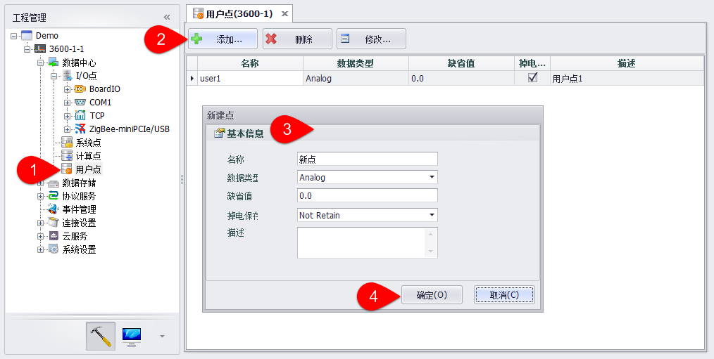

## 用户点配置

前几章讲到实际数据采集IO点的配置，但工程部署中还需要一些非实际IO的点，这些点是用户可选可配，即用户点，这些用户点可用于C语言和KW语言编程，可作为一个控制信号，也可作为一个运算结果的呈现，总之，这些用户点的应用取决于客户的实际需要。　

EdgeLink Studio中支持用户点的配置功能，用户可根据需求逐一配置到RTU中，用于后续编程需要。如下图编辑用户点操作过程：　

1.双击用户点或者右键选择编辑。

2.点击“添加”按钮添加一个新点。选中一个或者多个点，进行删除或修改操作。

3.填写点信息，包括选择点类型、设置缺省值、填写描述（选填）。

4.点击“确定”按钮完成添加。点击“取消”按钮撤销操作。

