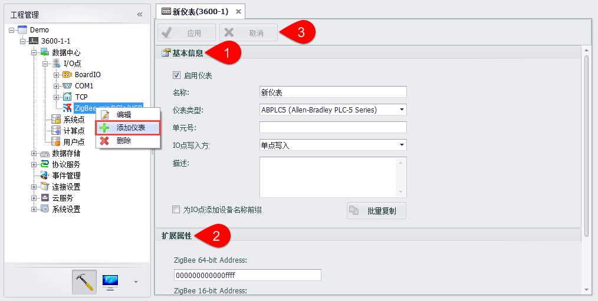
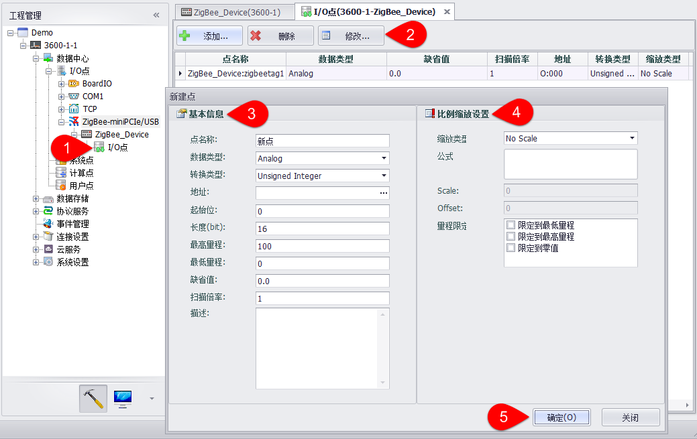

## Zigbee无线采集设备点配置　

针对Zigbee无线设备采集需求，可右键执行该端口的“编辑”、“添加设备”及“删除”操作。　

a. 编辑信息在新建Zigbee端口时已经设置，若有Zigbee端口信息需要更正，用户也可在“编辑”画面中更正，而后选择“重置”，即完成信息更正。　

b. 添加Zigbee设备，操作过程如下图：　

c. 添加Zigbee 设备I/O点信息，操作过程与添加板载、串口、网口I/O相似，如下图：　

1.双击或者右键编辑I/O点　

2.点击“添加”按钮添加一个新点。选中一个或多个点，进行删除或修改。

3.填写点的基本信息　

4.填写点的比例缩放设置　

5.点击“确定”添加该点，点击“关闭”取消添加或修改。

Zigbee无线设备支持以设备模板方式配置tag点，具体说明见2.2.16设备模板。

在添加Zigbee无线设备时，若不指定使用设备模板，则可以根据设备类型读取对应的配置文件为设备添加预设tag点，具体说明见2.2.17通过配置文件添加预设Tag点部分。